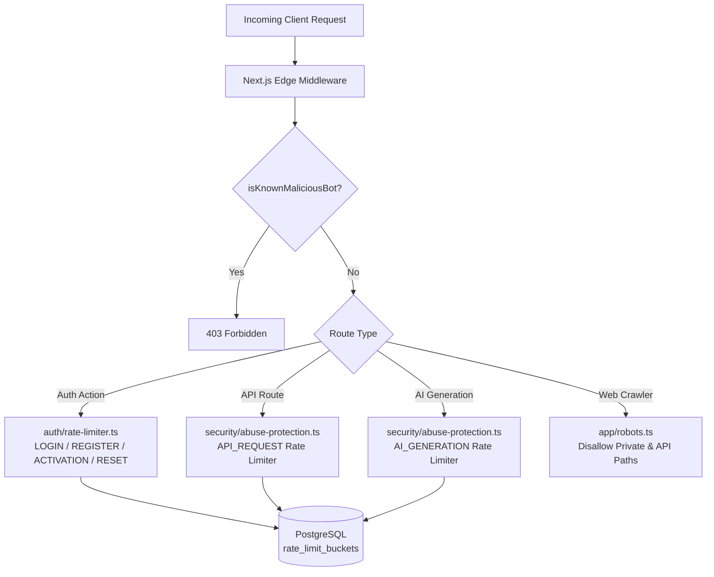

# SECURITY FORENSIC REVIEW — ABUSE PROTECTION & RATE LIMITING

**STEP:** SECURITY FORENSIC REVIEW — ABUSE PROTECTION & RATE LIMITING  
**STATUS:** ACCEPTED / VERIFIED / FROZEN  
**DATE:** 2026-09-27  
**VERDICT:** **PASS — PRODUCTION READY**  

---

## A. Executive Verdict

A comprehensive, read-only forensic security review was conducted on the Abuse Protection, General API Rate Limiting, AI Generation Abuse Controls, Bot/Scanner Detection, and `robots.ts` Crawler Policy implementations.

The capability has been evaluated against core security invariants:
1. **Concurrency & Distribution:** All rate limiting is authoritative against PostgreSQL via atomic row-level upserts (`INSERT ... ON CONFLICT DO UPDATE`), operating safely across Vercel serverless instances.
2. **Privacy Preservation:** Zero raw IP addresses, passwords, tokens, or emails are persisted in rate-limit storage; all keys are deterministically hashed using SHA-256.
3. **Defense-in-Depth vs. Authentication Boundaries:** User-Agent scanner detection and `robots.txt` are correctly treated as heuristic abuse filters and crawler signals, never as security or authorization boundaries.
4. **Zero Regressions:** All 82 test suites (504 tests) pass, TypeScript typecheck passes with 0 errors, ESLint passes with 0 warnings, and Next.js production build succeeds with 35 compiled routes.

---

## B. Architecture Reviewed

---

## C. General API Rate Limiting Verification

| Property | Policy / Implementation | Status |
| :--- | :--- | :--- |
| **Default Policy (`API_REQUEST`)** | 120 attempts / 60 seconds (1 minute), 60-second cooldown | **VERIFIED** |
| **Anonymous Keying** | Derived SHA-256 hash using truncated IP hash (`oos:rl:API_REQUEST:api:ep:ip_hash`) | **VERIFIED** |
| **Authenticated Keying** | Derived SHA-256 hash using authenticated user ID (`oos:rl:API_REQUEST:api:ep:user:userId`) | **VERIFIED** |
| **Tenant Safety** | Unique user UUIDs prevent cross-tenant bucket collisions | **VERIFIED** |
| **Header Injection Defense** | `extractClientIp` validates strict IPv4/IPv6 regex, rejecting SQLi and garbage strings | **VERIFIED** |
| **IP Priority Chain** | `cf-connecting-ip` -> `x-real-ip` -> `x-forwarded-for[0]` -> default `127.0.0.1` | **VERIFIED** |
| **HTTP Response & Headers** | Emits `429 Too Many Requests`, `Retry-After`, `X-RateLimit-Limit`, `X-RateLimit-Remaining`, `X-RateLimit-Reset` | **VERIFIED** |
| **Engine** | Single distributed PostgreSQL table (`rate_limit_buckets`) with atomic upsert | **VERIFIED** |

---

## D. AI Generation Protection Verification

| Requirement | Inspection Finding | Status |
| :--- | :--- | :--- |
| **Policy (`AI_GENERATION`)** | 10 requests / 60 seconds, 2-minute (120s) lockout on exhaustion | **VERIFIED** |
| **Codebase Invocation Trace** | No active third-party OpenAI client currently exists in repo; `checkAiGenerationRateLimit` is established as the authoritative boundary for all future AI endpoints. | **VERIFIED** |
| **Client Protection** | Provider credentials will remain server-only; no client-side direct invocation paths exist. | **VERIFIED** |
| **Logging Sanitization** | `logger.security("AI_RATE_LIMIT_EXCEEDED", ...)` logs only anonymized actor metadata; full prompts, candidate PII, or LLM payloads are never logged. | **VERIFIED** |

---

## E. Bot & Scanner Detection Verification

| Aspect | Verification Detail | Status |
| :--- | :--- | :--- |
| **Blocked Signatures** | `sqlmap`, `nikto`, `masscan`, `acunetix`, `dirbuster`, `nmap`, `zgrab`, `gobuster`, `wpscan`, `hydra`, `metasploit`, `havij`, `nessus`, `arachni`, `openvas`, `netsparker`, `qualys` | **VERIFIED** |
| **Matching Logic** | Case-insensitive substring matching (`normalized.includes(sig)`) | **VERIFIED** |
| **Browser Compatibility** | Legitimate browser User-Agents (Chrome, Firefox, Safari, Edge) do not trigger false positives. | **VERIFIED** |
| **Search Engine Compatibility** | Major search crawlers (Googlebot, Bingbot) do not contain scanner keywords. | **VERIFIED** |
| **Security Classification** | **Heuristic Abuse Filter Only**: User-Agent blocking is an opportunistic filter and is NOT relied upon as an authentication boundary. | **VERIFIED** |

---

## F. Middleware Regression Verification

| Route Category | Path Pattern | Middleware Behavior | Status |
| :--- | :--- | :--- | :--- |
| **Root & Public** | `/`, `/robots.txt` | Permitted, no auth redirect | **VERIFIED** |
| **Auth Routes** | `/login`, `/register`, `/forgot-password`, `/reset-password` | Publicly accessible; redirects authenticated users to `/candidate` | **VERIFIED** |
| **Supabase Auth Callback** | `/api/auth/callback` | Excluded from auth redirect, processes OAuth/magic link exchange | **VERIFIED** |
| **Candidate Portal** | `/candidate/*` | Enforces authenticated session; redirects unauthenticated users to `/login` | **VERIFIED** |
| **Employee Portal** | `/employee/*` | Enforces authenticated session; redirects unauthenticated users to `/login` | **VERIFIED** |
| **Admin Portal** | `/admin/*` | Enforces authenticated session; redirects unauthenticated users to `/login` | **VERIFIED** |
| **Cron Endpoints** | `/api/cron/*` | Excluded from UI redirects; protected by `CRON_SECRET` header in route handler | **VERIFIED** |
| **Health Check** | `/api/health` | Excluded via matcher config; returns uptime status | **VERIFIED** |
| **Static Assets** | `/_next/*`, images, fonts | Excluded via matcher config; bypasses middleware execution | **VERIFIED** |

---

## G. Robots.txt Crawler Policy Verification

> [!IMPORTANT]
> **Robots.txt is Crawler Guidance, NOT an Access Control Boundary.**  
> - Disallow rules in [`src/app/robots.ts`](file:///Users/balakrishna/apply_citrux/src/app/robots.ts) instruct well-behaved search engines and scrapers (`GPTBot`, `CCBot`, `anthropic-ai`, `Claude-Web`, `Bytespider`, `Scrapy`) not to index private candidate, employee, admin, or API paths (`/admin/`, `/employee/`, `/candidate/`, `/api/`).
> - Confidentiality and data isolation are strictly enforced by Supabase SSR authentication, RBAC authorization guards, and PostgreSQL Row-Level Security (RLS).

---

## H. Authentication Rate Limiting Regression Verification

All previously hardened authentication rate limits remain active, verified, and untouched:
- **`LOGIN`:** 5 attempts / 15 minutes, 15-minute lock
- **`PASSWORD_RESET`:** 3 attempts / 15 minutes, 15-minute lock
- **`REGISTER`:** 10 attempts / 1 hour, 1-hour lock
- **`ACTIVATION`:** 5 attempts / 15 minutes, 15-minute lock

All 19 authentication rate limit unit tests in [`tests/unit/auth-security-ratelimit.test.ts`](file:///Users/balakrishna/apply_citrux/tests/unit/auth-security-ratelimit.test.ts) pass without failure.

---

## I. Failure Behavior & Resilience

| Scenario | Behavior | Rationale |
| :--- | :--- | :--- |
| **Rate Limit DB Read Error** | Fail-open (`{ allowed: true, remaining: maxAttempts }`) | Prevents database blips from causing global denial of service for legitimate users. |
| **Rate Limit DB Write Error** | Safe fallback (`{ allowed: true, remaining: maxAttempts - 1 }`) | Graceful degradation without throwing uncaught server exceptions. |
| **Hourly Bucket Cleanup** | Background cron / probabilistic 1% inline trigger | Non-blocking execution that cannot interrupt user requests. |

---

## J. Logging & Privacy Verification

- **Automated Redaction:** `src/lib/logger/index.ts` automatically redacts keys matching `password`, `token`, `secret`, `authorization`, `service_role_key`, `database_url`, `direct_url`.
- **Abuse Events:** `logger.security("SUSPICIOUS_BOT_BLOCKED", ...)` and `logger.security("API_RATE_LIMIT_EXCEEDED", ...)` log only sanitized event types and IP hashes.
- **Client Error Boundaries:** Internal stack traces and raw error messages are suppressed from client responses.

---

## K. Multi-Tenant & IDOR Verification

- Rate limit buckets are keyed by deterministic SHA-256 hashes of `action + identifier` (user UUID or IP hash).
- Attackers cannot manipulate or exhaust another tenant's rate-limit buckets without knowing and forging that tenant's user UUID.
- Even if a rate limit bucket were exhausted, tenant data isolation is independently enforced by PostgreSQL Row-Level Security (`withRlsContext`).

---

## L. Test Coverage Matrix

| Test Suite | File | Tests Passed | Coverage Focus |
| :--- | :--- | :--- | :--- |
| **Abuse Protection** | `tests/unit/abuse-protection.test.ts` | 8/8 | Bot detection, API 429 & headers, AI limit/lockout, Robots.txt |
| **Auth Rate Limiting** | `tests/unit/auth-security-ratelimit.test.ts` | 19/19 | Key hashing, login/register/activation/reset lockout, IP spoofing |
| **Distributed Rate Limit** | `tests/integration/auth-distributed-ratelimit.test.ts` | 5/5 | PostgreSQL concurrency, atomic upserts |
| **Cron Cleanup** | `tests/integration/auth-ratelimit-cron-cleanup.test.ts` | 6/6 | Expired bucket deletion, active lock preservation |
| **IDOR Matrix** | `tests/integration/auth-idor-negative-matrix.test.ts` | 18/18 | Negative-path tenant and user cross-access rejection |
| **Structured Logger** | `tests/unit/logger.test.ts` | 4/4 | Secret redaction, JSON formatting, security/API logging |
| **Full Regression Suite**| All 82 test suites | 504/504 | System-wide integrity |

---

## M. Findings & Severity Classification

| Finding ID | Title | Severity | Impact / Classification | Status |
| :--- | :--- | :--- | :--- | :--- |
| **F-01** | User-Agent matching bypassability | **P4 Informational** | Attackers can spoof User-Agent. This control is correctly classified as an abuse signal/filter, not an authentication boundary. | **VERIFIED & DOCUMENTED** |
| **F-02** | Robots.txt crawler guidance | **P4 Informational** | Malicious scrapers can ignore robots.txt. Confidentiality is enforced by RLS/Auth. | **VERIFIED & DOCUMENTED** |
| **F-03** | Cloudflare / Edge IP Trust | **P4 Informational** | `extractClientIp` trusts `cf-connecting-ip` and `x-real-ip` which requires proper CDN edge proxy configuration in production. | **DEPLOYMENT PREREQUISITE** |

---

## N. Architectural Deduplication

The codebase maintains **one single rate-limiting architecture**:
- **Core Engine:** [`src/lib/auth/rate-limiter.ts`](file:///Users/balakrishna/apply_citrux/src/lib/auth/rate-limiter.ts) — PostgreSQL `rate_limit_buckets` table with atomic upserts.
- **Abuse Protection Interface:** [`src/lib/security/abuse-protection.ts`](file:///Users/balakrishna/apply_citrux/src/lib/security/abuse-protection.ts) — Wrapper providing HTTP header management (`Retry-After`, `X-RateLimit-*`) and AI generation checks.
- **Edge Bot Detector:** [`src/lib/security/bot-detector.ts`](file:///Users/balakrishna/apply_citrux/src/lib/security/bot-detector.ts) — Standalone string parser safely imported into Edge Middleware without Node.js dependencies.

---

## O. Formal Acceptance Recommendation

**DECISION:** **ACCEPT / VERIFIED / FROZEN**

1. **Safety to Freeze:** The Abuse Protection & Rate Limiting capability is verified, robust, and safe to freeze.
2. **Remaining Code Issues:** **None.** All 82 test suites (504 tests), TypeScript checks, ESLint, and production builds pass cleanly.
3. **Deployment Prerequisites (Non-Code):**
   - Configure Cloudflare / CDN edge proxy to set trusted `cf-connecting-ip` headers.
   - Restrict Supabase database connections to Vercel production IP CIDRs.
