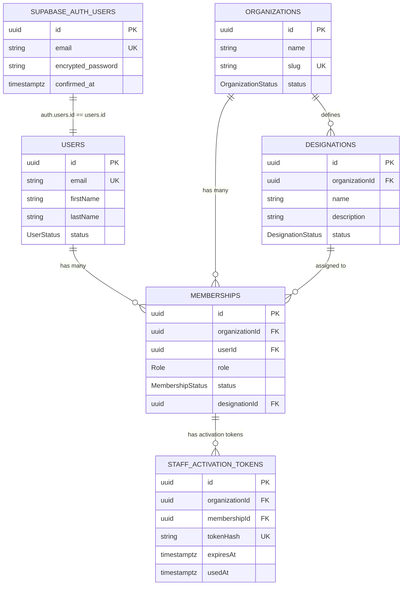
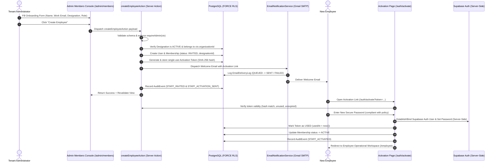

# OOS Engineering Change Specification: Employee Onboarding & Organizational Identity

**Document Version:** `1.0.0`  
**Status:** `DRAFT — PENDING HUMAN APPROVAL`  
**Implementation Status:** `NOT AUTHORIZED`  
**Classification:** Product Capability Change Specification (Post-Phase-10 Extension)  
**Target Delivery Path:** `docs/engineering/CHANGE_EMPLOYEE_ONBOARDING_ORGANIZATIONAL_IDENTITY_SPEC.md`  
**Authority Reference:** Master Correction Prompt (Specification Hardening), OOS Product Vision (§§22, 23), V1 PRD (§§17, 45, 47), Frozen Phase 1 Specification (v1.5.0), Frozen Phase 8 Specification (v1.1.0), Frozen Phase 10 Specification (v1.0.0), Approved ADRs (ADR-001 through ADR-005).

---

## Document Revision History

| Version | Date | Status | Description |
| :--- | :--- | :--- | :--- |
| `1.0.0` | 2026-09-25 | DRAFT — PENDING HUMAN APPROVAL | Hardened engineering change specification incorporating authoritative correction feedback: strict Role vs. Designation non-authorizing separation, persisted `INACTIVE` membership status contract (distinguished from `STAFF_DEACTIVATED` audit event and "Deactivate" UI label), explicit server-side Supabase Auth boundary, single-use activation credential architecture with unresolved human/security decisions (expiration, password policy, transport), Gmail SMTP delivery failure semantics without external queues, case-insensitive designation uniqueness invariant, and comprehensive testing matrix. Implementation strictly unauthorized until human sign-off. |

---

## 1. Problem Statement

The existing operational staff provisioning capability in OOS (established in Phase 1 and exposed via `/admin/members` in Phase 8) exhibits three structural deficiencies that prevent enterprise-grade operational readiness:

1. **Authentication Identity Disconnect**: The current `createEmployeeAction` in `src/lib/admin/actions.ts` generates a synthetic application `User` record with `crypto.randomUUID()` directly in PostgreSQL. It does **not** create a corresponding Supabase Auth user identity in `auth.users`, nor does it dispatch an activation credential. Consequently, an employee account appears in the database but cannot authenticate via `supabase.auth.signInWithPassword()` without manual database intervention.
2. **Conflation of Authorization Role and Organizational Identity**: The system only tracks technical `Role` (`CANDIDATE`, `EMPLOYEE`, `ADMIN`). It possesses no capability to capture an employee's organizational position, operational title, or business designation (e.g., *Application Specialist*, *Operations Manager*, *QA Specialist*).
3. **Absence of Centralized Organizational Structure Governance**: Administrators lack an administrative interface and data model to standardize, create, edit, archive, or audit organizational designations within their tenant.

---

## 2. Objective & Core Principles

The objective of this change specification is to establish an enterprise-grade, tenant-isolated **Employee Onboarding & Organizational Identity** subsystem governed by five non-negotiable principles:

1. **Strict Role $\neq$ Designation Separation**: Technical `Role` controls software authorization; `Designation` defines organizational/business position. Designations never grant, restrict, or modify permissions.
2. **Authoritative Authentication Identity Binding**: Every provisioned employee is guaranteed a real Supabase Auth identity capable of authenticating through the standard `signInWithPassword` flow upon completing activation.
3. **Secure One-Time Activation Credential (No Plaintext Passwords)**: The business requirement of a "one-time login credential" is satisfied via a cryptographically random, single-use, time-bounded activation token + mandatory first-login password setup. Permanent plaintext passwords are never generated, persisted, logged, or emailed.
4. **Gmail SMTP Communication Standard**: All welcome/activation emails are dispatched via the existing `EmailNotificationService` using the configured Gmail SMTP adapter and tracked in `public.email_delivery_logs`. No external queues or third-party email providers are introduced.
5. **Zero-Leakage Multi-Tenant Isolation**: Designations and employee memberships are strictly organization-scoped, protected by PostgreSQL `FORCE ROW LEVEL SECURITY` and verified server-side.

---

## 3. Frozen Contract Preservation & System Boundaries

This specification is an additive organizational-identity change that strictly preserves all frozen Phase 1–10 contracts:

1. **Role Model Invariant**: Technical roles remain strictly `CANDIDATE`, `EMPLOYEE`, and `ADMIN`.
2. **Persisted Membership Status Invariant**: In strict compliance with the frozen Phase 1 and Phase 8 contracts, the persisted membership status values are:
   - `INVITED` (Staff provisioned; activation email dispatched; password not yet established).
   - `ACTIVE` (Staff account activated and operational).
   - `INACTIVE` (Staff access revoked by Administrator).
   - `SUSPENDED` (Organizational/systemic suspension).
   *(Note: The system persists `INACTIVE`. The label "Deactivate" is exclusively a UI button/action label, and `STAFF_DEACTIVATED` is an authoritative audit event identifier, not a persisted database status enum).*
3. **Non-Authorizing Designation Invariant**: `Designation` is purely organizational identity metadata. It does not replace `Role`, determine RLS policies, or grant API capabilities.
4. **Phase 10 Integrity**: Phase 10 remains `ACCEPTED — FROZEN`. No modification to `PHASE_10_PRODUCTION_PILOT_SPEC.md` or Phase 1–9 contracts is authorized.

---

## 4. Non-Goals & Explicit Exclusions

The following capabilities are **STRICTLY PROHIBITED** from this specification and any downstream implementation:

- **No New Technical Authorization Roles**: Roles remain strictly `CANDIDATE`, `EMPLOYEE`, `ADMIN`. No introduction of `MANAGER`, `TEAM_LEAD`, `QA_MANAGER`, `OPERATIONS_MANAGER`, `DIRECTOR`, or composite roles.
- **No HR Management Systems**: No compensation, salary tracking, payroll, employee benefits, or employment contract generation.
- **No Attendance / Time Tracking**: No clock-in/out mechanisms, timesheets, or leave tracking.
- **No Performance Management**: No appraisals, KPIs, OKRs, or performance reviews.
- **No Recruitment ATS**: No internal job boards, applicant screening pipelines, or staff interview tracking.
- **No Employee Self-Registration**: Operational staff accounts must only be provisioned by authorized tenant administrators.
- **No Reporting Trees / Hierarchy Graphs**: No multi-level manager-subordinate relationship chains or dynamic approval workflows.
- **No Automated Routing / AI Auto-Assignment**: Operational work assignment remains strictly manual per Phase 8 specification.
- **No External Queues / Infrastructure**: No Redis, Kafka, BullMQ, or standalone background worker processes.

---

## 5. Existing-System Dependencies & Grounding

```text
┌────────────────────────────────────────────────────────────────────────────────────────┐
│ Existing Architecture Foundation (Frozen Phase 1–10 Baseline)                          │
├───────────────────────────────┬───────────────────────────────┬────────────────────────┤
│ 1. Identity & RBAC            │ 2. Communication Engine       │ 3. Security & Database │
│    • Supabase Auth            │    • Gmail SMTP Adapter       │    • PostgreSQL 15+    │
│    • User & Membership Models │    • Nodemailer Transport     │    • FORCE RLS         │
│    • Role: CANDIDATE/EMP/ADMIN│    • EmailDeliveryLog Model   │    • withRlsContext()  │
│    • Status: INVITED/ACTIVE/  │    • Systemic Audit Trail     │    • Prisma ORM 7.10.0 │
│      INACTIVE/SUSPENDED       │                               │                        │
└───────────────────────────────┴───────────────────────────────┴────────────────────────┘
```

1. **Authentication Context (`src/lib/auth/context.ts`)**:
   - `getAuthenticatedContext()` extracts verified `userId`, `organizationId`, and `role`.
   - `requireAdmin(ctx)` enforces strict server-side administrative access.
2. **Database & Row Level Security (`src/lib/db/rls.ts`)**:
   - Multi-tenancy enforced via PostgreSQL Row Level Security (`FORCE ROW LEVEL SECURITY`) and transaction-scoped `set_config('request.jwt.claim.sub', $1, true)`.
3. **Email Infrastructure (`src/lib/email/index.ts`)**:
   - `GmailSmtpAdapter` implements `EmailProvider` using server-side Gmail SMTP credentials.
   - `EmailNotificationService` writes transactional delivery logs to `public.email_delivery_logs` with statuses `QUEUED`, `SENT`, `FAILED`.
4. **Authoritative Audit System (`src/lib/audit/index.ts`)**:
   - `logUserAuditEvent` records structured events in `public.audit_events` referencing `AuditAction`.

---

## 6. Employee Identity: Role vs. Designation Invariant

To maintain strict least-privilege security and prevent domain pollution, the system enforces an absolute architectural boundary:

```text
┌────────────────────────────────────────────────────────────────────────────────────────┐
│                                EMPLOYEE IDENTITY MODEL                                 │
├───────────────────────────────────────────┬────────────────────────────────────────────┤
│ TECHNICAL ROLE (Authorization Capability) │ BUSINESS DESIGNATION (Organizational Title)│
├───────────────────────────────────────────┼────────────────────────────────────────────┤
│ • "What is this user authorized to do?"   │ • "What is this person's business title?"  │
│ • Locked System Enum:                     │ • Dynamic Tenant Entity (Admin-Managed):   │
│   - CANDIDATE                             │   - Application Specialist                 │
│   - EMPLOYEE                              │   - Senior Application Specialist          │
│   - ADMIN                                 │   - Operations Executive                   │
│ • Controls routes, mutations, and data RLS│   - Operations Manager                     │
│ • Hardcoded in code-level RBAC guards     │   - Quality Analyst / QA Specialist        │
│ • ZERO dependency on Designation          │   - Customer Success Executive             │
│                                           │ • ZERO authorization authority             │
└───────────────────────────────────────────┴────────────────────────────────────────────┘
```

### Invariants:
1. **Designation Never Grants Permissions**: Permissions derive solely from `Role`. An employee with designation *"Operations Manager"* and role `EMPLOYEE` possesses standard employee permissions, not administrative permissions.
2. **No Role-Title Fusion**: Composite roles (such as `EMPLOYEE_APPLICATION_SPECIALIST` or `ADMIN_OPERATIONS_MANAGER`) are strictly prohibited.
3. **Candidate Independence**: The `CANDIDATE` role is completely independent of the designation model (`designationId` is always `NULL` for candidates).

---

## 7. Authoritative Auth & User Identity Architecture

### 7.1 Entity Relationship Topology



### 7.2 Resolution of the Supabase Auth Provisioning Boundary

To eliminate the architectural flaw of "orphaned application users without auth identities", the provisioning and activation architecture is specified as follows:

```text
Admin creates employee at /admin/members
        ↓
Server creates Application User & Membership (status = INVITED) with designationId
        ↓
Activation token generated; only SHA-256 hash stored in staff_activation_tokens
        ↓
Welcome email dispatched with one-time activation link via EmailNotificationService (Gmail SMTP)
        ↓
Employee opens /auth/activate?token=... (Bearer token verified against hash)
        ↓
Employee submits compliant password
        ↓
Server-side Supabase Auth identity established/bound via approved privileged mechanism
        ↓
Membership.status transitions from INVITED to ACTIVE & token marked usedAt = now()
        ↓
Employee logs in via standard signInWithPassword flow into /employee workspace
```

### 7.3 Security Boundaries on Auth Operations
- **Privileged Operations**: Any administrative Supabase Auth operations must execute server-side only.
- **Zero Client Credentials**: No Supabase Auth service-role key or internal secrets may ever reach the browser or client bundle.
- **No Plaintext Passwords in PostgreSQL**: No password (temporary or permanent) is ever persisted in PostgreSQL or written to application logs.
- **Bearer Credential Handling**: The activation token is sensitive authentication material and must be handled with strict bearer-token hygiene.

---

## 8. Designation Domain Model & Management

### 8.1 Proposed Data Contract (`Designation`)

```prisma
enum DesignationStatus {
  ACTIVE
  ARCHIVED
}

model Designation {
  id             String            @id @default(dbgenerated("gen_random_uuid()")) @db.Uuid
  organizationId String            @map("organization_id") @db.Uuid
  name           String            @db.VarChar(100)
  description    String?           @db.Text
  status         DesignationStatus @default(ACTIVE) @map("status")
  createdAt      DateTime          @default(now()) @map("created_at") @db.Timestamptz(6)
  updatedAt      DateTime          @default(now()) @updatedAt @map("updated_at") @db.Timestamptz(6)

  organization   Organization      @relation(fields: [organizationId], references: [id], onDelete: Restrict)
  memberships    Membership[]

  @@unique([organizationId, name], name: "org_designation_name_unique")
  @@index([organizationId, status], name: "idx_designations_org_status")
  @@map("designations")
}
```

### 8.2 Business Invariants & Lifecycle Rules
1. **Name Uniqueness Invariant**: Within one organization, two `ACTIVE` designations must not have the same case-insensitive name (e.g. `lower(name)`). *(The exact database index/constraint strategy will be finalized during approved implementation to enforce this invariant).*
2. **Archival Model (No Hard Deletes)**: Designations cannot be hard-deleted if referenced by any historical `Membership`. They must be transitioned to `ARCHIVED`.
3. **Assignment Restriction**: `ARCHIVED` designations **cannot** be assigned to newly provisioned employees or selected during designation updates.
4. **Historical Preservation**: Existing employees assigned to an archived designation **retain** that designation without disruption. In UI tables and profiles, archived designations display an `(Archived)` badge.
5. **Reactivation**: An administrator can reactivate an `ARCHIVED` designation back to `ACTIVE`, making it available for assignment again.
6. **No Domain Bloat**: Designations do not possess permissions, approval authorities, skill mappings, salary bands, or reporting structures.

---

## 9. Employee Creation & Onboarding Flow



### 9.1 Form Specification (`/admin/members`)
The provisioning form is organized into three distinct sections:
- **1. PERSONAL INFORMATION**:
  - First Name (`firstName`, required, string, max 100)
  - Last Name (`lastName`, required, string, max 100)
  - Work Email (`email`, required, email format, lowercase)
- **2. WORK PROFILE**:
  - Designation (`designationId`, required dropdown, populated **strictly with `ACTIVE` designations** belonging to `ctx.organizationId`)
  - Role (`role`, required select: `EMPLOYEE` | `ADMIN`)
- **3. ACCOUNT SETUP**:
  - Descriptive notice: *"The system will send a secure welcome email with a one-time activation credential. The employee will establish their password upon first login."*
  - **No plaintext password inputs**.

---

## 10. Activation Token Security & URL Hygiene

### 10.1 Token Cryptography & Storage
- **Entropy**: 256-bit cryptographically secure pseudorandom token generated via Node.js `crypto.randomBytes(32).toString("hex")`.
- **Zero Plaintext Persistence**: Plaintext tokens are **never** stored in PostgreSQL. Only a cryptographic `SHA-256` hash is persisted.
- **Proposed Storage Model**:
  ```prisma
  model StaffActivationToken {
    id             String    @id @default(dbgenerated("gen_random_uuid()")) @db.Uuid
    organizationId String    @map("organization_id") @db.Uuid
    membershipId   String    @map("membership_id") @db.Uuid
    tokenHash      String    @unique @map("token_hash") @db.VarChar(64)
    expiresAt      DateTime  @map("expires_at") @db.Timestamptz(6)
    usedAt         DateTime? @map("used_at") @db.Timestamptz(6)
    createdAt      DateTime  @default(now()) @map("created_at") @db.Timestamptz(6)

    organization   Organization @relation(fields: [organizationId], references: [id], onDelete: Cascade)
    membership     Membership   @relation(fields: [membershipId], references: [id], onDelete: Cascade)

    @@index([membershipId, expiresAt])
    @@index([organizationId])
    @@map("staff_activation_tokens")
  }
  ```

### 10.2 Token Lifecycle & Verification Rules
1. **Comparison Against Stored Hash**: Inbound URL tokens are hashed with SHA-256 and compared against stored `tokenHash`.
2. **Single Use & Atomic Consumption**: Once validated and password is established, `usedAt` is stamped with `now()`. Token consumption and membership activation occur in a single atomic transaction.
3. **Replay Rejection**: Used tokens (`usedAt != null`) are strictly rejected.
4. **Expiration Rejection**: Tokens where `expiresAt < now()` are strictly rejected.
   - Proposed Default Expiration: **48 Hours** `[HUMAN / SECURITY DECISION REQUIRED]`.
5. **Invalidation on Resend**: Triggering "Resend Activation" immediately invalidates all prior unconsumed tokens for that `membershipId` (`expiresAt = now()`).
6. **No Multi-Tenancy Cross-Talk**: Token resolution verifies `organizationId` and `membershipId` server-side; a token cannot activate another user or organization.

### 10.3 Activation URL Hygiene & Privacy
- **Zero Token Logging**: Raw activation tokens must never be written to application logs, audit logs, or telemetry payloads.
- **Zero Browser Storage Persistence**: Tokens must never be stored in browser `localStorage` or `sessionStorage`.
- **Referrer & Leakage Protection**: The `/auth/activate` page must set appropriate `Referrer-Policy: no-referrer` to prevent bearer token leakage to third parties.
- **URL Scrubbing**: Upon successful token validation, the client application removes the bearer token from the visible browser URL (via `window.history.replaceState`) where technically appropriate.

---

## 11. Welcome Email & Failure Semantics

### 11.1 Transport & Template Contract
- **Provider**: Handled strictly via the existing `EmailNotificationService` using `GmailSmtpAdapter` (Nodemailer over Gmail SMTP).
- **Template Identifier**: `STAFF_WELCOME_ACTIVATION`.
- **Delivery Logging**: Logged in `public.email_delivery_logs` with statuses `QUEUED`, `SENT`, `FAILED`.

### 11.2 Email Content Rules
- **Allowed Elements**: Organization name, employee full name, designation, assigned role, login email, one-time activation link, expiration guidance, and security instructions.
- **Strictly Prohibited Elements**: Permanent passwords, plaintext temporary passwords, database credentials, Supabase service-role keys, or internal secrets.

### 11.3 Delivery Failure Semantics (No External Queues)
- **Transactional Atomicity**: Staff record creation and activation-token generation are transactional domain operations.
- **Failure Resilience**: If Gmail SMTP delivery fails:
  - The employee record remains in `INVITED` state.
  - `EmailDeliveryLog` records the failure reason with status `FAILED`.
  - The employee account is **NOT** partially activated.
  - The Administrator sees the failed delivery status in `/admin/members` and can safely click **"Resend Activation"**.
  - No background worker queues (Redis, Kafka, BullMQ) are introduced.

---

## 12. Resend Activation Protocol

When an Administrator clicks **"Resend Activation"** at `/admin/members`:
1. Server verifies the caller is an active `ADMIN` in the target employee's organization.
2. Server invalidates all previous unconsumed activation tokens for that `membershipId` (`expiresAt = now()`).
3. Server generates a fresh 256-bit cryptographic token and persists its SHA-256 hash.
4. Server dispatches a new `STAFF_WELCOME_ACTIVATION` email via `EmailNotificationService`.
5. Server records delivery result in `email_delivery_logs`.
6. Server records `STAFF_ACTIVATION_RESENT` in `public.audit_events`.
7. Guarantees that only **one** activation credential is valid at any given time.

---

## 13. Admin UI & UX Specifications

### 13.1 Admin Members Console (`/admin/members`)
```text
┌────────────────────────────────────────────────────────────────────────────────────────┐
│ Staff & Organizational Governance                     [ Manage Designations Settings → ]│
├────────────────────────────────────────────────────────────────────────────────────────┤
│ Provision Operational Staff                                                            │
│ ┌────────────────────────────────────────────────────────────────────────────────────┐ │
│ │ 1. PERSONAL INFORMATION                                                            │ │
│ │ First Name: [ Sarah         ]   Last Name: [ Chen          ]   Email: [sarah@co.com]│ │
│ │                                                                                    │ │
│ │ 2. WORK PROFILE                                                                    │ │
│ │ Role (Authorization Level): [ EMPLOYEE ▼ ]                                         │ │
│ │ Designation (Organizational Title): [ Application Specialist ▼ ]                   │ │
│ │                                                                                    │ │
│ │ 3. ACCOUNT SETUP                                                                   │ │
│ │ ℹ The employee will receive a welcome email with a secure one-time activation link.│ │
│ │                                                              [ Create Employee ]   │ │
│ └────────────────────────────────────────────────────────────────────────────────────┘ │
├────────────────────────────────────────────────────────────────────────────────────────┤
│ Organization Staff Roster (14)                                                         │
│ ┌────────────────────────────────────────────────────────────────────────────────────┐ │
│ │ Employee      │ Email         │ Designation       │ Role     │ Status  │ Actions   │ │
│ ├───────────────┼───────────────┼───────────────────┼──────────┼─────────┼───────────┤ │
│ │ Sarah Chen    │ sarah@co.com  │ App Specialist    │ EMPLOYEE │ ACTIVE  │ [Deact]   │ │
│ │ Marcus Vance  │ marcus@co.com │ Operations Lead   │ ADMIN    │ ACTIVE  │ [Deact]   │ │
│ │ Elena Rostova │ elena@co.com  │ QA Specialist     │ EMPLOYEE │ INVITED │ [Resend]  │ │
│ │ David Miller  │ david@co.com  │ Analyst (Archived)│ EMPLOYEE │ INACTIVE│ [Activate]│ │
│ └────────────────────────────────────────────────────────────────────────────────────┘ │
└────────────────────────────────────────────────────────────────────────────────────────┘
```
- **Persisted Status Values**: Strictly `INVITED`, `ACTIVE`, `INACTIVE`.
- **Action Labels**: "Activate", "Deactivate", "Resend Activation", "Change Role", "Change Designation".

### 13.2 Designation Settings Console (`/admin/settings/designations`)
```text
┌────────────────────────────────────────────────────────────────────────────────────────┐
│ Organizational Designations                                      [ + New Designation ] │
├────────────────────────────────────────────────────────────────────────────────────────┤
│ Search Designations: [ Search by name...          ]    Filter: [ All | Active | Arch ] │
├────────────────────────────────────────────────────────────────────────────────────────┤
│ Designation Name       │ Description                │ Staff │ Status   │ Actions       │
├────────────────────────┼────────────────────────────┼───────┼──────────┼───────────────┤
│ Application Specialist │ Manages candidate apps     │ 8     │ ACTIVE   │ [Edit] [Arch] │
│ Operations Manager     │ Supervises team operations │ 2     │ ACTIVE   │ [Edit] [Arch] │
│ Quality Analyst        │ Conducts QA reviews        │ 4     │ ACTIVE   │ [Edit] [Arch] │
│ Legacy Coordinator     │ Historical role title      │ 1     │ ARCHIVED │ [Reactivate]  │
└────────────────────────────────────────────────────────────────────────────────────────┘
```

---

## 14. Authoritative Audit Stream

All operations are recorded in `public.audit_events` using the existing audit architecture:

| Action Identifier | Entity Type | Actor Type | Key Audit Payload Details |
| :--- | :--- | :--- | :--- |
| `DESIGNATION_CREATED` | `Designation` | `USER` (Admin) | `designationId`, `name`, `description` |
| `DESIGNATION_UPDATED` | `Designation` | `USER` (Admin) | `designationId`, `oldName`, `newName`, `oldDesc`, `newDesc` |
| `DESIGNATION_ARCHIVED` | `Designation` | `USER` (Admin) | `designationId`, `name`, `activeStaffCount` |
| `DESIGNATION_REACTIVATED`| `Designation` | `USER` (Admin) | `designationId`, `name` |
| `STAFF_INVITED` | `Membership` | `USER` (Admin) | `targetUserId`, `email`, `role`, `designationId`, `designationName` |
| `STAFF_ACTIVATION_SENT` | `Membership` | `SYSTEM` / `USER` | `membershipId`, `recipientEmail`, `tokenId` |
| `STAFF_ACTIVATED` | `Membership` | `USER` (Employee)| `membershipId`, `userId`, `activatedAt` |
| `STAFF_ACTIVATION_RESENT`| `Membership` | `USER` (Admin) | `membershipId`, `targetUserId`, `recipientEmail` |
| `STAFF_ROLE_CHANGED` | `Membership` | `USER` (Admin) | `membershipId`, `targetUserId`, `oldRole`, `newRole` |
| `STAFF_DESIGNATION_CHANGED`| `Membership` | `USER` (Admin) | `membershipId`, `targetUserId`, `oldDesignationId`, `newDesignationId` |
| `STAFF_DEACTIVATED` | `Membership` | `USER` (Admin) | `membershipId`, `targetUserId`, `reason` *(Sets status $\rightarrow$ `INACTIVE`)* |
| `STAFF_REACTIVATED` | `Membership` | `USER` (Admin) | `membershipId`, `targetUserId` *(Sets status $\rightarrow$ `ACTIVE`)* |

---

## 15. Authorization & Row Level Security (RLS)

### 15.1 Role-Based Access Boundary

| Operation | `ADMIN` Role | `EMPLOYEE` Role | `CANDIDATE` Role |
| :--- | :--- | :--- | :--- |
| **Manage Designations (`/admin/settings/designations`)** | Allowed (Tenant Scoped) | Denied | Denied |
| **Provision Staff / Assign Designation** | Allowed (Tenant Scoped) | Denied | Denied |
| **Resend Staff Activation** | Allowed (Tenant Scoped) | Denied | Denied |
| **Read Active Designations (For UI assignment filters)** | Allowed | Allowed | Denied |

### 15.2 PostgreSQL RLS Policies (`designations`)
```sql
ALTER TABLE public.designations ENABLE ROW LEVEL SECURITY;
ALTER TABLE public.designations FORCE ROW LEVEL SECURITY;

-- Select Policy: Active members of the tenant can view designations
CREATE POLICY designations_select_policy ON public.designations
  FOR SELECT
  TO authenticated
  USING (
    organization_id = (
      SELECT organization_id FROM public.memberships
      WHERE user_id = NULLIF(current_setting('request.jwt.claim.sub', true), '')::uuid
        AND status = 'ACTIVE'
      LIMIT 1
    )
  );

-- Mutation Policy: Only active ADMIN members can insert, update, or delete designations
CREATE POLICY designations_admin_write_policy ON public.designations
  FOR ALL
  TO authenticated
  USING (
    organization_id = (
      SELECT organization_id FROM public.memberships
      WHERE user_id = NULLIF(current_setting('request.jwt.claim.sub', true), '')::uuid
        AND role = 'ADMIN'
        AND status = 'ACTIVE'
      LIMIT 1
    )
  )
  WITH CHECK (
    organization_id = (
      SELECT organization_id FROM public.memberships
      WHERE user_id = NULLIF(current_setting('request.jwt.claim.sub', true), '')::uuid
        AND role = 'ADMIN'
        AND status = 'ACTIVE'
      LIMIT 1
    )
  );
```

---

## 16. Database Impact & Proposed Schema Alterations

### 16.1 Proposed New Tables
1. `public.designations`:
   - `id` (UUID PK)
   - `organization_id` (UUID FK $\rightarrow$ `organizations.id`)
   - `name` (VARCHAR(100))
   - `description` (TEXT nullable)
   - `status` (ENUM `DesignationStatus`: `ACTIVE`, `ARCHIVED`)
   - `created_at`, `updated_at` (TIMESTAMPTZ)
   - Indexes: Case-insensitive unique on `[organization_id, lower(name)]`, compound `[organization_id, status]`.
2. `public.staff_activation_tokens`:
   - `id` (UUID PK)
   - `organization_id` (UUID FK $\rightarrow$ `organizations.id`)
   - `membership_id` (UUID FK $\rightarrow$ `memberships.id`)
   - `token_hash` (VARCHAR(64) UNIQUE)
   - `expires_at` (TIMESTAMPTZ)
   - `used_at` (TIMESTAMPTZ nullable)
   - `created_at` (TIMESTAMPTZ)
   - Indexes: Unique `token_hash`, compound `[membership_id, expires_at]`.

### 16.2 Proposed Table Alterations
1. `public.memberships`:
   - Add column: `designation_id` (UUID nullable, FK $\rightarrow$ `designations.id ON DELETE SET NULL`).
   - Add index: `[organizationId, designationId]`.

---

## 17. API & Server Action Specifications

### 17.1 Administrative Actions (`src/lib/admin/actions.ts`)
- `createEmployeeAction(input: CreateEmployeeInput)`: Provisions staff with designation, creates `INVITED` membership, generates activation token, and dispatches welcome email.
- `resendStaffActivationAction(input: { membershipId: string })`: Revokes old tokens, creates new activation token, and dispatches email.
- `createDesignationAction(input: CreateDesignationInput)`: Creates a new designation in tenant.
- `updateDesignationAction(input: UpdateDesignationInput)`: Updates designation name and description.
- `setDesignationStatusAction(input: { designationId: string; status: DesignationStatus })`: Transitions status between `ACTIVE` and `ARCHIVED`.
- `updateEmployeeDesignationAction(input: { membershipId: string; designationId: string })`: Modifies an employee's assigned designation.

### 17.2 Public Activation Action (`src/lib/auth/actions.ts`)
- `activateStaffAccountAction(input: ActivateStaffAccountInput)`: Public server action validating activation token, creating/updating Supabase Auth credentials, setting `Membership.status = ACTIVE`, marking token as used, and returning sign-in session.

---

## 18. Testing Plan & Quality Firewalls

### 18.1 Specific Unit & Integration Test Requirements
- **Test A (Membership Lifecycle)**: Verify transitions `INVITED` $\rightarrow$ `ACTIVE`, `ACTIVE` $\rightarrow$ `INACTIVE`, and `INACTIVE` $\rightarrow$ `ACTIVE`.
- **Test B (No DEACTIVATED Enum)**: Verify no `DEACTIVATED` value exists in persisted membership statuses.
- **Test C (Role/Designation Separation)**: Verify `Designation` does not alter role-based permissions.
- **Test D (Cross-Tenant Rejection)**: Verify assigning an Org B designation to Org A employee is rejected.
- **Test E (Archived Designation Assignment)**: Verify `ARCHIVED` designation cannot be assigned to new staff.
- **Test F (Historical Designation Retention)**: Verify existing employees retain archived designations without data loss.
- **Test G (Token Replay Rejection)**: Verify used activation tokens fail immediately.
- **Test H (Token Expiration Rejection)**: Verify expired activation tokens fail immediately.
- **Test I (Resend Token Invalidation)**: Verify resending activation invalidates previous tokens.
- **Test J (Zero Token Logging)**: Verify raw activation tokens never appear in server/audit logs.
- **Test K (Zero Password Logging)**: Verify passwords never appear in database or logs.
- **Test L (Candidate Provisioning Denial)**: Verify `CANDIDATE` role cannot provision staff.
- **Test M (Employee Provisioning Denial)**: Verify `EMPLOYEE` role cannot provision staff.
- **Test N (Employee Designation Admin Denial)**: Verify `EMPLOYEE` role cannot mutate designations.
- **Test O (Admin Authorization)**: Verify only active `ADMIN` can manage designations and staff.
- **Test P (Email Failure State)**: Verify SMTP failure leaves employee in `INVITED` state.
- **Test Q (Activation Success)**: Verify valid activation transitions membership to `ACTIVE`.
- **Test R (Authoritative Audit Events)**: Verify events record in `public.audit_events`.
- **Test S (Phase 1–10 Regression)**: Full regression across candidate, job, application, QA, submission, and privacy flows.

---

## 19. Unresolved Human Decisions Required

The following 7 decisions require explicit human sign-off prior to authorizing implementation:

```text
┌────────────────────────────────────────────────────────────────────────────────────────┐
│                               HUMAN DECISIONS REQUIRED                                 │
├──────────────┬─────────────────────────────────────────────────────────────────────────┤
│ DECISION-1   │ Activation Credential Architecture                                      │
│              │ • Option A (PROPOSED RECOMMENDATION): Custom SHA-256 single-use token   │
│              │   stored in DB + dispatch via existing Gmail SMTP.                      │
│              │ • Option B: Supabase Auth Admin API invite (supabase.auth.admin.invite). │
│              │ Status: [HUMAN / SECURITY DECISION REQUIRED]                            │
├──────────────┼─────────────────────────────────────────────────────────────────────────┤
│ DECISION-2   │ Activation Token Expiration Window                                      │
│              │ • Proposed Default: 48 Hours. (Alternatives: 24 Hours / 7 Days).        │
│              │ Status: [HUMAN / SECURITY DECISION REQUIRED]                            │
├──────────────┼─────────────────────────────────────────────────────────────────────────┤
│ DECISION-3   │ Designation Domain Model Fields                                         │
│              │ • Proposed Default: Minimal fields (id, orgId, name, desc, status).     │
│              │ Status: [HUMAN / SECURITY DECISION REQUIRED]                            │
├──────────────┼─────────────────────────────────────────────────────────────────────────┤
│ DECISION-4   │ Membership Status for Unactivated Staff                                 │
│              │ • Proposed Default: Use existing MembershipStatus.INVITED enum value.   │
│              │ Status: [HUMAN / SECURITY DECISION REQUIRED]                            │
├──────────────┼─────────────────────────────────────────────────────────────────────────┤
│ DECISION-5   │ Staff Designation Change Tracking                                       │
│              │ • Proposed Default: Direct update on Membership + audit event logging.  │
│              │ Status: [HUMAN / SECURITY DECISION REQUIRED]                            │
├──────────────┼─────────────────────────────────────────────────────────────────────────┤
│ DECISION-6   │ Password Policy Definition                                              │
│              │ • Proposed Default: Min 8 chars, 1 uppercase, 1 lowercase, 1 number,    │
│              │   1 special character.                                                  │
│              │ Status: [HUMAN / SECURITY DECISION REQUIRED]                            │
├──────────────┼─────────────────────────────────────────────────────────────────────────┤
│ DECISION-7   │ Signed / Activation Credential Handling Policy                          │
│              │ • Proposed Default: URL-based bearer token + immediate URL scrubbing.  │
│              │ Status: [HUMAN / SECURITY DECISION REQUIRED]                            │
└──────────────┴─────────────────────────────────────────────────────────────────────────┘
```

---

## 20. Acceptance Criteria (Binary Verification Checklist)

- [ ] `Role` and `Designation` are strictly separated; technical roles remain `CANDIDATE`, `EMPLOYEE`, `ADMIN`.
- [ ] `Designation` never grants software permissions.
- [ ] Persisted membership statuses remain strictly `INVITED`, `ACTIVE`, `INACTIVE`, `SUSPENDED`.
- [ ] No `DEACTIVATED` enum value is introduced into the database schema.
- [ ] Designations are strictly organization-scoped and protected by PostgreSQL `FORCE ROW LEVEL SECURITY`.
- [ ] Authorized Admins can create, view, edit, archive, and reactivate designations via `/admin/settings/designations`.
- [ ] Archived designations cannot be assigned to new employees while existing assignments remain historically preserved.
- [ ] Admin employee provisioning form captures Personal Information, Work Profile (Active Designations dropdown + Role), and Account Setup notice.
- [ ] Provisioning creates membership in `INVITED` state and generates a single-use, 256-bit cryptographic activation token.
- [ ] Plaintext activation tokens are **never** stored in the database; only SHA-256 hashes are persisted.
- [ ] Welcome email is dispatched via `EmailNotificationService` (Gmail SMTP) and tracked in `public.email_delivery_logs`.
- [ ] Employee activation interface (`/auth/activate`) validates tokens and enforces secure password establishment.
- [ ] Upon activation, a real Supabase Auth user identity is established, `Membership.status` transitions to `ACTIVE`, and token is marked used.
- [ ] Admin can resend activation email, which revokes all previous unconsumed tokens for that membership.
- [ ] Email dispatch failures do not corrupt database records and remain recoverable via Admin UI.
- [ ] All designation and employee onboarding mutations produce structured `AuditEvent` records in `public.audit_events`.
- [ ] Candidates and non-admin staff are strictly prevented from managing designations or provisioning employees.
- [ ] Phase 1–10 regression test suite passes with zero regressions.

---

## 21. Specification Review Notes

- **Phase 1–10 Contracts Preserved**: All existing frozen specifications (`PHASE_01` through `PHASE_10`) remain intact and unaltered.
- **Employee Deactivation Semantics**: Persisted status remains `INACTIVE` per the frozen Phase 1 & Phase 8 contracts.
- **Role vs. Designation Boundary**: Role strictly controls RBAC; Designation is non-authorizing organizational metadata.
- **Activation Credential Security**: Single-use cryptographic bearer credentials stored only as SHA-256 hashes.
- **Zero Plaintext Password Persistence**: Passwords are never persisted in PostgreSQL, written to logs, or emailed.
- **No Extra Infrastructure**: Email handled purely via Gmail SMTP / `EmailNotificationService`; zero external queue systems (Redis/Kafka) introduced.
- **No Implementation Performed**: Specification-only update; zero production code, schema, migration, or test alterations.
- **Human Decisions Unresolved**: All 7 architectural decisions remain explicitly flagged as `[HUMAN / SECURITY DECISION REQUIRED]`.

---

## 22. Implementation Boundary & Governance Firewall

```text
╔════════════════════════════════════════════════════════════════════════════════════════╗
║                                 GOVERNANCE FIREWALL                                    ║
╠════════════════════════════════════════════════════════════════════════════════════════╣
║ Current Specification Status: DRAFT — PENDING HUMAN APPROVAL                           ║
║ Implementation Authorization: NOT AUTHORIZED                                           ║
║                                                                                        ║
║ RULES:                                                                                 ║
║ 1. DO NOT apply Prisma migrations or modify schema.prisma.                            ║
║ 2. DO NOT modify src/lib/admin/actions.ts or src/app/(dashboard)/admin.                ║
║ 3. DO NOT alter authentication or email services.                                     ║
║ 4. DO NOT modify frozen Phase 1–10 specifications.                                     ║
║ 5. Await explicit human approval on DECISION-1 through DECISION-7 before coding.       ║
╚════════════════════════════════════════════════════════════════════════════════════════╝
```
