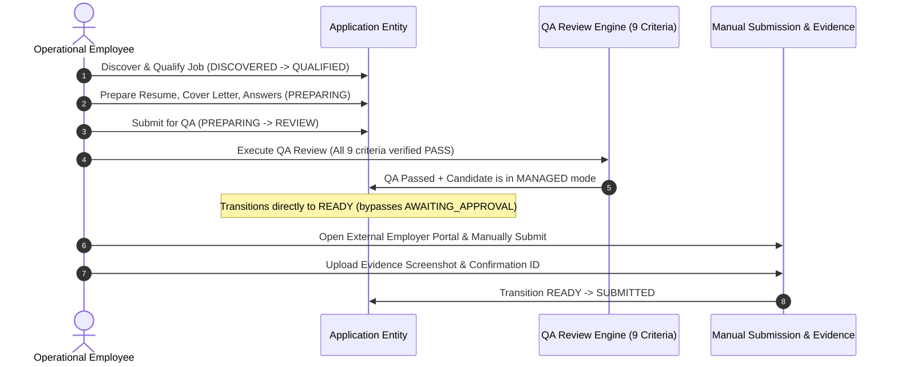
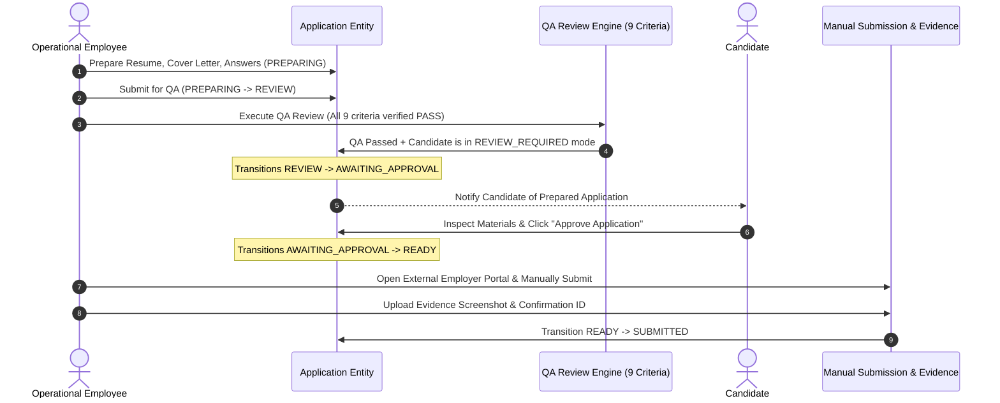

# OOS Engineering Change Specification: Optional Candidate Approval & Managed Application Authorization

**Document Version:** `1.1.0`  
**Status:** `ACCEPTED — FROZEN`  
**Implementation Status:** `IMPLEMENTED — VERIFIED — ACCEPTED`  
**Classification:** Product & Business Model Change Specification (Post-Phase-10 Extension)  
**Target Delivery Path:** `docs/engineering/CHANGE_OPTIONAL_CANDIDATE_APPROVAL_SPEC.md`  
**Authority Reference:** Human Acceptance Gate (Optional Candidate Approval & Managed Application Authorization), OOS Product Vision (§§14, 22, 23), V1 PRD (§§14, 32, 34, 35, 39, 40), Frozen Phase 1–10 Engineering Specifications, Approved ADRs (ADR-001 through ADR-009).

---

## Document Revision History

| Version | Date | Status | Description |
| :--- | :--- | :--- | :--- |
| `1.0.0` | 2026-09-25 | APPROVED — READY FOR IMPLEMENTATION AUTHORIZATION | Formally approved by Human Acceptance Gate for implementation planning. Decouples universal candidate approval from broad managed application authorization. Establishes Managed Application Path (QA Pass $\rightarrow$ `READY` $\rightarrow$ `SUBMITTED`) and Review-Required Path (QA Pass $\rightarrow$ `AWAITING_APPROVAL` $\rightarrow$ `READY` $\rightarrow$ `SUBMITTED`). Enforces bounded authorization against candidate preferences, 9-point QA invariance, human-executed submission with evidence, and authoritative consent revocation. |
| `1.1.0` | 2026-09-25 | ACCEPTED — FROZEN | Formally ratified and accepted by Human Acceptance Gate. Verified implementation complete across schema, RLS, QA actions, submission notifications, candidate actions, UI indicators, and 365 passing tests. Production deployment / pilot launch remains independently governed. |

---

## 1. Executive Summary

This engineering change specification defines a foundational business-model correction for the Operations Operating System (OOS):

> **Core Value Proposition**: The candidate purchases **time savings** through a managed job-application service. Therefore, candidate approval must become **optional and conditional** rather than universally mandatory. Candidates who provide broad authorization for the managed service should not be burdened with reviewing and approving every individual application, provided the application remains strictly within their pre-approved job preferences, work authorization limits, and verified quality standards.

This change specification formalizes:
1. The critical architectural distinction between **Candidate Consent / Managed Application Authorization** (broad authorization to act on the candidate's behalf) and **Per-Application Candidate Approval** (explicit per-job sign-off).
2. Two supported operational execution paths:
   - **Path A (Managed Authorization Path)**: `PREPARING` $\rightarrow$ `REVIEW` (QA Pass) $\rightarrow$ `READY` $\rightarrow$ `SUBMITTED`.
   - **Path B (Review-Required Path)**: `PREPARING` $\rightarrow$ `REVIEW` (QA Pass) $\rightarrow$ `AWAITING_APPROVAL` $\rightarrow$ `READY` $\rightarrow$ `SUBMITTED`.
3. The absolute invariance of **Internal Quality Assurance (QA)**: QA verification against the 9 frozen criteria remains non-negotiably mandatory before any application can become `READY` for external submission.
4. Candidate preference boundary enforcement: Broad authorization is bounded by candidate preferences (target roles, locations, remote preferences, minimum salary, work authorization constraints, and exclusion lists); applications outside these boundaries cannot be submitted under managed authorization without explicit candidate approval.

---

## 2. Business Problem

Under the prior frozen Phase 3 and Phase 5 contracts, every single prepared application was forced through `AWAITING_APPROVAL`, requiring the candidate to log in and click "Approve" before an employee could externally submit it.

This introduced severe operational and commercial bottlenecks:
1. **Destruction of Core Customer Value (Time Savings)**: Candidates hire the managed service specifically to offload the repetitive administrative burden of job applications. Forcing candidates to approve 50–100 applications per month recreates the exact manual friction they paid to eliminate.
2. **Operational Stoppages & Velocity Degradation**: High-quality job openings close rapidly (often within 24–48 hours). When prepared applications sit idle in `AWAITING_APPROVAL` waiting for candidate response, application windows expire, leading to missed opportunities and degraded operational SLAs.
3. **Mismatched Engagement Expectations**: Candidates who explicitly desire a "hands-off, white-glove" managed job search are frustrated by constant approval notifications, while candidates who desire granular control lack an explicit setting to declare their preference.

---

## 3. Current Business Model

The OOS business model delivers a managed operational service where:
- **The Candidate**: Provides truthful career background, defines job preferences and hard constraints, grants legal consent/authorization, and sets their desired level of application governance.
- **The Operational Employee**: Proactively discovers matching jobs, prepares tailored resumes and screening responses, executes internal QA checks, manually submits the application on the employer's portal on behalf of the candidate, and uploads verifiable submission evidence.
- **The System (OOS)**: Acts as the authoritative system of record, enforcing multi-tenant isolation, auditability, candidate preference firewalls, QA checklists, and submission tracking.

---

## 4. Current Frozen Contract (Phases 3 & 5 Baseline)

Under the existing frozen contracts (`PHASE_03_APPLICATION_CORE_SPEC.md` v1.1.0 and `PHASE_05_QA_APPROVAL_SPEC.md` v1.2.2):
- **Universal Approval Invariant**: "Every prepared application must pass through `AWAITING_APPROVAL` and receive explicit candidate sign-off before advancing to `READY` and `SUBMITTED`. There is no administrative override or bypass."
- **Current State Lifecycle**:
  ```text
  DISCOVERED → QUALIFIED → PREPARING → REVIEW → AWAITING_APPROVAL → READY → SUBMITTED
  ```
- **State Semantics**:
  - `REVIEW`: Application undergoing internal operational QA review.
  - `AWAITING_APPROVAL`: Mandatory gate awaiting candidate sign-off.
  - `READY`: Authorized for external manual submission by staff.

---

## 5. Approved Business Requirement

The system must support a **Managed Operating Model** where:
1. Candidates can authorize the operating team to submit applications matching their defined preferences directly upon passing internal QA, without requiring individual per-application approval.
2. Candidates who prefer granular oversight retain the ability to mandate per-application review (`REVIEW_REQUIRED` mode).
3. The operational employee performs the external manual submission and captures evidence in both modes; the platform never executes automated headless bot submissions.
4. Candidate approval is conditional based on the candidate's established authorization policy and the specific application's alignment with their bounded preferences.

---

## 6. Conceptual Distinction: Consent vs. Per-Application Approval

To prevent legal, operational, and architectural conflation, the system enforces a strict separation between two independent authorization constructs:

```text
┌────────────────────────────────────────────────────────────────────────────────────────┐
│                         AUTHORIZATION ARCHITECTURE MATRIX                              │
├───────────────────────────────────────────┬────────────────────────────────────────────┤
│ A. MANAGED APPLICATION CONSENT            │ B. PER-APPLICATION CANDIDATE APPROVAL      │
├───────────────────────────────────────────┼────────────────────────────────────────────┤
│ • "Broad Operational Authority"           │ • "Granular Per-Job Transaction Sign-Off"  │
│ • Legal consent authorizing staff to      │ • Candidate review of specific materials   │
│   represent candidate and apply on their  │   (tailored resume, answers) for 1 job.    │
│   behalf within defined preferences.      │ • Operates at the Application level.       │
│ • Operates at the Candidate/Tenant level. │ • State machine transition:                │
│ • Mandatory prerequisite for ANY work.    │   AWAITING_APPROVAL → READY.               │
│ • If revoked: all unsubmitted apps WITHDRAW│ • Optional / conditional based on policy.  │
└───────────────────────────────────────────┴────────────────────────────────────────────┘
```

**Key Invariant**: The existence of active Candidate Consent is a **necessary baseline** for all operational work, but it does **not** mandate universal per-application approval.

---

## 7. Application Authorization Modes

The specification defines two supported authorization modes:

```text
┌────────────────────────────────────────────────────────────────────────────────────────┐
│                         CANDIDATE AUTHORIZATION MODES                                  │
├────────────────────────────────────────┬───────────────────────────────────────────────┤
│ 1. MANAGED (Supported)                 │ 2. REVIEW_REQUIRED (Supported)                │
├────────────────────────────────────────┼───────────────────────────────────────────────┤
│ • Employee submits suitable            │ • Employee prepares materials; application    │
│   applications passing QA directly     │   MUST transition to AWAITING_APPROVAL.       │
│   without waiting for candidate        │ • Requires explicit candidate approval        │
│   sign-off.                            │   before reaching READY.                      │
│ • Core time-saving business path.      │ • For high-control candidates.                │
└────────────────────────────────────────┴───────────────────────────────────────────────┘
```

*(Note: Extended conditional modes such as `RESTRICTED` remain deferred as future considerations pending explicit human review).*

---

## 8. Managed Application Path (Path A)

For candidates with `authorizationMode === "MANAGED"` where the job satisfies all candidate preference boundaries:



---

## 9. Review-Required Path (Path B)

For candidates with `authorizationMode === "REVIEW_REQUIRED"` or where an application exceeds managed boundary constraints:



---

## 10. Application State Impact & Lifecycle Comparison

### 10.1 Authoritative 14-State Machine Preservation
No new application states are created. The existing 14 states defined in Phase 3 remain preserved:
`DISCOVERED`, `QUALIFIED`, `PREPARING`, `REVIEW`, `AWAITING_APPROVAL`, `READY`, `SUBMITTED`, `SUBMISSION_ISSUE`, `REVIEW_REQUIRED`, `CORRECTION_APPROVED`, `RESUBMISSION`, `REJECTED`, `WITHDRAWN`, `FAILED`.

### 10.2 State Transition Matrix Comparison

| Transition Path | Prior Frozen Contract (v1.1.0) | Approved Change Contract (v1.0.0) | Justification |
| :--- | :--- | :--- | :--- |
| `REVIEW` $\rightarrow$ `AWAITING_APPROVAL` | **Universal**: Mandatory for all QA PASS outcomes. | **Conditional**: Entered only when candidate is in `REVIEW_REQUIRED` mode or application triggers boundary exceptions. | Allows managed candidates to bypass individual sign-off. |
| `REVIEW` $\rightarrow$ `READY` | **Prohibited**: Direct transition was disallowed. | **Permitted for Managed**: Valid QA PASS automatically transitions directly to `READY` when candidate is in `MANAGED` mode. | Implements the core time-saving managed application flow. |
| `AWAITING_APPROVAL` $\rightarrow$ `READY` | **Permitted**: Via explicit candidate approval. | **Preserved**: Retained intact for all `REVIEW_REQUIRED` workflows. | Preserves candidate choice and granular oversight. |
| `AWAITING_APPROVAL` $\rightarrow$ `PREPARING` | **Permitted**: Via candidate revision request. | **Preserved**: Retained intact for `REVIEW_REQUIRED` workflows. | Candidate feedback loop remains standard. |
| `READY` $\rightarrow$ `SUBMITTED` | **Permitted**: Requires manual submission evidence. | **Preserved**: Requires manual external submission and evidence upload by employee in all modes. | Employee remains the human operator. |

---

## 11. Candidate Experience & Preference Boundaries

### 11.1 Bounded Authorization Principle
> *"Managed authorization is bounded authorization, not unrestricted authority."*

A candidate's broad managed consent is valid **only within the boundary of their approved profile preferences**:
1. **Target Roles**: e.g., `["Software Engineer", "Backend Engineer"]`.
2. **Target Locations & Remote Preference**: `REMOTE_ONLY`, `HYBRID`, `ONSITE`, `FLEXIBLE`.
3. **Compensation Floor**: Minimum base salary (e.g., `$140,000 USD`).
4. **Employment Type**: `FULL_TIME`, `CONTRACT`, etc.
5. **Work Authorization & Sponsorship Constraints**: Must strictly match candidate legal status.
6. **Company / Industry Exclusions**: Candidate-defined exclusion lists (e.g., current employer).

### 11.2 Boundary Violation Safety Rule
If an employee prepares an application for a job that falls **outside** the candidate's stated preferences (e.g., salary below minimum, hybrid when candidate is remote-only, or company on exclusion list):
- The application **CANNOT** use the `MANAGED` direct-to-`READY` path.
- The application must automatically route to `AWAITING_APPROVAL` with an explicit notice: *"This application requires your review because it falls outside your standard preferences (e.g. Compensation / Location mismatch)."*

### 11.3 Candidate UI Messaging
- **Managed Account Banner**: *"You have authorized our team to apply to suitable jobs on your behalf within your approved preferences. Applications matching your criteria will be submitted directly after passing internal QA."*
- **Review-Required Account Banner**: *"You have selected per-application review. All prepared applications will pause for your explicit approval before our team submits them."*

---

## 12. Employee Operational Experience

1. **Unmistakable Authorization Visibility**: On the Employee Application Workbench (`/employee/applications/[id]`), the authorization status is prominently displayed:
   - `[MANAGED AUTHORIZATION]`: *"Authorized for direct submission upon passing QA."*
   - `[REVIEW REQUIRED]`: *"Candidate approval required prior to external submission."*
2. **Post-QA State Clarity**:
   - In Managed mode: Passing QA immediately enables the "Submit Application Externally" workflow (`READY` state).
   - In Review-Required mode: Passing QA places the application in `AWAITING_APPROVAL` and disables the submission button until the candidate approves.
3. **Manual Submission Responsibility**: The employee remains the human operator who navigates to the external portal, fills out the employer application, submits, and captures the confirmation screenshot.

---

## 13. Admin Oversight & Governance

Administrators gain full visibility and control over tenant authorization modes:
1. **Candidate Profile Inspection**: View current authorization mode (`MANAGED` vs `REVIEW_REQUIRED`), date established, and preference boundary settings.
2. **Tenant Governance**: View and audit candidate-level authorization mode settings and state progressions across the organization.
3. **Audit Visibility**: Inspect audit logs for mode changes, managed submissions, and candidate approvals across the tenant.

---

## 14. Quality Assurance (QA) Invariance

> **CRITICAL INVARIANT**: Optional candidate approval does **NOT** mean optional Quality Assurance.

Internal QA review remains non-negotiable. The 9 authoritative criteria defined in Phase 5 (§34) must continue to be evaluated on every single application regardless of authorization mode:

1. `CANDIDATE_JOB_ALIGNMENT`
2. `RESUME_ACCURACY`
3. `JOB_REQUIREMENTS_MATCH`
4. `SALARY_ALIGNMENT`
5. `LOCATION_AUTHORIZATION`
6. `WORK_AUTHORIZATION`
7. `SCREENING_ANSWERS`
8. `APPLICATION_COMPLETENESS`
9. `CANDIDATE_CONSENT_ACTIVE`

**Distinction**: QA verifies **application correctness and truthfulness**; Candidate Approval governs **customer authorization mode**. Neither replaces or weakens the other.

---

## 15. Submission & Evidence Execution (Phase 6 Alignment)

1. **Pre-Submission Eligibility**: An application is eligible for external submission **only** when in `READY` status.
2. **Transition to READY**:
   - Managed Mode: Reached via QA Pass (`REVIEW` $\rightarrow$ `READY`).
   - Review-Required Mode: Reached via Candidate Approval (`AWAITING_APPROVAL` $\rightarrow$ `READY`).
3. **Evidence Capture Invariant**: Recording submission timestamp, submitting staff ID, confirmation screenshot, and portal reference remains strictly mandatory for transitioning `READY` $\rightarrow$ `SUBMITTED`.

---

## 16. Communication & Notification Impact

Using the existing Phase 7 `Notification` and `EmailNotificationService` infrastructure:
- **Managed Mode Notifications**: When an application is submitted under managed authorization, candidate receives a notification: *"Application Submitted: [Job Title] at [Company Name] — View Evidence"*.
- **Review-Required Notifications**: When QA passes, candidate receives: *"Action Required: Review and approve your application for [Job Title] at [Company Name]"*.
- **No External Infrastructure**: No SMS, WhatsApp, or third-party queues are introduced.

---

## 17. Authoritative Audit Stream Integration

All events record strictly in `public.audit_events` using the existing audit architecture:

| Proposed Audit Action | Actor Type | Key Audit Payload Details | Governance Status |
| :--- | :--- | :--- | :--- |
| `CANDIDATE_MANAGED_AUTHORIZATION_GRANTED` | `USER` (Candidate) | `candidateId`, `mode: MANAGED`, `effectiveDate` | `[HUMAN PRODUCT DECISION REQUIRED]` |
| `CANDIDATE_AUTHORIZATION_MODE_CHANGED` | `USER` (Cand/Admin)| `candidateId`, `oldMode`, `newMode`, `reason` | `[HUMAN PRODUCT DECISION REQUIRED]` |
| `APPLICATION_ADVANCED_TO_READY_MANAGED` | `USER` (Staff/QA) | `applicationId`, `qaReviewId`, `authorizationMode: MANAGED` | `[HUMAN PRODUCT DECISION REQUIRED]` |
| `APPLICATION_APPROVED_BY_CANDIDATE` | `USER` (Candidate) | `applicationId`, `approvedAt`, `approvedBy` | Existing Frozen Event |
| `APPLICATION_SUBMITTED` | `USER` (Staff) | `applicationId`, `submissionId`, `authorizationMode` | Existing Frozen Event |

---

## 18. Security & Authorization Integrity

1. **Server-Derived Context**: Authorization mode is evaluated server-side during the QA review mutation; client cannot force a direct transition to `READY`.
2. **Consent Revocation Invariant**: If candidate consent is revoked:
   - **ALL** unsubmitted applications (in `PREPARING`, `REVIEW`, `AWAITING_APPROVAL`, `READY`) immediately transition to `WITHDRAWN`.
   - Relevant open operational tasks are canceled according to the existing frozen contract.
   - External submission is strictly blocked.
   - Already `SUBMITTED` applications remain historical records.
   - Candidate lifecycle status does not automatically change.
3. **Anti-Replay / Double Submission**: Database locks and transaction isolation prevent concurrent submission attempts.
4. **Zero AI / Headless Automation**: All submissions must be performed manually by an authenticated staff member; automated external script submission remains prohibited.

---

## 19. RLS & Multi-Tenancy Impact

- **Tenant Isolation**: All authorization mode settings and application transitions remain strictly isolated by `organizationId`.
- **Candidate Scoping**: Candidates can only view and mutate their own authorization mode.
- **Forced RLS**: PostgreSQL `FORCE ROW LEVEL SECURITY` policies remain fully enforced across `candidates`, `applications`, `application_qa_reviews`, and `audit_events`.

---

## 20. Database Impact Analysis

### 20.1 Proposed Minimal Schema Delta
To minimize schema churn, evaluate adding an authorization mode enum and field to the `Candidate` model:

```prisma
// Proposed Enum
enum ApplicationAuthorizationMode {
  MANAGED
  REVIEW_REQUIRED
}

// Proposed Candidate Field Addition
model Candidate {
  // ... existing Phase 2 fields ...
  applicationAuthorizationMode ApplicationAuthorizationMode @default(MANAGED) @map("application_authorization_mode")
  // ... rest of model ...
}
```

### 20.2 Schema Evaluation Notes
- **Why on Candidate?**: Authorization mode is an account-level customer preference governing how the operations team services the candidate.
- **Migration Impact**: Additive non-destructive migration; existing candidates backfilled with default policy upon implementation approval.

---

## 21. API & Server Action Impact

1. **`executeQaReviewAction` (`src/lib/qa/actions.ts`)**:
   - Update logic on `decision === PASS`:
     - If candidate's effective mode is `MANAGED` and no boundary violations exist $\rightarrow$ Transition application directly from `REVIEW` to `READY`, set `approvalStatus = APPROVED` (system-managed), and stage for submission.
     - If candidate is `REVIEW_REQUIRED` or boundary violation exists $\rightarrow$ Transition `REVIEW` to `AWAITING_APPROVAL` and set `approvalStatus = PENDING`.
2. **`updateCandidateAuthorizationModeAction` (`src/lib/candidate/actions.ts`)**:
   - New server action allowing authenticated candidate (or authorized admin) to toggle between `MANAGED` and `REVIEW_REQUIRED`.

---

## 22. Testing Plan & Quality Firewalls

### 22.1 Future Verification Matrix
- **Test A (Managed Golden Path)**: Candidate in `MANAGED` mode $\rightarrow$ Employee prepares application $\rightarrow$ QA passes $\rightarrow$ Application transitions directly to `READY` $\rightarrow$ Employee submits externally with evidence $\rightarrow$ Transitions to `SUBMITTED`.
- **Test B (Review-Required Golden Path)**: Candidate in `REVIEW_REQUIRED` mode $\rightarrow$ QA passes $\rightarrow$ Application transitions to `AWAITING_APPROVAL` $\rightarrow$ Submission blocked $\rightarrow$ Candidate approves $\rightarrow$ Transitions to `READY` $\rightarrow$ Submission permitted.
- **Test C (Boundary Exception Handling)**: Candidate in `MANAGED` mode, but job salary is below candidate minimum $\rightarrow$ QA pass routes to `AWAITING_APPROVAL` instead of `READY`.
- **Test D (Consent Revocation Immediate Effect)**: Candidate revokes consent $\rightarrow$ All pre-submission applications (in `PREPARING`, `REVIEW`, `AWAITING_APPROVAL`, `READY`) transition to `WITHDRAWN` $\rightarrow$ External submission blocked.
- **Test E (Post-Submission Consent Revocation)**: Consent revoked after external submission $\rightarrow$ Historical `SUBMITTED` record remains intact.
- **Test F (Tenant Isolation)**: Candidate A in Org 1 changing mode cannot affect Candidate B in Org 2.
- **Test G (Role Security)**: Candidate cannot submit applications externally; Employee cannot approve applications on behalf of candidate in `REVIEW_REQUIRED` mode.

---

## 23. Golden Path Impact

The Phase 9 Golden Path must be updated to formally incorporate and test **both** operational paths:
- **Golden Path A (Managed Service Path)**: Discovered $\rightarrow$ Qualified $\rightarrow$ Preparing $\rightarrow$ Review (QA Pass) $\rightarrow$ Ready $\rightarrow$ Manual Submission & Evidence $\rightarrow$ Submitted.
- **Golden Path B (Review-Required Path)**: Discovered $\rightarrow$ Qualified $\rightarrow$ Preparing $\rightarrow$ Review (QA Pass) $\rightarrow$ Awaiting Approval $\rightarrow$ Candidate Approval $\rightarrow$ Ready $\rightarrow$ Manual Submission & Evidence $\rightarrow$ Submitted.

---

## 24. Phase 1–10 Impact Matrix

| Phase Specification | Classification | Detailed Impact Description |
| :--- | :--- | :--- |
| **Phase 1: Identity & RBAC** | `NO CHANGE` | Roles (`CANDIDATE`, `EMPLOYEE`, `ADMIN`) and tenancy remain unchanged. |
| **Phase 2: Candidate Core** | `CONTRACT CHANGE REQUIRED` | Add `applicationAuthorizationMode` to candidate profile domain and preferences. |
| **Phase 3: Application Core** | `CONTRACT CHANGE REQUIRED` | Update state machine transitions: permit `REVIEW` $\rightarrow$ `READY` for managed mode while preserving `REVIEW` $\rightarrow$ `AWAITING_APPROVAL` for review-required mode. |
| **Phase 4: Task & Preparation** | `NO CHANGE` | Preparation tasks (`PREPARE_RESUME`, `APPLICATION_QA`) execute identically. |
| **Phase 5: QA & Approval Core** | `CONTRACT CHANGE REQUIRED` | Update QA decision handler to conditionally branch to `READY` vs `AWAITING_APPROVAL`. Candidate approval becomes conditional. 9 QA criteria remain invariant. |
| **Phase 6: Submission & Evidence**| `NO CHANGE` | Pre-submission requirement remains `READY`; manual submission and evidence capture unchanged. |
| **Phase 7: Communication** | `IMPLEMENTATION CHANGE REQUIRED`| Add notification triggers for managed application submission events. |
| **Phase 8: Admin & Privacy** | `NO CHANGE` | Admin oversight views display candidate authorization mode. Privacy requests unaffected. |
| **Phase 9: Golden Path** | `TEST CHANGE REQUIRED` | Expand golden path verification suite to test both Managed and Review-Required paths. |
| **Phase 10: Production Pilot** | `DOCUMENTATION CHANGE REQUIRED`| Document operational procedures for managing candidate authorization modes during pilot. |

*(Note: Frozen Phase specifications remain frozen and will only be updated via controlled change releases upon implementation authorization).*

---

## 25. Post-Phase-9 Operational Hardening Impact

- **Hardening Baseline Intact**: Transaction-scoped RLS, strict input sanitization, and deterministic error handling established in Post-Phase-9 Hardening are fully preserved.
- **State Transition Guards**: Ensure `withRlsContext()` protects the new conditional branch in QA resolution.

---

## 26. Production Pilot Impact

Phase 10 is currently `ACCEPTED — FROZEN` with implementation `IMPLEMENTED — VERIFIED — ACCEPTED`.

This change specification represents an approved business-model update that will be incorporated into the pilot roadmap via controlled implementation authorization.

---

## 27. Migration Considerations

1. **Additive Schema Migration**: Adding `application_authorization_mode` with default value `MANAGED` requires zero breaking table drops.
2. **Backfill**: Existing seed/test candidates backfilled to `MANAGED`.
3. **Zero Downtime**: Non-blocking DDL execution compatible with PostgreSQL concurrent operations.

---

## 28. Rollback Considerations

1. **Code Revert**: Reverting server action branches restores universal `REVIEW` $\rightarrow$ `AWAITING_APPROVAL` routing.
2. **Data Safety**: All applications in `READY` or `SUBMITTED` states remain completely valid and auditable.

---

## 29. Unresolved Human Decisions Required

The following product and operational decisions remain explicitly flagged as unresolved pending formal implementation kickoff:

```text
┌────────────────────────────────────────────────────────────────────────────────────────┐
│                               HUMAN DECISIONS REQUIRED                                 │
├──────────────┬─────────────────────────────────────────────────────────────────────────┤
│ DECISION-1   │ Default Candidate Authorization Mode                                    │
│              │ • Option A (PROPOSED RECOMMENDATION): Default to MANAGED (opt-out of    │
│              │   individual approval, maximizing time savings).                        │
│              │ • Option B: Default to REVIEW_REQUIRED (opt-in to managed submissions). │
│              │ Status: [HUMAN PRODUCT DECISION REQUIRED]                               │
├──────────────┼─────────────────────────────────────────────────────────────────────────┤
│ DECISION-2   │ Specific Audit Action Vocabulary                                        │
│              │ • Proposed: CANDIDATE_MANAGED_AUTHORIZATION_GRANTED,                    │
│              │   CANDIDATE_AUTHORIZATION_MODE_CHANGED,                                 │
│              │   APPLICATION_ADVANCED_TO_READY_MANAGED.                                │
│              │ Status: [HUMAN PRODUCT DECISION REQUIRED]                               │
├──────────────┼─────────────────────────────────────────────────────────────────────────┤
│ DECISION-3   │ Exact Notification Cadence for Managed Applications                     │
│              │ • Immediate transactional email on submission vs daily digest.          │
│              │ Status: [HUMAN PRODUCT DECISION REQUIRED]                               │
├──────────────┼─────────────────────────────────────────────────────────────────────────┤
│ DECISION-4   │ Exact Mode-Switching Rules                                              │
│              │ • Allow mode toggle anytime vs restrict when applications in review.    │
│              │ Status: [HUMAN PRODUCT DECISION REQUIRED]                               │
└──────────────┴─────────────────────────────────────────────────────────────────────────┘
```

---

## 30. Open Questions

1. **Candidate Mode Switching Frequency**: Should candidates be permitted to toggle between `MANAGED` and `REVIEW_REQUIRED` at any time, or only when no applications are currently in `REVIEW`? *(Proposed recommendation: Allow at any time; changes apply immediately to subsequent QA reviews).*
2. **Notification Cadence for Managed Applications**: Should managed candidates receive immediate email notifications upon each submission, or a daily digest? *(Proposed recommendation: Immediate notification via existing Phase 7 system).*

---

## 31. Approved Acceptance Criteria (Binary Verification Checklist)

- [ ] Candidate approval is optional and governed by the candidate's `applicationAuthorizationMode`.
- [ ] Supported modes include `MANAGED` and `REVIEW_REQUIRED`.
- [ ] For `MANAGED` candidates, passing QA review transitions application directly from `REVIEW` to `READY`.
- [ ] For `REVIEW_REQUIRED` candidates, passing QA review transitions application from `REVIEW` to `AWAITING_APPROVAL`.
- [ ] In `REVIEW_REQUIRED` mode, candidate approval is required to transition `AWAITING_APPROVAL` to `READY`.
- [ ] Internal QA review of all 9 criteria remains strictly mandatory in both modes.
- [ ] Applications violating candidate preference boundaries cannot advance to `READY` under managed authorization without explicit candidate approval.
- [ ] External submission requires manual execution and evidence capture by staff in all modes.
- [ ] Consent revocation immediately transitions all unsubmitted applications to `WITHDRAWN`.
- [ ] Audit events record authorization mode changes and managed state progressions.
- [ ] Phase 1–10 contracts remain intact with zero unauthorized regressions.

---

## 32. Explicit Non-Goals

This change specification strictly prohibits:
- No automated external submission bots or headless browser scripts.
- No automated job board scrapers or ATS API integrations.
- No AI/LLM resume generation or automated cover letter tailoring.
- No billing, subscriptions, payment gateways, or fee processing.
- No background queue workers (Redis, Kafka, BullMQ, Celery).
- No new RBAC roles (`SUPER_ADMIN`, `MANAGER`, `QA_DIRECTOR`).

---

## 33. Final Change Boundary & Safety Guarantee

```text
╔════════════════════════════════════════════════════════════════════════════════════════╗
║                                 GOVERNANCE FIREWALL                                    ║
╠════════════════════════════════════════════════════════════════════════════════════════╣
║ Current Specification Status: APPROVED — READY FOR IMPLEMENTATION AUTHORIZATION        ║
║ Implementation Authorization: NOT AUTHORIZED                                           ║
║                                                                                        ║
║ RULES:                                                                                 ║
║ 1. DO NOT apply Prisma migrations or modify schema.prisma.                            ║
║ 2. DO NOT modify QA review actions or application state machine code.                 ║
║ 3. DO NOT alter frozen Phase 1–10 specifications.                                     ║
║ 4. Await explicit human implementation release before coding.                         ║
╚════════════════════════════════════════════════════════════════════════════════════════╝
```

---

## 34. Governance & Approval Gate

- **Author**: Antigravity AI Engineering Assistant
- **Status**: `APPROVED — READY FOR IMPLEMENTATION AUTHORIZATION`
- **Implementation Gate**: `NOT AUTHORIZED`
- **Next Step**: Await formal human implementation release.
