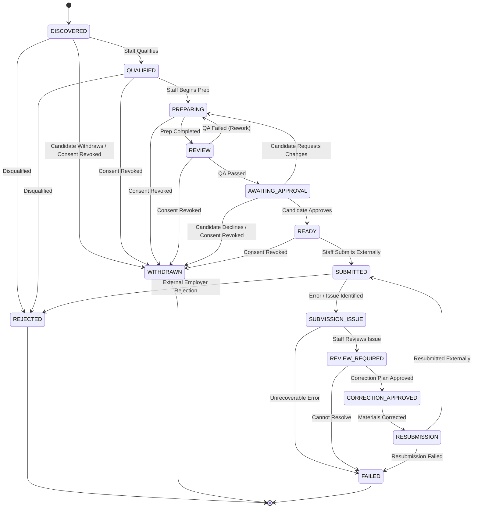

# PHASE 3 — APPLICATION CORE ENGINEERING SPECIFICATION

> **Status:** DRAFT — PENDING HUMAN APPROVAL  
> **Version:** 1.1.0  
> **Document Type:** Engineering Specification  
> **Product:** Operations Operating System (OOS)  
> **Phase:** Phase 3 — Application Core  
> **Date:** 2026-09-24  
> **Implementation Authorization:** NOT AUTHORIZED  

---

## 1. Document Control

| Property | Value |
| :--- | :--- |
| **Document Title** | Phase 3 — Application Core Engineering Specification |
| **Document Version** | 1.1.0 (with Addendum v1.2.0) |
| **Status** | DRAFT — PENDING HUMAN APPROVAL (Addendum Ratified) |
| **Classification** | Engineering Contract |
| **Parent Specification** | `docs/01_V1_PRD.md` (v1.3.0), `docs/00_PRODUCT_VISION.md` |
| **Preceding Phases** | Phase 1 (v1.5.0), Phase 2 (v1.2.0) |
| **Implementation Gate** | FROZEN — IMPLEMENTATION PROHIBITED UNTIL HUMAN APPROVAL |

---

## 2. Phase Objective

The objective of Phase 3 is to establish the controlled operational **Application Core** connecting:
```text
Candidate (Phase 2 Core)
       ↓
      Job
       ↓
  Application
       ↓
Preparation & Review
       ↓
Universal Candidate Approval
       ↓
Manual Submission & Evidence
```

Phase 3 implements the single system of record for managing the end-to-end operational lifecycle of job applications within the approved V1 boundary.

---

## 3. Authority Hierarchy

All engineering design decisions in this document derive strictly from the following order of precedence:

1. **Explicit Human Decisions**
   - **Reapplication Policy**: A candidate can have at most one active (non-terminal) application per job. If a prior application is in a terminal state (`REJECTED`, `WITHDRAWN`, `FAILED`), a new application can be created for the same job.
   - **Candidate Approval Policy**: Universal Candidate Approval. Every prepared application must pass through `AWAITING_APPROVAL` and receive explicit candidate sign-off before advancing to `READY` and `SUBMITTED`.
   - **Resubmission Limit**: No hardcoded automated limit. The correction cycle is human-controlled by Staff/Admin, with incremental `attemptNumber` tracking on every submission attempt.
2. **OOS Product Vision** (`docs/00_PRODUCT_VISION.md`)
3. **OOS V1 Product Requirements Document** (`docs/01_V1_PRD.md`)
4. **Accepted Phase 1 Engineering Specification** (`docs/engineering/PHASE_01_IDENTITY_RBAC_SPEC.md` v1.5.0)
5. **Accepted Phase 2 Engineering Specification** (`docs/engineering/PHASE_02_CANDIDATE_CORE_SPEC.md` v1.2.0)
6. **Accepted ADRs** (`ADR-001` through `ADR-005`)
7. **Accepted Implementation Contracts**

---

## 4. Scope

Phase 3 defines the engineering contracts, data models, state machines, validation rules, RLS policies, audit mechanisms, server actions, and UI specifications for:

- **Job Entity**: Manual job creation, review, qualification metadata, and lifecycle.
- **Application Entity**: Operational representation linking a Candidate, a Job, and an Organization.
- **Application State Machine**: The authoritative 14-state lifecycle defined in V1 PRD Section 32.
- **Application Preparation Model**: Manual resume version selection, cover letter text, and screening answers.
- **Application Review & QA**: Pre-submission quality assurance check.
- **Universal Candidate Approval**: Explicit, auditable candidate sign-off workflow before external submission.
- **Manual Submission & Evidence**: Recording submission timestamps, submitting employee, external references, and confirmation evidence.
- **Submission Correction Cycle**: Auditable non-destructive correction loop (`SUBMITTED` → `SUBMISSION_ISSUE` → `REVIEW_REQUIRED` → `CORRECTION_APPROVED` → `RESUBMISSION` → `SUBMITTED`).
- **Consent Revocation Hook**: Deterministic transition of unsubmitted applications to `WITHDRAWN`.
- **Application Audit Logging**: Full append-only audit trail for all application events.

---

## 5. Phase Boundary

### In-Scope:
- Relational schema for Jobs, Applications, Application Materials, Application Submissions, and Application State History.
- Server-side state machine enforcing all 14 V1 application states and permitted transitions.
- Transaction-local PostgreSQL RLS with `FORCE ROW LEVEL SECURITY` for runtime role `oos_app_runtime`.
- Server actions with strict Zod validation for candidate, employee, and admin application workflows.
- Server-rendered dashboards for Candidate Application Review, Employee Application Workspace, and Admin Application Oversight.

### Strict Out-of-Scope (Firewall):
- Automated job scraping, board crawling, or third-party ATS API integrations.
- AI-generated resumes, AI-tailored text, AI cover letters, or AI screening answers.
- Automated browser submission (Puppeteer/Playwright/Selenium) or robotic process automation (RPA).
- Automated job matching, scoring algorithms, or automated candidate-job routing.
- Task management engine, SLA calculation, and escalation engine (deferred to later V1 phase).
- Candidate-employee messaging and communication channels (deferred to later V1 phase).
- Billing, payments, subscriptions, interview scheduling, and offer management.

---

## 6. Application Domain Model

```
+-----------------------------------------------------------------------------+
|                                Organization                                 |
+-----------------------------------------------------------------------------+
         |                                           |
         | 1:N                                       | 1:N
         v                                           v
+------------------+                       +-------------------+
|    Candidate     |                       |        Job        |
| (Phase 2 Core)   |                       | (Manual Creation) |
+------------------+                       +-------------------+
         \                                           /
          \ 1:N                                     / 1:N
           \                                       /
            v                                     v
   +-----------------------------------------------------+
   |                     Application                     |
   |  - id, organizationId, candidateId, jobId           |
   |  - status (14 V1 States)                            |
   |  - assignedEmployeeId (Operational tag)             |
   |  - approvalStatus, approvedAt, approvedBy           |
   +-----------------------------------------------------+
        |                     |                       |
        | 1:N                 | 1:N                   | 1:N
        v                     v                       v
+----------------+   +-------------------+   +--------------------+
|  Application   |   |    Application    |   |    Application     |
|   Materials    |   |    Submissions    |   |   State History    |
| (Resume, Text) |   | (Evidence, Notes) |   | (Audit Transition) |
+----------------+   +-------------------+   +--------------------+
```

---

## 7. Candidate ↔ Application Relationship

1. **Tenancy Integrity**: An application must belong to the same `organizationId` as the referenced `candidateId`. Cross-organization application linking is prohibited by foreign keys and RLS.
2. **Candidate Status Precondition**: An application can only be created for a candidate whose lifecycle status is `ACTIVE` (or `ONBOARDING` if staff initiates triage). Applications cannot be created for `ARCHIVED` candidates.
3. **Source of Truth Hierarchy**: The application references candidate documents created in Phase 2 (`candidate_documents`), specifically pinning immutable `candidateDocumentId` and `documentVersion`. Subsequent candidate profile edits do not overwrite historical application snapshots.
4. **Self-Service Visibility**: Candidates can view all applications associated with their `candidateId` within their tenant organization.

---

## 8. Job ↔ Application Relationship

1. **Job Tenancy**: Jobs are scoped to `organizationId`. An application can only link to a job belonging to the identical `organizationId`.
2. **Manual Ingestion**: Jobs are created and qualified manually by authorized Employees or Admins (V1 PRD Section 29 & 30).
3. **Job Status Guard**: An application cannot transition to `READY` or `SUBMITTED` if the underlying Job status is `CLOSED` or `ARCHIVED`.

---

## 9. Application Data Model

### 9.1 Prisma Schema Definition

```prisma
enum ApplicationStatus {
  DISCOVERED
  QUALIFIED
  PREPARING
  REVIEW
  AWAITING_APPROVAL
  READY
  SUBMITTED
  SUBMISSION_ISSUE
  REVIEW_REQUIRED
  CORRECTION_APPROVED
  RESUBMISSION
  REJECTED
  WITHDRAWN
  FAILED
}

enum JobStatus {
  OPEN
  CLOSED
  ARCHIVED
}

enum JobEmploymentType {
  FULL_TIME
  PART_TIME
  CONTRACT
  INTERNSHIP
  TEMPORARY
}

enum ApplicationApprovalStatus {
  PENDING
  APPROVED
  REVISION_REQUESTED
}

model Job {
  id                 String            @id @default(dbgenerated("gen_random_uuid()")) @db.Uuid
  organizationId     String            @db.Uuid
  title              String            @db.VarChar(255)
  companyName        String            @db.VarChar(255)
  jobDescription     String            @db.Text
  location           String?           @db.VarChar(255)
  isRemote           Boolean           @default(false)
  employmentType     JobEmploymentType @default(FULL_TIME)
  salaryMin          Int?
  salaryMax          Int?
  salaryCurrency     String?           @default("USD") @db.VarChar(10)
  source             String?           @db.VarChar(100)
  externalUrl        String?           @db.VarChar(1024)
  qualificationNotes String?           @db.Text
  status             JobStatus         @default(OPEN)
  createdById        String            @db.Uuid
  createdAt          DateTime          @default(now()) @db.Timestamptz(6)
  updatedAt          DateTime          @default(now()) @updatedAt @db.Timestamptz(6)

  organization       Organization      @relation(fields: [organizationId], references: [id], onDelete: Restrict)
  createdBy          User              @relation("JobCreator", fields: [createdById], references: [id], onDelete: Restrict)
  applications       Application[]

  @@index([organizationId, status])
  @@map("jobs")
}

model Application {
  id                   String                     @id @default(dbgenerated("gen_random_uuid()")) @db.Uuid
  organizationId       String                     @db.Uuid
  candidateId          String                     @db.Uuid
  jobId                String                     @db.Uuid
  status               ApplicationStatus          @default(DISCOVERED)
  assignedEmployeeId   String?                    @db.Uuid
  approvalStatus       ApplicationApprovalStatus?
  approvalRequestedAt  DateTime?                  @db.Timestamptz(6)
  approvedAt           DateTime?                  @db.Timestamptz(6)
  approvedBy           String?                    @db.Uuid
  approvalNotes        String?                    @db.Text
  rejectionReason      String?                    @db.Text
  failureReason        String?                    @db.Text
  withdrawalReason     String?                    @db.Text
  createdAt            DateTime                   @default(now()) @db.Timestamptz(6)
  updatedAt            DateTime                   @default(now()) @updatedAt @db.Timestamptz(6)

  organization         Organization               @relation(fields: [organizationId], references: [id], onDelete: Restrict)
  candidate            Candidate                  @relation(fields: [candidateId], references: [id], onDelete: Restrict)
  job                  Job                        @relation(fields: [jobId], references: [id], onDelete: Restrict)
  assignedEmployee     User?                      @relation("ApplicationAssignee", fields: [assignedEmployeeId], references: [id], onDelete: SetNull)
  approver             User?                      @relation("ApplicationApprover", fields: [approvedBy], references: [id], onDelete: SetNull)
  materials            ApplicationMaterial[]
  submissions          ApplicationSubmission[]
  stateHistory         ApplicationStateHistory[]

  @@index([organizationId, status])
  @@index([assignedEmployeeId, status])
  @@index([candidateId, status])
  @@map("applications")
}

model ApplicationMaterial {
  id                  String             @id @default(dbgenerated("gen_random_uuid()")) @db.Uuid
  applicationId       String             @db.Uuid
  candidateDocumentId String?            @db.Uuid
  documentVersion     Int?
  coverLetterText     String?            @db.Text
  screeningAnswers    Json?              @db.JsonB
  customNotes         String?            @db.Text
  isCurrent           Boolean            @default(true)
  createdById         String             @db.Uuid
  createdAt           DateTime           @default(now()) @db.Timestamptz(6)

  application         Application        @relation(fields: [applicationId], references: [id], onDelete: Cascade)
  candidateDocument   CandidateDocument? @relation(fields: [candidateDocumentId], references: [id], onDelete: Restrict)
  createdBy           User               @relation(fields: [createdById], references: [id], onDelete: Restrict)

  @@index([applicationId, isCurrent])
  @@map("application_materials")
}

model ApplicationSubmission {
  id                   String      @id @default(dbgenerated("gen_random_uuid()")) @db.Uuid
  applicationId        String      @db.Uuid
  attemptNumber        Int         @default(1)
  submittedAt          DateTime    @default(now()) @db.Timestamptz(6)
  submittedById        String      @db.Uuid
  externalReference    String?     @db.VarChar(255)
  externalUrl          String?     @db.VarChar(1024)
  confirmationEvidence String?     @db.Text
  submissionNotes      String?     @db.Text
  issueDescription     String?     @db.Text
  correctionNotes      String?     @db.Text
  createdAt            DateTime    @default(now()) @db.Timestamptz(6)

  application          Application @relation(fields: [applicationId], references: [id], onDelete: Cascade)
  submittedBy          User        @relation(fields: [submittedById], references: [id], onDelete: Restrict)

  @@index([applicationId, attemptNumber])
  @@map("application_submissions")
}

model ApplicationStateHistory {
  id             String             @id @default(dbgenerated("gen_random_uuid()")) @db.Uuid
  applicationId  String             @db.Uuid
  fromStatus     ApplicationStatus?
  toStatus       ApplicationStatus
  changedById    String             @db.Uuid
  reason         String?            @db.Text
  createdAt      DateTime           @default(now()) @db.Timestamptz(6)

  application    Application        @relation(fields: [applicationId], references: [id], onDelete: Cascade)
  changedBy      User               @relation(fields: [changedById], references: [id], onDelete: Restrict)

  @@index([applicationId, createdAt])
  @@map("application_state_history")
}
```

### 9.2 Database Index for Reapplication Policy

To enforce the human-approved reapplication rule (at most one active application per candidate-job pair), a PostgreSQL partial unique index is required:

```sql
CREATE UNIQUE INDEX "applications_active_candidate_job_idx" 
ON "public"."applications"("candidateId", "jobId") 
WHERE "status" NOT IN ('REJECTED', 'WITHDRAWN', 'FAILED');
```

---

## 10. Application Lifecycle

The 14 authoritative V1 application states (V1 PRD Section 32):

| State | Classification | Description |
| :--- | :--- | :--- |
| `DISCOVERED` | Intake | Job identified and initially associated with candidate. |
| `QUALIFIED` | Triage | Staff confirmed candidate meets mandatory job requirements. |
| `PREPARING` | Authoring | Staff actively assembling tailored resume version, cover letter, and screening answers. |
| `REVIEW` | Internal QA | Prepared application undergoing internal operational quality assurance check. |
| `AWAITING_APPROVAL` | Gate | Application locked and submitted to candidate portal for explicit candidate sign-off. |
| `READY` | Staging | Application fully approved and queued for manual external submission. |
| `SUBMITTED` | Execution | Staff completed manual external submission and recorded confirmation evidence. |
| `SUBMISSION_ISSUE` | Incident | Post-submission issue identified (e.g., portal error, expired listing, bad link). |
| `REVIEW_REQUIRED` | Incident Triage | Staff actively reviewing submission defect and determining correction strategy. |
| `CORRECTION_APPROVED` | Correction Gate | Staff approved corrected submission materials. |
| `RESUBMISSION` | Resubmission Staging | Application staged for secondary external submission attempt. |
| `REJECTED` | Terminal / Outcome | External employer issued rejection or candidate disqualified during triage. |
| `WITHDRAWN` | Terminal / Revocation | Candidate withdrew application or candidate consent was revoked. |
| `FAILED` | Terminal / Defect | Application unrecoverable due to operational defect or employer job cancellation. |

---

## 11. Application State Machine



---

## 12. State Transition Rules

| Transition | Permitted Actor | Preconditions & Validation | Side Effects & Audit Event |
| :--- | :--- | :--- | :--- |
| `*` → `WITHDRAWN` | Candidate, Staff, System (Consent) | Unsubmitted application (`status != SUBMITTED`). | Creates `ApplicationStateHistory`, emits `APPLICATION_STATUS_CHANGED`. |
| `DISCOVERED` → `QUALIFIED` | Employee, Admin | Candidate status `ACTIVE`, Job status `OPEN`. | Emits `APPLICATION_QUALIFIED`. |
| `QUALIFIED` → `PREPARING` | Employee, Admin | Application assigned to employee. | Emits `APPLICATION_PREPARATION_STARTED`. |
| `PREPARING` → `REVIEW` | Employee, Admin | `ApplicationMaterial` record exists with valid document. | Emits `APPLICATION_REVIEW_REQUESTED`. |
| `REVIEW` → `AWAITING_APPROVAL` | Employee, Admin | QA checklist verified server-side. | Sets `approvalStatus = PENDING`, emits `APPLICATION_APPROVAL_REQUESTED`. |
| `AWAITING_APPROVAL` → `READY` | Candidate (Self) | Caller is Candidate owner (`candidate.userId = current_user_id()`). | Sets `approvalStatus = APPROVED`, `approvedAt = now()`, emits `APPLICATION_APPROVED`. |
| `AWAITING_APPROVAL` → `PREPARING` | Candidate (Self) | Candidate provides feedback notes. | Sets `approvalStatus = REVISION_REQUESTED`, emits `APPLICATION_REVISION_REQUESTED`. |
| `READY` → `SUBMITTED` | Employee, Admin | Valid submission evidence and timestamp provided. | Creates `ApplicationSubmission` record, emits `APPLICATION_SUBMITTED`. |
| `SUBMITTED` → `SUBMISSION_ISSUE` | Employee, Admin | Valid issue description provided. | Emits `APPLICATION_SUBMISSION_ISSUE_RECORDED`. |
| `SUBMISSION_ISSUE` → `REVIEW_REQUIRED`| Employee, Admin | Issue assigned to reviewer. | Emits `APPLICATION_CORRECTION_REVIEW_STARTED`. |
| `REVIEW_REQUIRED` → `CORRECTION_APPROVED`| Employee, Admin | Reviewer logs resolution notes. | Emits `APPLICATION_CORRECTION_APPROVED`. |
| `CORRECTION_APPROVED` → `RESUBMISSION` | Employee, Admin | Corrected `ApplicationMaterial` created. | Emits `APPLICATION_RESUBMISSION_STAGED`. |
| `RESUBMISSION` → `SUBMITTED` | Employee, Admin | Resubmission evidence recorded with incremented attempt number. | Creates `ApplicationSubmission`, emits `APPLICATION_RESUBMITTED`. |

---

## 13. Application Creation

1. **Endpoint**: `createApplicationAction(input: CreateApplicationInput)`
2. **Authority**: Authoritative rule: **Employee or Admin only**. Candidates do not create applications directly in V1.
3. **Preconditions**:
   - `candidateId` belongs to current `organizationId`.
   - `jobId` belongs to current `organizationId`.
   - Candidate has no existing non-terminal application for this `jobId`.
4. **Initial State**: Always `DISCOVERED`.

---

## 14. Application Update Rules

- Applications in terminal states (`REJECTED`, `WITHDRAWN`, `FAILED`) cannot have their status, job, or candidate mutated.
- Material modifications to `ApplicationMaterial` are restricted when application is in `AWAITING_APPROVAL`, `READY`, or `SUBMITTED` unless a revision/correction transition is executed.

---

## 15. Application Ownership / Assignment

- **Semantics**: `assignedEmployeeId` is strictly an operational workload assignment tag.
- **Authorization Separation**: In accordance with Phase 2 locked principles, assignment does NOT gate READ access. All active employees within the organization retain read access to all applications in their tenant.
- **Assignment Mutation**: Restricted to Employee/Admin roles. Setting `assignedEmployeeId` generates audit event `APPLICATION_ASSIGNED`.

---

## 16. Application Source

- Applications record their origination source in `jobs.source` (e.g., `MANUAL_STAFF_SOURCED`, `CANDIDATE_REQUESTED`, `COMPANY_SOURCING`).

---

## 17. Application Preparation Boundary

- In V1, preparation is **100% manual**.
- Staff selects an existing `CandidateDocument` (from Phase 2 storage) and records custom notes, cover letter text, or screening answers into `ApplicationMaterial`.
- No AI or automated scraping/synthesis is permitted.

---

## 18. Application Review Boundary (Internal QA)

- Before transitioning to `AWAITING_APPROVAL`, staff executes an internal QA check verifying:
  1. Candidate work authorization aligns with job requirements.
  2. Selected resume reflects candidate-verified facts.
  3. Location and salary expectations match.
  4. Screening questions answered truthfully without fabrication.

---

## 19. Universal Candidate Approval Boundary

1. **Universal Requirement**: Every application must receive explicit candidate sign-off in `AWAITING_APPROVAL` before moving to `READY`.
2. **Immutability of Materials during Approval**: While `status = AWAITING_APPROVAL`, staff cannot silently alter the attached resume or cover letter. If changes are requested by the candidate, the application returns to `PREPARING`.
3. **Audit Trail**: Approvals capture candidate identity, timestamp, and material version.

---

## 20. Submission Boundary

1. **Manual Submission Only**: External submission is performed manually by human employees. Automated browser submission is prohibited.
2. **Evidence Recording**:
   - `externalReference`: Confirmation code or ATS application ID.
   - `confirmationEvidence`: Raw confirmation email text or reference.
   - `submittedAt`: Precise timestamp when submission occurred.
   - `submittedById`: Specific employee who performed the submission.

---

## 21. Application History & Versioning

- State transitions are recorded in `application_state_history` with `fromStatus`, `toStatus`, `changedById`, and timestamp.
- Submissions and resubmissions are recorded in `application_submissions` with immutable attempt numbers.
- Previous application materials remain in `application_materials` (with `isCurrent = false`) to ensure historical fidelity.

---

## 22. Duplicate / Conflict Handling

- **Reapplication Rule**: A candidate may apply again to the same job record only after any previous application to that job has reached a terminal state (`REJECTED`, `WITHDRAWN`, `FAILED`).
- Enforced at the database layer via partial unique index `applications_active_candidate_job_idx`.

---

## 23. Withdrawal / Rejection / Failure

- `WITHDRAWN`: Invoked when candidate requests withdrawal or when consent is revoked. Terminal state.
- `REJECTED`: Invoked when employer issues a rejection or candidate is disqualified during triage. Terminal state.
- `FAILED`: Invoked when an unrecoverable operational failure occurs. Terminal state.

---

## 24. Consent Interaction

When a candidate revokes application consent (V1 PRD Section 23):
1. The system queries all applications for `candidateId` where `status NOT IN ('SUBMITTED', 'REJECTED', 'WITHDRAWN', 'FAILED')`.
2. All matching applications are automatically transitioned to `WITHDRAWN` in a single database transaction.
3. An audit event `APPLICATION_BULK_WITHDRAWN_CONSENT_REVOKED` is logged.
4. Already `SUBMITTED` applications remain intact as immutable historical records.

---

## 25. Authorization Model

| Operation | Candidate | Employee | Admin |
| :--- | :---: | :---: | :---: |
| **Create Job** | ❌ | ✅ | ✅ |
| **View Jobs** | ✅ (Scoped) | ✅ | ✅ |
| **Create Application** | ❌ | ✅ | ✅ |
| **View Applications** | ✅ (Own applications) | ✅ (Org-wide) | ✅ (Org-wide) |
| **Prepare Application** | ❌ | ✅ | ✅ |
| **QA / Review Application**| ❌ | ✅ | ✅ |
| **Approve Application** | ✅ (Own application) | ❌ (Cannot fake approval) | ❌ |
| **Record Submission** | ❌ | ✅ | ✅ |
| **Record Submission Issue**| ❌ | ✅ | ✅ |
| **Execute Status Transition**| Limited (Approve/Decline) | ✅ | ✅ |
| **Assign Application** | ❌ | ✅ | ✅ |

---

## 26. RLS Requirements

1. `ALTER TABLE "public"."jobs" ENABLE ROW LEVEL SECURITY;` & `FORCE ROW LEVEL SECURITY;`
2. `ALTER TABLE "public"."applications" ENABLE ROW LEVEL SECURITY;` & `FORCE ROW LEVEL SECURITY;`
3. `ALTER TABLE "public"."application_materials" ENABLE ROW LEVEL SECURITY;` & `FORCE ROW LEVEL SECURITY;`
4. `ALTER TABLE "public"."application_submissions" ENABLE ROW LEVEL SECURITY;` & `FORCE ROW LEVEL SECURITY;`
5. `ALTER TABLE "public"."application_state_history" ENABLE ROW LEVEL SECURITY;` & `FORCE ROW LEVEL SECURITY;`
6. Application RLS Policies:
   - Candidates can `SELECT` applications where `candidateId IN (SELECT id FROM candidates WHERE userId = current_user_id())`.
   - Organization staff can `SELECT`, `INSERT`, `UPDATE` applications where `is_org_privileged_member(organizationId, current_user_id())`.
   - Direct `DELETE` on `applications` is blocked (`false`).

---

## 27. Audit Requirements

The following `AuditAction` enum values are required for Phase 3:
- `JOB_CREATED`
- `JOB_UPDATED`
- `APPLICATION_CREATED`
- `APPLICATION_STATUS_CHANGED`
- `APPLICATION_ASSIGNED`
- `APPLICATION_MATERIAL_UPDATED`
- `APPLICATION_APPROVAL_REQUESTED`
- `APPLICATION_APPROVED`
- `APPLICATION_APPROVAL_REJECTED`
- `APPLICATION_SUBMITTED`
- `APPLICATION_SUBMISSION_ISSUE`
- `APPLICATION_CORRECTION_APPROVED`
- `APPLICATION_RESUBMITTED`
- `APPLICATION_WITHDRAWN`
- `APPLICATION_BULK_WITHDRAWN_CONSENT_REVOKED`

---

## 28. Validation Requirements (Zod Schemas)

1. `JobCreateSchema`: Title, companyName, jobDescription, location, employmentType, salaryMin, salaryMax, salaryCurrency, source, externalUrl.
2. `ApplicationCreateSchema`: `candidateId` (UUID), `jobId` (UUID), optional `assignedEmployeeId`.
3. `ApplicationMaterialSchema`: `applicationId`, `candidateDocumentId`, `documentVersion`, `coverLetterText`, `screeningAnswers`.
4. `ApplicationStatusTransitionSchema`: `applicationId`, `targetStatus`, optional `notes` or `reason`.
5. `ApplicationApprovalSchema`: `applicationId`, `approved` (boolean), optional `feedbackNotes`.
6. `ApplicationSubmissionSchema`: `applicationId`, `externalReference`, `confirmationEvidence`, `submissionNotes`.
7. `ApplicationSubmissionIssueSchema`: `applicationId`, `issueDescription`.

---

## 29. API / Server Actions

- `createJobAction(input: JobCreateInput)`
- `updateJobAction(input: JobUpdateInput)`
- `createApplicationAction(input: ApplicationCreateInput)`
- `assignApplicationAction(input: ApplicationAssignInput)`
- `updateApplicationMaterialAction(input: ApplicationMaterialInput)`
- `requestCandidateApprovalAction(applicationId: string)`
- `submitCandidateApprovalAction(input: ApplicationApprovalInput)`
- `recordApplicationSubmissionAction(input: ApplicationSubmissionInput)`
- `recordSubmissionIssueAction(input: ApplicationSubmissionIssueInput)`
- `approveSubmissionCorrectionAction(input: SubmissionCorrectionApprovalInput)`
- `recordApplicationResubmissionAction(input: ApplicationResubmissionInput)`
- `withdrawApplicationAction(applicationId: string, reason?: string)`

---

## 30. Database Requirements

- PostgreSQL 16+ via Prisma 7.
- Tables: `jobs`, `applications`, `application_materials`, `application_submissions`, `application_state_history`.
- Foreign keys with `ON DELETE RESTRICT` for principal tenant entities and `ON DELETE CASCADE` for child state/submission records.
- Partial unique index on `applications(candidateId, jobId)` for non-terminal applications.

---

## 31. Idempotency Requirements

- State transition mutations must verify current status within the transaction (`SELECT ... FOR UPDATE` or conditional `WHERE status = expectedCurrentStatus`).
- Duplicate submission recording for the same attempt number is rejected.

---

## 32. Error Handling

- `InvalidStateTransitionError`: Thrown when a requested transition is not in the permitted transition matrix.
- `AuthorizationError`: Thrown when a candidate attempts staff transitions or staff attempts candidate approval.
- `ConflictError`: Thrown when an active application for `(candidateId, jobId)` already exists.
- `NotFoundError`: Thrown when Job or Application record does not exist in the tenant.

---

## 33. UI / UX Requirements

- **Candidate Portal**:
  - `/candidate/applications`: List of active and historical applications.
  - `/candidate/applications/[id]`: Detail view showing job description, attached resume version, cover letter, and one-click Approval/Revision action banner when `status = AWAITING_APPROVAL`.
- **Employee Workspace**:
  - `/employee/applications`: Operational board/list filterable by status, assignee, and candidate.
  - `/employee/applications/[id]`: Application workbench with QA checklist, material selector, submission recording modal, and issue resolution flow.
- **Admin Console**:
  - `/admin/applications`: Global application pipeline overview, reassignment tools, and audit log inspector.

---

## 34. Performance Requirements

- All list queries paginated (default 25 records).
- All queries filtered by `organizationId` and indexed foreign keys (`candidateId`, `jobId`, `assignedEmployeeId`).
- Zero N+1 queries; application detail views fetch materials and latest submission via single relation join.

---

## 35. Security Requirements

- Strict server-side session resolution via Supabase Auth.
- Authorization enforced in server action layer before database queries.
- Tenant isolation enforced in both Prisma queries (`where: { organizationId }`) and PostgreSQL RLS.
- Runtime database role `oos_app_runtime` has `NOSUPERUSER` and `NOBYPASSRLS`.

---

## 36. Privacy / Data Protection

- Applications contain candidate career data and PII.
- Handled strictly via the approved V1 Privacy Request Workflow (V1 PRD Section 45-47).
- Unsubmitted applications are handled in accordance with admin-reviewed privacy scope, while submitted applications maintain minimum regulatory evidence records.

---

## 37. Testing Strategy

1. **Unit Tests**:
   - Validation schema edge cases (`JobCreateSchema`, `ApplicationTransitionSchema`).
   - State machine transition graph verification (all 14 states and permitted transitions).
   - Rejection of invalid transitions (e.g. `DISCOVERED` → `SUBMITTED`).
2. **Integration Tests**:
   - Candidate application creation, preparation, QA review, and universal approval flow.
   - Candidate self-approval vs employee unauthorized approval attempt.
   - Submission recording, issue tracking, and resubmission cycle.
   - Consent revocation bulk withdrawal hook.
   - RLS contract verification on all Phase 3 tables.

---

## 38. Observability

- Structured logging with `logger.info` / `logger.error` on all application state mutations.
- `applicationId`, `candidateId`, `jobId`, `organizationId`, and `actorId` included in structured log context.
- Zero sensitive PII (passwords, tokens, raw resumes) logged.

---

## 39. Explicit Exclusions

Phase 3 explicitly excludes:
- AI Resume tailoring or automated content generation.
- Automated browser submission or ATS bot integrations.
- Job scraping or third-party API ingestors.
- Algorithmic candidate-job matching.
- Task management engine (Phase 4).
- Internal messaging & candidate chat (Phase 4).
- External email delivery integration (SendGrid/Resend) (Phase 4).
- Microservices, Redis, Kafka, or background workers.

---

## 40. Acceptance Criteria

1. All 14 V1 application states explicitly defined and enforced in server actions.
2. The entire submission correction loop (`SUBMITTED` → `SUBMISSION_ISSUE` → `REVIEW_REQUIRED` → `CORRECTION_APPROVED` → `RESUBMISSION` → `SUBMITTED`) implemented and verified.
3. Universal Candidate Approval strictly enforced before advancing to `READY`.
4. Reapplication policy enforced via partial unique index on non-terminal applications.
5. Consent revocation deterministically withdraws all unsubmitted applications.
6. PostgreSQL RLS with `FORCE ROW LEVEL SECURITY` applied to all Phase 3 tables.
7. `npm run typecheck`, `npm run lint`, `npm test`, and `npm run build` pass cleanly upon implementation.

---

## 41. Open Human Decisions

NONE IDENTIFIED AT SPECIFICATION LEVEL.

All previous open decisions have been formally resolved by Human Authority:
1. **Reapplication Policy**: Allow reapplication after terminal state (enforced via partial unique index on active statuses).
2. **Candidate Approval Policy**: Universal Candidate Approval (all applications require candidate sign-off).
3. **Resubmission Limit**: Human-controlled by Staff/Admin without automated cutoff.

---

## 42. Implementation Gate

```text
STATUS: DRAFT — PENDING HUMAN APPROVAL
VERSION: 1.1.0
IMPLEMENTATION: NOT AUTHORIZED

DO NOT MODIFY APPLICATION CODE.
DO NOT CREATE MIGRATIONS.
DO NOT PROCEED TO PHASE 3 IMPLEMENTATION UNTIL THIS SPECIFICATION IS FORMALLY APPROVED.
```

---

## 43. Addendum v1.2.0 — Optional Candidate Approval & Managed Application Lifecycle (Ratified 2026-09-25)

**Authority Reference:** `docs/engineering/CHANGE_OPTIONAL_CANDIDATE_APPROVAL_SPEC.md` (v1.1.0, ACCEPTED — FROZEN)

### 43.1 Dual-Path Application State Progression
The application state machine preserves the 14 `ApplicationStatus` vocabulary and supports two paths:
1. **Managed Path (`applicationAuthorizationMode = MANAGED`)**:
   `DISCOVERED` $\rightarrow$ `QUALIFIED` $\rightarrow$ `PREPARING` $\rightarrow$ `REVIEW` (QA Pass) $\rightarrow$ `READY` $\rightarrow$ `SUBMITTED`
   - Bounded by candidate preferences; if preferences are violated, routes to `AWAITING_APPROVAL`.
2. **Review-Required Path (`applicationAuthorizationMode = REVIEW_REQUIRED`)**:
   `DISCOVERED` $\rightarrow$ `QUALIFIED` $\rightarrow$ `PREPARING` $\rightarrow$ `REVIEW` (QA Pass) $\rightarrow$ `AWAITING_APPROVAL` $\rightarrow$ `READY` $\rightarrow$ `SUBMITTED`

### 43.2 Invariants Preserved
- 14 `ApplicationStatus` states remain strictly preserved.
- QA review remains mandatory with 9 verified criteria before `READY`.
- External submission remains human-executed by authorized employees.
- Consent revocation immediately transitions unsubmitted applications to `WITHDRAWN`.

