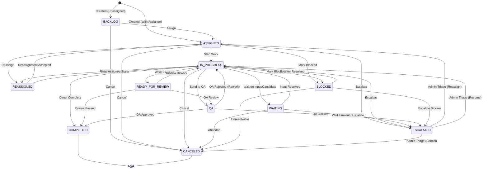

# PHASE 4 — TASK & PREPARATION CORE ENGINEERING SPECIFICATION

> **Status:** DRAFT — PENDING HUMAN APPROVAL  
> **Version:** 1.1.0  
> **Document Type:** Engineering Specification  
> **Product:** Operations Operating System (OOS)  
> **Phase:** Phase 4 — Task & Preparation Core  
> **Date:** 2026-09-24  
> **Implementation Authorization:** NOT AUTHORIZED  

---

## 1. Document Control

| Property | Value |
| :--- | :--- |
| **Document Title** | Phase 4 — Task & Preparation Core Engineering Specification |
| **Document Version** | 1.1.0 |
| **Status** | DRAFT — PENDING HUMAN APPROVAL |
| **Classification** | Engineering Contract |
| **Parent Specification** | `docs/01_V1_PRD.md` (v1.3.0), `docs/00_PRODUCT_VISION.md` |
| **Preceding Phases** | Phase 1 Identity & RBAC (v1.5.0), Phase 2 Candidate Core (v1.2.0), Phase 3 Application Core (v1.1.0) |
| **Implementation Gate** | FROZEN — IMPLEMENTATION PROHIBITED UNTIL HUMAN APPROVAL |

---

## 2. Phase Objective

Define the authoritative engineering contract for the operational **Task and Preparation Core** of the Operations Operating System (OOS).

Phase 4 defines how internal operational work is:
1. **Represented**: Structured, staff-only operational task records categorized across candidate, job, application, QA, and operational workflows.
2. **Assigned**: Explicit human operational work-allocation to authorized staff members (`EMPLOYEE`, `ADMIN`).
3. **Tracked**: 11-state task lifecycle tracking progression from backlog to completion.
4. **Executed**: Preparation checklists, review gates, and issue tracking linked to Candidates and Applications.
5. **Audited**: Append-only transactional history and immutable audit logs preserving ownership changes, blockers, administrative triage, and completions.

Phase 4 builds directly upon the accepted Phase 1, Phase 2, and Phase 3 architectures without redesigning them.

---

## 3. Authority & Source Hierarchy

All design choices and constraints in this specification derive strictly from authoritative sources in the following locked order of precedence:

```text
Explicit human decisions
  ↓
Product Vision (docs/00_PRODUCT_VISION.md)
  ↓
V1 PRD (docs/01_V1_PRD.md v1.3.0)
  ↓
Phase 1 Engineering Specification (v1.5.0)
  ↓
Phase 2 Engineering Specification (v1.2.0)
  ↓
Phase 3 Engineering Specification (v1.1.0)
  ↓
Accepted Architectural Decision Records (ADR-001 through ADR-003)
  ↓
Accepted Phase 0–3 Implementation Contracts
```

*Existing code cannot override an approved product or engineering contract. No requirement is assumed or invented.*

---

## 4. Scope

Phase 4 encompasses:
1. **Task Domain Model**: The `Task`, `TaskChecklistItem`, and `TaskStateHistory` entities.
2. **Staff-Only Operational Scope**: Generic operational tasks are internal staff-only artifacts; candidates interact via dedicated Phase 2/3 portal interfaces.
3. **Task Categorization & Types**: Structured types for Candidate, Job, Application, QA, and Operational tasks (V1 PRD §39).
4. **Task Lifecycle & State Machine**: 11 authoritative statuses (`BACKLOG`, `ASSIGNED`, `IN_PROGRESS`, `WAITING`, `READY_FOR_REVIEW`, `QA`, `COMPLETED`, `BLOCKED`, `CANCELED`, `REASSIGNED`, `ESCALATED`) (V1 PRD §40).
5. **Task Ownership & Work Allocation**: Operational assignment and reassignment rules.
6. **Administrative Escalation & Triage**: Administrative oversight and triage model for `ESCALATED` tasks without adding new RBAC roles.
7. **Context Association**: Safe, non-duplicative foreign linkages to `Candidate`, `Job`, and `Application`.
8. **Application Preparation Support**: Checklists and operational task tracking for resume tailoring, cover letter assembly, and screening QA.
9. **Task History & Audit**: Full state change tracking and immutable audit events.
10. **Multi-Tenant Row-Level Security (RLS)**: PostgreSQL RLS policies and `SECURITY DEFINER` helper functions enforcing strict staff-only access.
11. **Staff Workspaces**: Employee Task Workbench and Admin Task Oversight UI.
12. **Validation & Server Operations**: Zod schemas and Next.js Server Actions with strict error handling.

---

## 5. Explicit Exclusions

Phase 4 explicitly **excludes** the following out-of-scope capabilities:
- **No Automatic Task-Generation Engine**: Tasks are created ONLY through explicitly authorized server operations (`createTaskAction`). No workflow-triggered generation, event-driven generation, rules engine, or background task generators.
- **No Workflow / BPM Engine**: No generic workflow builder, visual pipeline editor, or dynamic DAG execution engine.
- **No Automated Capacity Balancing / Workforce Optimization**: No automated workload distribution, round-robin algorithms, or capacity metrics.
- **No SLA / Auto-Escalation Engine**: No automated timers, cron workers, background escalation scripts, or SLA auto-triggers.
- **No Generic Candidate Task Workbench**: Candidates do not receive a generic task list or task status transition controls. Candidate actions occur strictly through dedicated Phase 2/3 domain experiences.
- **No New RBAC Roles**: No `TEAM_LEAD`, `MANAGER`, `OPERATIONS_DIRECTOR`, or specialized sub-roles. RBAC remains strictly `ADMIN`, `EMPLOYEE`, `CANDIDATE`.
- **No AI / LLM Generation**: No AI resume writing, AI cover letter generation, AI screening answers, or automated task summarization.
- **No External Automation / Web Scraping**: No automated ATS submission, browser bots, or job board scrapers.
- **No Background Workers / Distributed Queues**: No Redis, BullMQ, Kafka, RabbitMQ, or Celery.
- **No Real-Time WebSocket Messaging**: Candidate/Staff messaging is a separate Phase 5 communication scope.
- **No Interview / Offer / Billing Systems**: Out of scope for V1.

---

## 6. Relationship to V1 PRD

The V1 PRD establishes Tasks as the operational backbone for internal managed operations:
- **V1 PRD §39**: Explicitly enumerates task categories: Candidate Tasks, Job Tasks, Application Tasks, QA Tasks, and Operational Tasks.
- **V1 PRD §40**: Explicitly locks the 11 task statuses and mandates ownership and status history.
- **V1 PRD §21-§22**: Affirms that operations are human-driven, verified, and audited.
- **V1 PRD §56**: Affirms that incomplete assigned tasks become available for reassignment by an authorized administrator upon staff offboarding.

---

## 7. Relationship to Phase 1 (Identity, RBAC & Security)

Phase 4 inherits Phase 1 security contracts without alteration:
- **Transaction-Local Identity**: Identity is established via `withRlsContext(userId, ...)` and read via `public.current_user_id()`.
- **Database Roles**: The app runs exclusively as `oos_app_runtime` with `NOSUPERUSER` and `NOBYPASSRLS`.
- **FORCE ROW LEVEL SECURITY**: Enabled and forced on all new Phase 4 tables.
- **SECURITY DEFINER Boundaries**: Helper functions use `SECURITY DEFINER` and `SET search_path = public, pg_temp`.
- **Audit System**: Audit events are logged append-only via `logUserAuditEvent`.

---

## 8. Relationship to Phase 2 (Candidate Core)

Phase 4 interacts with Phase 2 entities strictly through safe references:
- **Candidate Linkage**: An operational Task may optionally link to a `Candidate` (`taskId.candidateId`) for staff contextual tracking.
- **Candidate Interface Separation**: Candidate users do not access the generic Task entity. Candidate actions (profile completion, document upload, verification) remain handled by dedicated Phase 2 portal pages (`/candidate/profile`, etc.).
- **Authorization Boundary Separation**: A task assignment to an employee **does not** create or alter candidate access authorization. Staff members have organization-scoped access under Phase 1/Phase 2 RBAC.
- **Lifecycle Independence**: Updating a Candidate-linked operational task (e.g., `COMPLETE_PROFILE`) does not implicitly mutate `Candidate.status` without executing the approved Phase 2 server action (`updateCandidateStatusAction`).
- **Consent Revocation**: When candidate consent is revoked (Phase 2 §17), active tasks linked to the candidate or their unsubmitted applications are transitioned to `CANCELED`.

---

## 9. Relationship to Phase 3 (Application Core)

Phase 4 operationalizes the preparation and review workflows of Phase 3:
- **Application Linkage**: A Task may link to an `Application` (`taskId.applicationId`).
- **Preparation Tasks**: Tasks like `PREPARE_RESUME`, `PREPARE_COVER_LETTER`, and `APPLICATION_QA` track staff operational progress for applications in `PREPARING` or `REVIEW` states.
- **Universal Candidate Approval Separation**: Universal Candidate Approval remains governed strictly by the Phase 3 contract (`REVIEW` $\rightarrow$ `AWAITING_APPROVAL` $\rightarrow$ `READY` $\rightarrow$ `SUBMITTED`). Approval is executed exclusively by the candidate on `/candidate/applications/[id]`, not via generic task status mutations.
- **State Machine Separation**: Completing a preparation task **does not** automatically mutate `Application.status`. The responsible staff member must explicitly invoke the Phase 3 `transitionApplicationStatusAction` or `requestCandidateApprovalAction`.
- **Submission Correction Tasks**: When an application enters `SUBMISSION_ISSUE`, staff create `SUBMISSION_CORRECTION` tasks to structure the remediation workflow.

---

## 10. Critical Authorization Rule: Task Ownership vs Data Access

> [!IMPORTANT]
> **Task assignment is purely an operational workload and responsibility indicator. It is NEVER an authorization boundary.**

```text
┌─────────────────────────────────────────────────────────────────┐
│                      DATA ACCESS (RBAC + RLS)                   │
│  Organization-scoped membership & role determines read/write   │
│  permissions. Assigned employee ≠ Only authorized user.         │
└─────────────────────────────────────────────────────────────────┘
                                ▲
                                │ (Independent Dimensions)
                                ▼
┌─────────────────────────────────────────────────────────────────┐
│                    OPERATIONAL WORK ALLOCATION                  │
│  Task assignedEmployeeId indicates who is executing the work.   │
│  Does NOT grant, alter, or restrict base database permissions.  │
└─────────────────────────────────────────────────────────────────┘
```

1. Any active `EMPLOYEE` or `ADMIN` in the organization has permission to view all operational tasks in the organization.
2. Any active `EMPLOYEE` or `ADMIN` can update task progress, post status transitions, or reassign tasks according to organization policy.
3. Candidate users have zero direct access to generic operational tasks in the database or UI.
4. Task ownership never bypasses RLS, alters RBAC, or grants cross-organization access.

---

## 11. Task Types & Categorization

The Task domain model incorporates the exact categories and types approved in V1 PRD Section 39:

```prisma
enum TaskCategory {
  CANDIDATE
  JOB
  APPLICATION
  QA
  OPERATIONAL
}

enum TaskType {
  // Candidate-Related Staff Tasks (PRD §39)
  COMPLETE_PROFILE
  UPLOAD_DOCUMENT
  VERIFY_INFORMATION
  APPROVE_APPLICATION
  PROVIDE_MISSING_INFO

  // Job-Related Staff Tasks (PRD §39)
  REVIEW_JOB
  QUALIFY_JOB

  // Application-Related Staff Tasks (PRD §39)
  PREPARE_RESUME
  PREPARE_COVER_LETTER
  PREPARE_SCREENING_ANSWERS
  COMPLETE_APPLICATION
  VERIFY_APPLICATION
  SUBMIT_APPLICATION

  // QA Staff Tasks (PRD §39)
  RESUME_QA
  APPLICATION_QA
  SUBMISSION_QA

  // Operational Management Tasks (PRD §39)
  CANDIDATE_ASSIGNMENT
  CANDIDATE_REASSIGNMENT
  ESCALATION_HANDLING
  SUBMISSION_CORRECTION
}
```

---

## 12. Task Status Model

The task lifecycle uses exactly the 11 statuses locked in V1 PRD Section 40:

| Status | Classification | Description |
| :--- | :--- | :--- |
| `BACKLOG` | Unassigned / Staged | Task created but not yet scheduled or assigned for immediate execution. |
| `ASSIGNED` | Assigned | Task assigned to a designated staff member. |
| `IN_PROGRESS` | Active | Assignee is actively working on the task. |
| `WAITING` | Suspended (External) | Work is temporarily paused waiting on candidate input or external dependency. |
| `READY_FOR_REVIEW` | Internal Gate | Assignee completed drafting/work; ready for peer or QA review. |
| `QA` | Verification | Task undergoing formal internal quality assurance check. |
| `COMPLETED` | Terminal / Success | Task successfully completed, verified, and closed. |
| `BLOCKED` | Suspended (Defect) | Work is blocked by an operational defect, missing asset, or technical issue. |
| `CANCELED` | Terminal / Voided | Task rendered obsolete, abandoned, or candidate consent revoked. |
| `REASSIGNED` | Transition | Operational marker indicating ownership handoff in progress. |
| `ESCALATED` | Administrative Triage | Task flagged for urgent administrative intervention or priority resolution. |

---

## 13. Task State Machine & Valid Transitions



### Valid Transition Matrix

```ts
export const ALLOWED_TASK_TRANSITIONS: Record<TaskStatus, TaskStatus[]> = {
  BACKLOG: [TaskStatus.ASSIGNED, TaskStatus.CANCELED],
  ASSIGNED: [
    TaskStatus.IN_PROGRESS,
    TaskStatus.REASSIGNED,
    TaskStatus.BLOCKED,
    TaskStatus.ESCALATED,
    TaskStatus.CANCELED,
  ],
  IN_PROGRESS: [
    TaskStatus.WAITING,
    TaskStatus.READY_FOR_REVIEW,
    TaskStatus.QA,
    TaskStatus.COMPLETED,
    TaskStatus.BLOCKED,
    TaskStatus.REASSIGNED,
    TaskStatus.ESCALATED,
    TaskStatus.CANCELED,
  ],
  WAITING: [TaskStatus.IN_PROGRESS, TaskStatus.ESCALATED, TaskStatus.CANCELED],
  READY_FOR_REVIEW: [TaskStatus.QA, TaskStatus.IN_PROGRESS, TaskStatus.COMPLETED, TaskStatus.CANCELED],
  QA: [TaskStatus.COMPLETED, TaskStatus.IN_PROGRESS, TaskStatus.ESCALATED, TaskStatus.CANCELED],
  BLOCKED: [TaskStatus.IN_PROGRESS, TaskStatus.ESCALATED, TaskStatus.CANCELED],
  REASSIGNED: [TaskStatus.ASSIGNED, TaskStatus.IN_PROGRESS, TaskStatus.CANCELED],
  ESCALATED: [TaskStatus.ASSIGNED, TaskStatus.IN_PROGRESS, TaskStatus.CANCELED],
  COMPLETED: [], // Terminal
  CANCELED: [],  // Terminal
};
```

---

## 14. Administrative Escalation & Triage Model

### Locked Policy
`ESCALATED` tasks use **ADMIN TRIAGE**:
1. **No New Roles**: V1 roles remain strictly `CANDIDATE`, `EMPLOYEE`, `ADMIN`. No `Team Lead` or `Manager` roles exist.
2. **Escalation Action**: Any active `EMPLOYEE` or `ADMIN` can escalate a task by providing a mandatory `escalationReason`.
3. **Admin Triage Responsibility**:
   - `ESCALATED` tasks appear prominently in the Admin Console (`/admin/tasks/escalations`) and in high-priority staff filters.
   - An `ADMIN` user reviews the escalation and chooses one of three operational resolutions:
     - **Reassign**: Assign to another employee (`ESCALATED` $\rightarrow$ `ASSIGNED`).
     - **Resume**: Clear blocker and return to active work (`ESCALATED` $\rightarrow$ `IN_PROGRESS`).
     - **Cancel**: Close as unresolvable (`ESCALATED` $\rightarrow$ `CANCELED`).
4. **No Automated Escalation**: Escalation is strictly human-initiated. No cron jobs, timers, or SLA triggers exist.

---

## 15. Task Priority & Due Dates

### Priority Model
Tasks incorporate an operational priority enum to support staff triage:
```prisma
enum TaskPriority {
  LOW
  NORMAL
  HIGH
  URGENT
}
```
- Default: `NORMAL`
- `URGENT` tasks are flagged visually in the employee task workbench.
- Priority does not alter database authorization or bypass workflow gates.

### Due Dates
- Tasks may have an optional `dueDate: DateTime? @db.Timestamptz(6)`.
- Past-due tasks are marked as overdue in server-side query filters.
- There are **no automated background job triggers** attached to due dates in V1.

---

## 16. Task Checklists

To support standardized operational execution (e.g., preparation checklists, QA verification checklists), tasks support child checklist items:

```prisma
model TaskChecklistItem {
  id          String    @id @default(dbgenerated("gen_random_uuid()")) @db.Uuid
  taskId      String    @db.Uuid
  description String    @db.VarChar(500)
  isCompleted Boolean   @default(false)
  completedAt DateTime? @db.Timestamptz(6)
  completedById String? @db.Uuid
  orderIndex  Int       @default(0)
  createdAt   DateTime  @default(now()) @db.Timestamptz(6)

  task        Task      @relation(fields: [taskId], references: [id], onDelete: Cascade)
  completedBy User?     @relation(fields: [completedById], references: [id], onDelete: SetNull)

  @@index([taskId, orderIndex])
  @@map("task_checklist_items")
}
```

### Checklist Rules
1. Checklist items are freeform operational steps created with a task.
2. Checking an item records `isCompleted = true`, `completedAt = now()`, and `completedById = current_user_id()`.
3. Tasks of type `RESUME_QA`, `APPLICATION_QA`, or `SUBMISSION_QA` require all checklist items to be completed before the task can transition to `COMPLETED`.

---

## 17. Blocked and Waiting Semantics

When a task cannot proceed normally, staff must explicitly designate the reason:

### 1. WAITING Status
- Used when work is paused waiting for an external response or candidate action (e.g., waiting for candidate to provide missing transcript or complete portal approval).
- Requires a mandatory `waitingReason: String` (VARCHAR(500)).

### 2. BLOCKED Status
- Used when work is halted due to an operational or technical impediment (e.g., job portal down, document format corrupted, recruiter email invalid).
- Requires a mandatory `blockedReason: String` (VARCHAR(500)).

---

## 18. Task History & Audit Architecture

### Task State History
Every task status transition is recorded in `task_state_history`:
```prisma
model TaskStateHistory {
  id          String     @id @default(dbgenerated("gen_random_uuid()")) @db.Uuid
  taskId      String     @db.Uuid
  fromStatus  TaskStatus
  toStatus    TaskStatus
  changedById String     @db.Uuid
  reason      String?    @db.Text
  createdAt   DateTime   @default(now()) @db.Timestamptz(6)

  task        Task       @relation(fields: [taskId], references: [id], onDelete: Cascade)
  changedBy   User       @relation(fields: [changedById], references: [id], onDelete: Restrict)

  @@index([taskId, createdAt])
  @@map("task_state_history")
}
```

### Immutable Audit Events
Phase 4 extends the `AuditAction` enum with exact task events:
- `TASK_CREATED`
- `TASK_UPDATED`
- `TASK_ASSIGNED`
- `TASK_REASSIGNED`
- `TASK_STATUS_CHANGED`
- `TASK_CHECKLIST_UPDATED`
- `TASK_COMPLETED`
- `TASK_CANCELED`
- `TASK_ESCALATED`

---

## 19. Database Schema Specification

```prisma
// Phase 4 Enums
enum TaskCategory {
  CANDIDATE
  JOB
  APPLICATION
  QA
  OPERATIONAL
}

enum TaskType {
  COMPLETE_PROFILE
  UPLOAD_DOCUMENT
  VERIFY_INFORMATION
  APPROVE_APPLICATION
  PROVIDE_MISSING_INFO
  REVIEW_JOB
  QUALIFY_JOB
  PREPARE_RESUME
  PREPARE_COVER_LETTER
  PREPARE_SCREENING_ANSWERS
  COMPLETE_APPLICATION
  VERIFY_APPLICATION
  SUBMIT_APPLICATION
  RESUME_QA
  APPLICATION_QA
  SUBMISSION_QA
  CANDIDATE_ASSIGNMENT
  CANDIDATE_REASSIGNMENT
  ESCALATION_HANDLING
  SUBMISSION_CORRECTION
}

enum TaskStatus {
  BACKLOG
  ASSIGNED
  IN_PROGRESS
  WAITING
  READY_FOR_REVIEW
  QA
  COMPLETED
  BLOCKED
  CANCELED
  REASSIGNED
  ESCALATED
}

enum TaskPriority {
  LOW
  NORMAL
  HIGH
  URGENT
}

// Phase 4 Models
model Task {
  id                 String              @id @default(dbgenerated("gen_random_uuid()")) @db.Uuid
  organizationId     String              @db.Uuid
  title              String              @db.VarChar(255)
  description        String?             @db.Text
  category           TaskCategory
  type               TaskType
  status             TaskStatus          @default(BACKLOG)
  priority           TaskPriority        @default(NORMAL)
  dueDate            DateTime?           @db.Timestamptz(6)
  
  assignedEmployeeId String?             @db.Uuid
  candidateId        String?             @db.Uuid
  jobId              String?             @db.Uuid
  applicationId      String?             @db.Uuid

  waitingReason      String?             @db.VarChar(500)
  blockedReason      String?             @db.VarChar(500)
  escalationReason   String?             @db.VarChar(500)
  
  completedAt        DateTime?           @db.Timestamptz(6)
  completedById      String?             @db.Uuid
  createdById        String              @db.Uuid
  createdAt          DateTime            @default(now()) @db.Timestamptz(6)
  updatedAt          DateTime            @default(now()) @updatedAt @db.Timestamptz(6)

  organization       Organization        @relation(fields: [organizationId], references: [id], onDelete: Restrict)
  assignedEmployee   User?               @relation("TaskAssignee", fields: [assignedEmployeeId], references: [id], onDelete: SetNull)
  candidate          Candidate?          @relation(fields: [candidateId], references: [id], onDelete: Cascade)
  job                Job?                @relation(fields: [jobId], references: [id], onDelete: SetNull)
  application        Application?        @relation(fields: [applicationId], references: [id], onDelete: Cascade)
  completedBy        User?               @relation("TaskCompleter", fields: [completedById], references: [id], onDelete: SetNull)
  createdBy          User                @relation("TaskCreator", fields: [createdById], references: [id], onDelete: Restrict)

  checklistItems     TaskChecklistItem[]
  stateHistory       TaskStateHistory[]

  @@index([organizationId, status])
  @@index([assignedEmployeeId, status])
  @@index([candidateId, status])
  @@index([applicationId, status])
  @@index([category, status])
  @@index([dueDate])
  @@map("tasks")
}

model TaskChecklistItem {
  id            String    @id @default(dbgenerated("gen_random_uuid()")) @db.Uuid
  taskId        String    @db.Uuid
  description   String    @db.VarChar(500)
  isCompleted   Boolean   @default(false)
  completedAt   DateTime? @db.Timestamptz(6)
  completedById String?   @db.Uuid
  orderIndex    Int       @default(0)
  createdAt     DateTime  @default(now()) @db.Timestamptz(6)

  task          Task      @relation(fields: [taskId], references: [id], onDelete: Cascade)
  completedBy   User?     @relation(fields: [completedById], references: [id], onDelete: SetNull)

  @@index([taskId, orderIndex])
  @@map("task_checklist_items")
}

model TaskStateHistory {
  id          String     @id @default(dbgenerated("gen_random_uuid()")) @db.Uuid
  taskId      String     @db.Uuid
  fromStatus  TaskStatus
  toStatus    TaskStatus
  changedById String     @db.Uuid
  reason      String?    @db.Text
  createdAt   DateTime   @default(now()) @db.Timestamptz(6)

  task        Task       @relation(fields: [taskId], references: [id], onDelete: Cascade)
  changedBy   User       @relation(fields: [changedById], references: [id], onDelete: Restrict)

  @@index([taskId, createdAt])
  @@map("task_state_history")
}
```

---

## 20. Row-Level Security (RLS) & Security Functions

### 1. Helper Function
```sql
-- Checks if caller is an active Employee or Admin in the task's organization
CREATE OR REPLACE FUNCTION public.is_task_org_privileged_member(lookup_task_id uuid, lookup_user_id uuid)
RETURNS boolean
SECURITY DEFINER
SET search_path = public, pg_temp
LANGUAGE sql STABLE AS $$
  SELECT EXISTS (
    SELECT 1 FROM public.tasks t
    JOIN public.memberships m ON t."organizationId" = m."organizationId"
    WHERE t.id = lookup_task_id
      AND m."userId" = lookup_user_id
      AND m.status = 'ACTIVE'
      AND m.role IN ('EMPLOYEE', 'ADMIN')
  );
$$;
REVOKE ALL ON FUNCTION public.is_task_org_privileged_member(uuid, uuid) FROM PUBLIC;
GRANT EXECUTE ON FUNCTION public.is_task_org_privileged_member(uuid, uuid) TO oos_app_runtime, authenticated;
```

### 2. Table RLS Activation & Policies (Staff-Only)
```sql
ALTER TABLE "public"."tasks" ENABLE ROW LEVEL SECURITY;
ALTER TABLE "public"."tasks" FORCE ROW LEVEL SECURITY;

ALTER TABLE "public"."task_checklist_items" ENABLE ROW LEVEL SECURITY;
ALTER TABLE "public"."task_checklist_items" FORCE ROW LEVEL SECURITY;

ALTER TABLE "public"."task_state_history" ENABLE ROW LEVEL SECURITY;
ALTER TABLE "public"."task_state_history" FORCE ROW LEVEL SECURITY;

-- Tasks Policies: Strictly privileged staff (EMPLOYEE / ADMIN) within organization
CREATE POLICY tasks_select ON "public"."tasks"
  FOR SELECT USING (
    public.current_user_id() IS NOT NULL AND
    public.is_org_privileged_member("organizationId", public.current_user_id())
  );

CREATE POLICY tasks_insert ON "public"."tasks"
  FOR INSERT WITH CHECK (
    public.current_user_id() IS NOT NULL AND
    public.is_org_privileged_member("organizationId", public.current_user_id())
  );

CREATE POLICY tasks_update ON "public"."tasks"
  FOR UPDATE USING (
    public.current_user_id() IS NOT NULL AND
    public.is_org_privileged_member("organizationId", public.current_user_id())
  );

CREATE POLICY tasks_delete ON "public"."tasks"
  FOR DELETE USING (
    false -- Hard deletes prohibited; use CANCELED status
  );

-- Child Table Policies
CREATE POLICY task_checklist_items_select ON "public"."task_checklist_items"
  FOR SELECT USING (
    public.current_user_id() IS NOT NULL AND
    public.is_task_org_privileged_member("taskId", public.current_user_id())
  );

CREATE POLICY task_checklist_items_mutation ON "public"."task_checklist_items"
  FOR ALL USING (
    public.current_user_id() IS NOT NULL AND
    public.is_task_org_privileged_member("taskId", public.current_user_id())
  );

CREATE POLICY task_state_history_select ON "public"."task_state_history"
  FOR SELECT USING (
    public.current_user_id() IS NOT NULL AND
    public.is_task_org_privileged_member("taskId", public.current_user_id())
  );

CREATE POLICY task_state_history_mutation ON "public"."task_state_history"
  FOR ALL USING (
    public.current_user_id() IS NOT NULL AND
    public.is_task_org_privileged_member("taskId", public.current_user_id())
  );

-- Grants
GRANT SELECT, INSERT, UPDATE, DELETE ON TABLE
  "public"."tasks",
  "public"."task_checklist_items",
  "public"."task_state_history"
TO oos_app_runtime;
```

---

## 21. Server Actions & API Contracts

### 1. `createTaskAction`
- **Actor**: `EMPLOYEE`, `ADMIN`
- **Input**:
  - `title`: String (1–255 chars)
  - `description`: Optional String
  - `category`: `TaskCategory`
  - `type`: `TaskType`
  - `priority`: `TaskPriority` (default `NORMAL`)
  - `dueDate`: Optional ISO string
  - `assignedEmployeeId`: Optional UUID
  - `candidateId`: Optional UUID
  - `jobId`: Optional UUID
  - `applicationId`: Optional UUID
  - `checklistItems`: Optional Array of strings
- **Logic**:
  1. Authenticates context and ensures caller is `EMPLOYEE` or `ADMIN`.
  2. Validates organizational context and foreign keys.
  3. If `assignedEmployeeId` is provided, sets status to `ASSIGNED`, otherwise `BACKLOG`.
  4. Inserts `Task`, `TaskChecklistItem`s, and initial `TaskStateHistory`.
  5. Emits `TASK_CREATED` audit event.

### 2. `assignTaskAction`
- **Actor**: `EMPLOYEE`, `ADMIN`
- **Input**: `taskId: UUID`, `assignedEmployeeId: UUID`
- **Logic**:
  1. Authenticates context and ensures caller is `EMPLOYEE` or `ADMIN`.
  2. Validates target user is active `EMPLOYEE`/`ADMIN` in the organization.
  3. Updates `assignedEmployeeId` and sets status to `ASSIGNED` (or `REASSIGNED` if reassigning active work).
  4. Records `TaskStateHistory` and emits `TASK_ASSIGNED` / `TASK_REASSIGNED` audit event.

### 3. `transitionTaskStatusAction`
- **Actor**: `EMPLOYEE`, `ADMIN`
- **Input**:
  - `taskId: UUID`
  - `targetStatus: TaskStatus`
  - `reason`: Optional String (Mandatory for `BLOCKED`, `WAITING`, `ESCALATED`)
- **Logic**:
  1. Authenticates context and ensures caller is `EMPLOYEE` or `ADMIN`.
  2. Verifies transition against `ALLOWED_TASK_TRANSITIONS`.
  3. If transitioning to `COMPLETED`, verifies all mandatory checklist items are complete.
  4. Updates status, records `completedAt`/`completedById` if terminal.
  5. Records `TaskStateHistory` and emits `TASK_STATUS_CHANGED` audit event.

### 4. `updateTaskChecklistItemAction`
- **Actor**: `EMPLOYEE`, `ADMIN`
- **Input**: `checklistItemId: UUID`, `isCompleted: boolean`
- **Logic**:
  1. Authenticates context and ensures caller is `EMPLOYEE` or `ADMIN`.
  2. Updates item state and sets `completedAt`/`completedById`.
  3. Emits `TASK_CHECKLIST_UPDATED` audit event.

---

## 22. Validation Schemas (Zod)

```ts
import { z } from "zod";

export const TaskCreateSchema = z.object({
  title: z.string().trim().min(1, "Title is required").max(255),
  description: z.string().trim().max(5000).optional().nullable(),
  category: z.enum(["CANDIDATE", "JOB", "APPLICATION", "QA", "OPERATIONAL"]),
  type: z.enum([
    "COMPLETE_PROFILE", "UPLOAD_DOCUMENT", "VERIFY_INFORMATION", "APPROVE_APPLICATION", "PROVIDE_MISSING_INFO",
    "REVIEW_JOB", "QUALIFY_JOB",
    "PREPARE_RESUME", "PREPARE_COVER_LETTER", "PREPARE_SCREENING_ANSWERS", "COMPLETE_APPLICATION", "VERIFY_APPLICATION", "SUBMIT_APPLICATION",
    "RESUME_QA", "APPLICATION_QA", "SUBMISSION_QA",
    "CANDIDATE_ASSIGNMENT", "CANDIDATE_REASSIGNMENT", "ESCALATION_HANDLING", "SUBMISSION_CORRECTION"
  ]),
  priority: z.enum(["LOW", "NORMAL", "HIGH", "URGENT"]).default("NORMAL"),
  dueDate: z.string().datetime().optional().nullable(),
  assignedEmployeeId: z.string().uuid().optional().nullable(),
  candidateId: z.string().uuid().optional().nullable(),
  jobId: z.string().uuid().optional().nullable(),
  applicationId: z.string().uuid().optional().nullable(),
  checklistItems: z.array(z.string().trim().min(1).max(500)).max(50).default([]),
});

export const TaskAssignSchema = z.object({
  taskId: z.string().uuid(),
  assignedEmployeeId: z.string().uuid().nullable(),
});

export const TaskStatusTransitionSchema = z.object({
  taskId: z.string().uuid(),
  targetStatus: z.enum([
    "BACKLOG", "ASSIGNED", "IN_PROGRESS", "WAITING", "READY_FOR_REVIEW",
    "QA", "COMPLETED", "BLOCKED", "CANCELED", "REASSIGNED", "ESCALATED"
  ]),
  reason: z.string().trim().max(500).optional().nullable(),
});

export const TaskChecklistItemUpdateSchema = z.object({
  checklistItemId: z.string().uuid(),
  isCompleted: z.boolean(),
});
```

---

## 23. UI / UX Requirements

Phase 4 introduces operational task management screens adhering strictly to the OOS design system:

### 1. Employee Task Workbench (`/employee/tasks`)
- Filterable task board/table with views:
  - **My Tasks**: Filtered by `assignedEmployeeId = current_user_id()`.
  - **Unassigned / Backlog**: `status = BACKLOG`.
  - **QA Queue**: `status = QA` or `status = READY_FOR_REVIEW`.
  - **Blocked & Escalated**: `status IN ('BLOCKED', 'ESCALATED')`.
- Priority badges (`URGENT`, `HIGH`, `NORMAL`, `LOW`).
- Inline status transition controls for staff.

### 2. Task Detail Drawer / View (`/employee/tasks/[id]`)
- Full task metadata and context linkages (Candidate, Job, Application).
- Interactive preparation checklist with real-time checkbox completion.
- Blocked / Waiting / Escalation reason banners.
- Immutable state history timeline showing who moved the task across states.

### 3. Admin Escalation Console (`/admin/tasks/escalations`)
- Dedicated triage view for `ESCALATED` tasks.
- Actions: Reassign to staff member, Resume work, or Cancel task with structured notes.

### 4. Contextual Task Widgets
- **Candidate Detail Page (`/employee/candidates/[id]`)**: Embedded staff list of tasks linked to the candidate.
- **Application Workbench (`/employee/applications/[id]`)**: Embedded staff list of preparation and QA tasks linked to the application.

---

## 24. Testing Strategy

Phase 4 testing mandates the following suites:

### 1. Unit Tests
- `tests/unit/task-schemas.test.ts`: Zod schema validation for all task inputs, transitions, and checklist schemas.
- `tests/unit/task-lifecycle.test.ts`: Validates the complete 11-state transition matrix and verifies terminal behavior for `COMPLETED` and `CANCELED`.

### 2. Integration Tests
- `tests/integration/task-lifecycle.test.ts`: Tests task creation, assignment, progression through QA, and completion.
- `tests/integration/task-assignment.test.ts`: Tests assignment, reassignment, cross-tenant employee validation, and audit trail generation.
- `tests/integration/task-escalation.test.ts`: Tests administrative triage of `ESCALATED` tasks by `ADMIN` users.
- `tests/integration/task-checklists.test.ts`: Tests checklist completion requirements and QA completion gates.
- `tests/integration/task-context-linkage.test.ts`: Tests linkages to Candidates and Applications, verifying lifecycle independence.
- `tests/integration/task-rls-contract.test.ts`: Verifies migration DDL, `FORCE ROW LEVEL SECURITY`, `oos_app_runtime` grants, and denial of candidate direct access to task tables.

### 3. Regression Tests
- Verifies that all 147 Phase 1, Phase 2, and Phase 3 tests continue to pass with zero regressions.

---

## 25. Acceptance Criteria

Phase 4 implementation will be accepted only when:
1. All 11 Task statuses and 5 Task categories operate strictly as specified.
2. Generic operational Tasks are staff-only; candidates have zero direct access to task entities.
3. Task ownership is strictly operational metadata and **does not** act as an authorization boundary.
4. `ESCALATED` tasks are routed strictly to Admin triage without inventing new RBAC roles or background automation.
5. Tasks are created strictly through explicit server operations (zero automatic/event-driven task engines).
6. Preparation tasks support application materials QA without automatically forcing application status mutations.
7. Blocked, Waiting, and Escalated states enforce mandatory structured reason recording.
8. All 3 new tables (`tasks`, `task_checklist_items`, `task_state_history`) have `FORCE ROW LEVEL SECURITY` enabled.
9. All operations are audited with transaction-local user identity.
10. `npm run typecheck`, `npm run lint`, `npm test`, and `npm run build` pass cleanly with 0 errors.

---

## 26. Open Human Decisions

```text
NONE IDENTIFIED AT SPECIFICATION LEVEL
```

*All architectural boundaries, entity models, lifecycle transitions, authorization rules, and administrative escalation workflows are fully locked and resolved from authoritative sources.*

---

## 27. Implementation Gate

### Specification Status
- **Version**: 1.1.0
- **Status**: DRAFT — PENDING HUMAN APPROVAL
- **Implementation**: **NOT AUTHORIZED**

### Resolved Decisions
- **Candidate Task Visibility**: Generic Tasks are internal staff-only operational artifacts. Candidates interact strictly via dedicated Phase 2/3 portal interfaces.
- **Escalation Target**: `ESCALATED` tasks use Admin Triage within the existing single-tier staff model (`ADMIN`, `EMPLOYEE`, `CANDIDATE`). No new roles.
- **Task Generation**: Explicit server operations only; zero automatic/workflow task generation.
- **Task Ownership vs Authorization**: Decoupled. Task ownership is operational workload metadata only.
- **Security & RLS**: PostgreSQL `FORCE RLS` on all tables with explicit staff privileges and candidate direct-access denial.

### Open Human Decisions
```text
NONE IDENTIFIED AT SPECIFICATION LEVEL
```

### Implementation Changes
```text
NO CODE CHANGED
NO DATABASE CHANGED
NO MIGRATIONS CREATED
NO TESTS CREATED
NO DEPENDENCIES ADDED
NO CONFIGURATION CHANGED
```
