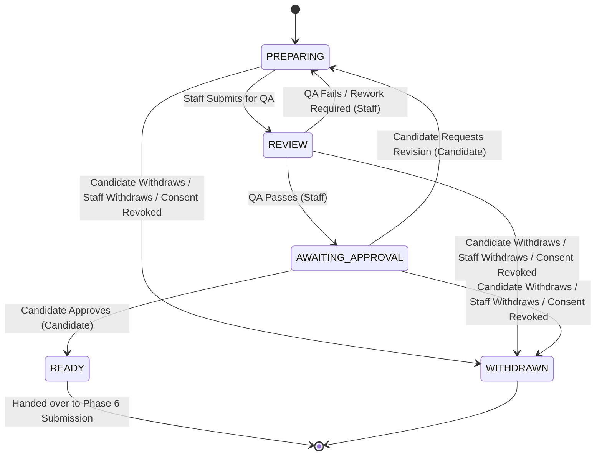

# Phase 5 Engineering Specification — QA & Candidate Approval Core

**Document Version:** `1.2.2`  
**Status:** `DRAFT — PENDING HUMAN APPROVAL`  
**Implementation Status:** `NOT AUTHORIZED`  
**Authority:** Product Vision, V1 PRD (§§14, 32, 34, 35, 39, 40), Phase 0 Spec, Phase 1 RBAC Spec, Phase 2 Candidate Core Spec (v1.2.0), Phase 3 Application Core Spec (v1.1.0), Phase 4 Task & Preparation Core Spec (v1.1.0), Approved ADRs (ADR-001 through ADR-009).

---

## Document Revision History

| Version | Date | Status | Description |
| :--- | :--- | :--- | :--- |
| `1.0.0` | 2026-09-24 | Draft | Initial draft for QA and Candidate Approval Core. |
| `1.1.0` | 2026-09-24 | Draft | Reconciled against frozen Phase 1–4 contracts; purged snapshot hash inferences, aligned Job status guards, and structured open human decisions. |
| `1.2.0` | 2026-09-24 | Draft | Locked human decisions: (1) QA review persistence locked to dedicated relational tables (`application_qa_reviews`, `application_qa_checklists`), (2) QA checklist items locked to binary `isVerified: boolean`, (3) Candidate revision storage locked to existing Phase 3 fields (`Application.approvalNotes` + `ApplicationStateHistory.reason`). |
| `1.2.1` | 2026-09-24 | Draft | Formalized deterministic 9-criteria validation (exact set matching, no duplicates/missing), removed unsupported `label` and `comments` from `ApplicationQaChecklist`, aligned consent revocation strictly with Phase 3 pre-submission scope, and tightened RLS/tenancy boundaries. |
| `1.2.2` | 2026-09-24 | Draft | Corrected conditional QA FAIL-note validation contract (mandatory non-empty notes for FAIL, optional for PASS) and purged remaining checklist-comment terminology across the specification. |
| `Addendum v1.3.0` | 2026-09-25 | Addendum Ratified | Addendum: Ratified Optional Candidate Approval & Managed Application Authorization. Dual-path QA completion: `MANAGED` mode without boundary violations advances directly to `READY` (`APPLICATION_ADVANCED_TO_READY_MANAGED`); `REVIEW_REQUIRED` or boundary violations route to `AWAITING_APPROVAL`. 9-point QA verification remains strictly mandatory. |

---

## 1. Executive Summary

Phase 5 defines the **QA & Candidate Approval Core** of the Operation Orchestration System (OOS). 

The operational pipeline for job applications is:
```text
Application Preparation (PREPARING)
        ↓
    QA Review (REVIEW)
        ↓
    QA Result (PASS / FAIL)
        ↓
Candidate Approval (AWAITING_APPROVAL)
        ↓
Candidate Decision (APPROVED / REVISION_REQUESTED)
        ↓
     READY
        ↓
Phase 6 Submission Execution
```

Phase 5 formalizes two distinct, non-bypassable quality and authorization gates between application authoring and external submission:
1. **QA Gate (`REVIEW`)**: Internal operational review verifying factual accuracy, candidate-job alignment, resume tailoring, screening answers, work authorization, and job requirement satisfaction against exactly the 9 authoritative criteria defined in V1 PRD §34.
2. **Candidate Approval Gate (`AWAITING_APPROVAL`)**: Universal candidate authorization gate where the candidate explicitly inspects prepared application materials, approves submission (`READY`), or requests revisions (`PREPARING`) (V1 PRD §35).

Phase 5 strictly excludes external browser submission execution, submission evidence recording, submission issue triage, and post-submission lifecycle management, which belong exclusively to Phase 6.

---

## 2. Authority & Source Hierarchy

The engineering definitions herein are derived strictly according to the following authoritative hierarchy:
1. Explicit human decisions and instructions.
2. Product Vision (`docs/00_PRODUCT_VISION.md`).
3. V1 Product Requirements Document (`docs/01_V1_PRD.md`, specifically §§14, 32, 34, 35, 39, 40).
4. Approved Phase 1 Engineering Specification & RBAC Contracts (`docs/engineering/PHASE_01_IDENTITY_RBAC_SPEC.md`).
5. Approved Phase 2 Candidate Core Specification & Contracts (`docs/engineering/PHASE_02_CANDIDATE_CORE_SPEC.md` v1.2.0).
6. Approved Phase 3 Application Core Specification & Contracts (`docs/engineering/PHASE_03_APPLICATION_CORE_SPEC.md` v1.1.0).
7. Approved Phase 4 Task & Preparation Core Specification & Contracts (`docs/engineering/PHASE_04_TASK_PREPARATION_CORE_SPEC.md` v1.1.0).
8. Approved Architectural Decision Records (ADR-001 through ADR-009).
9. Existing accepted implementation.

---

## 3. Scope & Boundaries

### 3.1 In-Scope Capabilities
1. **QA Review Domain**:
   - First-class relational QA persistence (`application_qa_reviews` and `application_qa_checklists`) supporting multiple historical QA cycles.
   - Deterministic verification of the exact 9 V1 PRD §34 quality criteria using binary `isVerified: boolean`.
   - Deterministic QA review decisions:
     - `PASS`: Moves application from `REVIEW` to `AWAITING_APPROVAL` (requires all 9 exact criteria to be present and `isVerified === true`; notes optional).
     - `FAIL`: Returns application from `REVIEW` to `PREPARING` with mandatory, non-empty failure/rework notes on `ApplicationQaReview.notes`.
   - Immutable audit logging, timestamps, and reviewer attribution (`reviewerId`) for all QA decisions.
2. **Universal Candidate Approval Domain**:
   - Universal Candidate Approval gate enforcement (`REVIEW` → `AWAITING_APPROVAL` → `READY`).
   - Candidate Approval recording: approval timestamp (`approvedAt`), candidate user ID attribution (`approvedBy`), application status progression to `READY`, and `approvalStatus = APPROVED`.
   - Candidate Revision Request mechanism (`AWAITING_APPROVAL` → `PREPARING`) recording candidate revision feedback in `Application.approvalNotes` and setting `approvalStatus = REVISION_REQUESTED`.
   - Explicit Candidate Withdrawal handling (`AWAITING_APPROVAL` → `WITHDRAWN`).
3. **Application Lifecycle Integration**:
   - Operates strictly within the 14-state `ApplicationStatus` machine owned by Phase 3.
   - Synchronizes `Application` fields (`approvalStatus`, `approvalRequestedAt`, `approvedAt`, `approvedBy`, `approvalNotes`) with QA and Candidate actions.
   - Job Status Guard: Prevents transition to `READY` if the underlying Job status is `CLOSED` or `ARCHIVED` (Phase 3 contract §8.2).
4. **Task & Preparation Integration**:
   - Operational coordination with Phase 4 preparation and QA tasks (`RESUME_QA`, `APPLICATION_QA`) without modifying the Phase 4 task domain or creating authorization boundaries.
5. **Security, Tenancy & Privacy**:
   - PostgreSQL Row Level Security (`FORCE RLS`) ensuring strict tenant isolation.
   - Staff-only firewall for internal QA reviews, notes, and checklist evaluations (candidates have zero access to internal QA data).
   - Candidate portal scoping ensuring candidates can only inspect and approve their own applications.
   - Consent revocation enforcement: consumes the frozen Phase 3 consent-revocation contract (all pre-submission applications transition to `WITHDRAWN`, and associated pending tasks are canceled).
6. **Audit Logging**:
   - Dedicated audit events emitted for all QA reviews, approval requests, approvals, and candidate revision requests.
7. **User Interfaces**:
   - Staff QA Console (`/employee/applications/[id]`).
   - Candidate Approval Portal (`/candidate/applications/[id]`).

### 3.2 Explicit Exclusions (Hard Scope Firewall)
Phase 5 explicitly excludes:
- External browser automation, direct submission dispatch, or portal script execution (Phase 6).
- Submission evidence, screenshots, external confirmation references, or submission issue correction cycles (Phase 6).
- Automated AI/LLM QA evaluation or automated AI approval generation.
- Automated task creation or workflow DAG engines.
- Automatic routing, round-robin assignment, or SLA escalation engines.
- New RBAC roles (e.g., `QA_MANAGER`, `REVIEWER`, `TEAM_LEAD`, `OPERATIONS_MANAGER`).
- Real-time messaging, WebSockets, or live chat.
- Billing, payments, candidate subscription gates, or fee processing.
- Background job queues (Redis, BullMQ, Celery, Kafka).
- Approval policy bypasses (there is no `AUTO_APPROVE` or `BYPASS_APPROVAL` setting; candidate approval is strictly universal).
- Speculative cryptographic snapshot hashes or version hashing models not defined by V1 PRD.
- Dedicated `application_revision_requests` table (revision notes are stored on `Application.approvalNotes` + `ApplicationStateHistory.reason`).

---

## 4. Architectural Principles & Invariants

1. **State Machine Authority**: Phase 3 holds sole architectural authority over the 14-state `ApplicationStatus` machine. Phase 5 operates strictly within the state transitions between `PREPARING`, `REVIEW`, `AWAITING_APPROVAL`, and `READY`.
2. **Universal Candidate Approval Invariant**: Every application must be explicitly reviewed and approved by the candidate while in `AWAITING_APPROVAL` before it can transition to `READY`. There is no administrative override or bypass.
3. **Staff-Only QA Invariant**: QA reviews can only be performed by authorized active `EMPLOYEE` or `ADMIN` users within the owning organization. Candidates have zero access to QA review endpoints or internal QA notes.
4. **Candidate-Only Approval Invariant**: Staff cannot approve an application on behalf of the candidate. Approval requires explicit authentication and submission by the candidate who owns the application (`candidate.userId == session.user.id`).
5. **Attribution & Audit Integrity**: All QA reviews and candidate approvals must record trusted server-derived user IDs, timestamps, and emit immutable audit log entries. No client-supplied user IDs, organization IDs, or timestamps are accepted.
6. **Job Status Guard**: An application cannot transition to `READY` upon candidate approval if the underlying Job status is `CLOSED` or `ARCHIVED` (Phase 3 §8.2).
7. **Tenancy Isolation**: Multi-tenant boundaries are strictly enforced at the database level via PostgreSQL RLS and session settings (`app.current_organization_id`). Cross-tenant access is rejected at both the application and database layers.
8. **Deterministic Consent Revocation**: Phase 5 consumes Phase 3's consent-revocation contract. If candidate consent is revoked, every application that has not already been externally submitted transitions to `WITHDRAWN`, and associated pending tasks are canceled. Already submitted applications remain immutable historical records.
9. **Multi-Cycle QA History Preservation**: Each QA review cycle creates a distinct `ApplicationQaReview` and child `ApplicationQaChecklist` records. Subsequent reviews never overwrite historical review cycles.
10. **Conditional QA Fail Notes Invariant**: A QA review with `decision = FAIL` must include non-empty review notes explaining the defect/rework required. A QA review with `decision = PASS` permits optional review notes.

---

## 5. Application Lifecycle & State Transitions

### 5.1 State Machine Context (Phase 3 Authority)

Phase 5 operates within the frozen Phase 3 Application lifecycle:
```text
DISCOVERED → QUALIFIED → PREPARING → REVIEW → AWAITING_APPROVAL → READY → SUBMITTED → ...
```

The state transitions governed by Phase 5 are:



### 5.2 State Transition Matrix

| Current State | Target State | Trigger Action | Permitted Actor | Preconditions & Validation | Side Effects & Audit Event |
| :--- | :--- | :--- | :--- | :--- | :--- |
| `PREPARING` | `REVIEW` | `submitApplicationForQaAction` | `EMPLOYEE`, `ADMIN` | Application belongs to org; required materials attached. | State history recorded; `APPLICATION_SUBMITTED_FOR_QA` audit emitted. |
| `REVIEW` | `AWAITING_APPROVAL` | `completeQaReviewAction` (Decision: `PASS`) | `EMPLOYEE`, `ADMIN` | QA review recorded; all 9 exact criteria present with `isVerified = true`; QA decision is `PASS`. | Application `approvalStatus = PENDING`, `approvalRequestedAt = now()`; state history recorded; `APPLICATION_QA_PASSED` and `APPLICATION_APPROVAL_REQUESTED` audit emitted. |
| `REVIEW` | `PREPARING` | `completeQaReviewAction` (Decision: `FAIL`) | `EMPLOYEE`, `ADMIN` | QA review recorded; QA decision is `FAIL`; mandatory, non-empty rework/failure notes provided on `ApplicationQaReview.notes`. | State history recorded with rework reason; `APPLICATION_QA_FAILED` audit emitted. |
| `AWAITING_APPROVAL` | `READY` | `approveApplicationAction` | `CANDIDATE` (Owner) | Authenticated session user is candidate owner; application is `AWAITING_APPROVAL`; candidate consent is active; underlying Job status is `OPEN` (Phase 3 §8.2). | Application `status = READY`, `approvalStatus = APPROVED`, `approvedAt = now()`, `approvedBy = session.user.id`; state history recorded; `APPLICATION_APPROVED_BY_CANDIDATE` audit emitted. |
| `AWAITING_APPROVAL` | `PREPARING` | `requestApplicationRevisionAction` | `CANDIDATE` (Owner) | Authenticated session user is candidate owner; application is `AWAITING_APPROVAL`; revision notes provided (min 5 chars). | Application `status = PREPARING`, `approvalStatus = REVISION_REQUESTED`, `approvalNotes = input.revisionNotes`; state history recorded with revision notes; `APPLICATION_REVISION_REQUESTED_BY_CANDIDATE` audit emitted. |
| `AWAITING_APPROVAL` | `WITHDRAWN` | `withdrawApplicationAction` | `CANDIDATE` (Owner), `EMPLOYEE`, `ADMIN` | Application is `AWAITING_APPROVAL`; withdrawal reason provided. | Application marked `WITHDRAWN`; `withdrawalReason` recorded; `APPLICATION_WITHDRAWN` audit emitted. |
| Pre-submission states (`DISCOVERED`, `QUALIFIED`, `PREPARING`, `REVIEW`, `AWAITING_APPROVAL`, `READY`) | `WITHDRAWN` | `revokeConsentAction` | `CANDIDATE` (Owner), `ADMIN` | Candidate revokes consent (Phase 3 §15 contract). | All unsubmitted applications set to `WITHDRAWN`; pending tasks canceled; `CANDIDATE_CONSENT_REVOKED` audit emitted. |

---

## 6. The Deterministic 9 QA Criteria & Candidate Approval Model

### 6.1 The Exact 9 QA Verification Criteria (V1 PRD §34)
QA must evaluate and verify exactly the 9 explicit criteria established by V1 PRD §34:
1. `CANDIDATE_JOB_ALIGNMENT`: Candidate background and experience match the target job posting.
2. `RESUME_ACCURACY`: Tailored resume is truthful, formatted correctly, and free of factual discrepancies.
3. `JOB_REQUIREMENTS_MATCH`: Mandatory qualifications, education, and years of experience are met.
4. `SALARY_ALIGNMENT`: Compensation expectations are compatible with the job listing.
5. `LOCATION_AUTHORIZATION`: Location and remote/hybrid work arrangement match employer criteria.
6. `WORK_AUTHORIZATION`: Candidate possesses valid work authorization for the target role and country.
7. `SCREENING_ANSWERS`: Truthful, complete, and tailored responses to employer screening questions.
8. `APPLICATION_COMPLETENESS`: All required contact info, documents, and application fields are complete.
9. `CANDIDATE_CONSENT_ACTIVE`: Candidate consent is currently active and unrevoked.

#### Deterministic Validation Rules:
- The submitted QA checklist array must contain **exactly** 9 items.
- Every item must have a `criterionKey` matching one of the 9 authoritative keys.
- Every key must appear **exactly once**. Duplicate keys are rejected. Unknown keys are rejected. Missing keys are rejected.
- A QA review cannot receive a `PASS` decision unless all 9 criteria have `isVerified === true`.
- A QA review with `decision = FAIL` must include non-empty `notes` explaining the defect or rework required.
- There are no QA scores, weightings, rankings, severity levels, AI evaluations, or `NOT_APPLICABLE` states.

### 6.2 Data Model Justification for Checklist Fields
In accordance with the authoritative contract hierarchy:
- `criterionKey` and `isVerified: boolean` are strictly justified by V1 PRD §34 and human decision lock #2.
- Generic display labels and per-item comments are not defined in V1 PRD §34 or Phase 1–4 contracts (criterion display text is static in code/UI, and overall review commentary is captured in `ApplicationQaReview.notes`). Therefore, `ApplicationQaChecklist` contains only `id`, `qaReviewId`, `criterionKey`, `isVerified`, and `createdAt`.

### 6.3 Candidate Approval Model (V1 PRD §35 & Phase 3 §9.1)
The candidate approval mechanism relies strictly on the fields established in the frozen Phase 3 schema:
- `approvalStatus`: `ApplicationApprovalStatus` (`PENDING`, `APPROVED`, `REVISION_REQUESTED`).
- `approvalRequestedAt`: Timestamp when application transitioned to `AWAITING_APPROVAL`.
- `approvedAt`: Timestamp when candidate authorized submission.
- `approvedBy`: User UUID of the candidate who authorized submission.
- `approvalNotes`: Text field storing candidate revision feedback notes.

---

## 7. Data Model & Database Architecture

Phase 5 establishes dedicated relational entities for structured QA reviews and checklist item verification while utilizing existing `applications`, `application_materials`, and `candidates` tables from Phases 1–3.

### 7.1 Prisma Schema Definition

```prisma
// ==========================================
// PHASE 5: QA & APPROVAL ENUMS
// ==========================================

enum QaDecision {
  PASS
  FAIL
}

enum QaCriterionKey {
  CANDIDATE_JOB_ALIGNMENT
  RESUME_ACCURACY
  JOB_REQUIREMENTS_MATCH
  SALARY_ALIGNMENT
  LOCATION_AUTHORIZATION
  WORK_AUTHORIZATION
  SCREENING_ANSWERS
  APPLICATION_COMPLETENESS
  CANDIDATE_CONSENT_ACTIVE
}

// ==========================================
// PHASE 5: QA MODELS
// ==========================================

model ApplicationQaReview {
  id              String                  @id @default(dbgenerated("gen_random_uuid()")) @db.Uuid
  organizationId  String                  @db.Uuid
  applicationId   String                  @db.Uuid
  reviewerId      String                  @db.Uuid
  decision        QaDecision
  notes           String?                 @db.Text
  checklistItems  ApplicationQaChecklist[]
  createdAt       DateTime                @default(now()) @db.Timestamptz(6)

  organization    Organization            @relation(fields: [organizationId], references: [id], onDelete: Restrict)
  application     Application             @relation(fields: [applicationId], references: [id], onDelete: Cascade)
  reviewer        User                    @relation(fields: [reviewerId], references: [id], onDelete: Restrict)

  @@index([organizationId, applicationId])
  @@index([applicationId, createdAt])
  @@map("application_qa_reviews")
}

model ApplicationQaChecklist {
  id              String                  @id @default(dbgenerated("gen_random_uuid()")) @db.Uuid
  qaReviewId      String                  @db.Uuid
  criterionKey    QaCriterionKey
  isVerified      Boolean                 @default(false)
  createdAt       DateTime                @default(now()) @db.Timestamptz(6)

  qaReview        ApplicationQaReview     @relation(fields: [qaReviewId], references: [id], onDelete: Cascade)

  @@unique([qaReviewId, criterionKey])
  @@index([qaReviewId])
  @@map("application_qa_checklists")
}
```

---

## 8. Authorization & Access Control

### 8.1 Role-Based Access Matrix

| Operation | `CANDIDATE` | `EMPLOYEE` | `ADMIN` | Rules & Constraints |
| :--- | :--- | :--- | :--- | :--- |
| **Submit Application for QA** (`PREPARING` → `REVIEW`) | ❌ Denied | ✅ Allowed | ✅ Allowed | Active staff member of owning organization only. |
| **Perform / Record QA Review** | ❌ Denied | ✅ Allowed | ✅ Allowed | Active staff member of owning organization only. |
| **View Internal QA Reviews & Notes** | ❌ Denied | ✅ Allowed | ✅ Allowed | Internal staff only. Never exposed to candidate. |
| **Request Candidate Approval** (`REVIEW` → `AWAITING_APPROVAL`) | ❌ Denied | ✅ Allowed | ✅ Allowed | Requires passing QA review. |
| **View Application in Candidate Portal** | ✅ Allowed (Owner) | ❌ Denied | ❌ Denied | Candidate can only view their own applications. |
| **Approve Application** (`AWAITING_APPROVAL` → `READY`) | ✅ Allowed (Owner) | ❌ Denied | ❌ Denied | Candidate only. Staff cannot approve on candidate's behalf. |
| **Request Revision** (`AWAITING_APPROVAL` → `PREPARING`) | ✅ Allowed (Owner) | ❌ Denied | ❌ Denied | Candidate provides revision feedback notes. |
| **Withdraw Application** | ✅ Allowed (Owner) | ✅ Allowed | ✅ Allowed | Candidate or staff. Moves to `WITHDRAWN`. |

### 8.2 Candidate Authorization Boundary
- Candidates interact **only** through `/candidate/applications/[id]` and dedicated candidate portal server actions.
- Candidates have **zero access** to `application_qa_reviews` or `application_qa_checklists`.
- Candidate approval actions verify `candidate.userId == session.user.id`.

---

## 9. Row Level Security (RLS) & Tenancy

### 9.1 PostgreSQL DDL & RLS Policies

```sql
-- 1. Enable RLS and FORCE RLS on QA tables
ALTER TABLE "public"."application_qa_reviews" ENABLE ROW LEVEL SECURITY;
ALTER TABLE "public"."application_qa_reviews" FORCE ROW LEVEL SECURITY;

ALTER TABLE "public"."application_qa_checklists" ENABLE ROW LEVEL SECURITY;
ALTER TABLE "public"."application_qa_checklists" FORCE ROW LEVEL SECURITY;

-- 2. Grants for app runtime
GRANT SELECT, INSERT, UPDATE, DELETE ON "public"."application_qa_reviews" TO "oos_app_runtime";
GRANT SELECT, INSERT, UPDATE, DELETE ON "public"."application_qa_checklists" TO "oos_app_runtime";

-- 3. Helper function for QA Review RLS
CREATE OR REPLACE FUNCTION public.is_qa_review_org_privileged_member(target_qa_review_id uuid)
RETURNS boolean
LANGUAGE sql
STABLE
SECURITY DEFINER
SET search_path = public, pg_temp
AS $$
  SELECT EXISTS (
    SELECT 1
    FROM public.application_qa_reviews qr
    JOIN public.organization_members om ON om.organization_id = qr.organization_id
    JOIN public.users u ON u.id = om.user_id
    WHERE qr.id = target_qa_review_id
      AND om.organization_id = (SELECT NULLIF(current_setting('app.current_organization_id', true), '')::uuid)
      AND om.user_id = (SELECT NULLIF(current_setting('app.current_user_id', true), '')::uuid)
      AND om.status = 'ACTIVE'
      AND u.is_active = true
      AND om.role IN ('EMPLOYEE', 'ADMIN')
  );
$$;

-- 4. Policies for application_qa_reviews (Staff-Only, Org-Scoped)
CREATE POLICY "application_qa_reviews_staff_select"
ON "public"."application_qa_reviews"
FOR SELECT
USING (
  public.is_org_privileged_member("organizationId")
);

CREATE POLICY "application_qa_reviews_staff_insert"
ON "public"."application_qa_reviews"
FOR INSERT
WITH CHECK (
  public.is_org_privileged_member("organizationId")
);

-- 5. Policies for application_qa_checklists (Staff-Only, Parent-Scoped)
CREATE POLICY "application_qa_checklists_staff_select"
ON "public"."application_qa_checklists"
FOR SELECT
USING (
  public.is_qa_review_org_privileged_member("qaReviewId")
);

CREATE POLICY "application_qa_checklists_staff_insert"
ON "public"."application_qa_checklists"
FOR INSERT
WITH CHECK (
  public.is_qa_review_org_privileged_member("qaReviewId")
);
```

---

## 10. Server Actions & API Contracts

All server actions execute on the server, validate input with Zod, authenticate the active session, enforce tenant/ownership boundaries, execute within database transactions, and emit audit logs.

### 10.1 Validation Schemas (`src/lib/validation/qa.schemas.ts`)

```typescript
import { z } from 'zod';

export const QA_CRITERION_KEYS = [
  'CANDIDATE_JOB_ALIGNMENT',
  'RESUME_ACCURACY',
  'JOB_REQUIREMENTS_MATCH',
  'SALARY_ALIGNMENT',
  'LOCATION_AUTHORIZATION',
  'WORK_AUTHORIZATION',
  'SCREENING_ANSWERS',
  'APPLICATION_COMPLETENESS',
  'CANDIDATE_CONSENT_ACTIVE',
] as const;

export const QaCriterionKeySchema = z.enum(QA_CRITERION_KEYS);

export const QaChecklistItemInputSchema = z.object({
  criterionKey: QaCriterionKeySchema,
  isVerified: z.boolean(),
});

export const CompleteQaReviewSchema = z
  .object({
    applicationId: z.string().uuid(),
    decision: z.enum(['PASS', 'FAIL']),
    notes: z.string().max(5000).optional().nullable(),
    checklistItems: z
      .array(QaChecklistItemInputSchema)
      .length(9, 'Exactly 9 QA criteria must be evaluated')
      .refine((items) => {
        const keys = new Set(items.map((i) => i.criterionKey));
        return keys.size === 9 && QA_CRITERION_KEYS.every((k) => keys.has(k));
      }, 'Every authoritative QA criterion key must appear exactly once'),
  })
  .refine(
    (data) => {
      if (data.decision === 'FAIL') {
        return typeof data.notes === 'string' && data.notes.trim().length > 0;
      }
      return true;
    },
    {
      message: 'Mandatory failure/rework notes must be provided when QA decision is FAIL',
      path: ['notes'],
    }
  );

export const CandidateApproveApplicationSchema = z.object({
  applicationId: z.string().uuid(),
});

export const CandidateRequestRevisionSchema = z.object({
  applicationId: z.string().uuid(),
  revisionNotes: z.string().min(5, 'Please provide details on requested revisions').max(2000),
});
```

### 10.2 Server Actions (`src/lib/qa/actions.ts`)

1. **`submitApplicationForQaAction(applicationId: string)`**:
   - **Actor**: `EMPLOYEE` or `ADMIN`
   - **Preconditions**: Application status must be `PREPARING`. Required materials attached.
   - **Operation**: Transitions application to `REVIEW`. Records `ApplicationStateHistory`. Emits `APPLICATION_SUBMITTED_FOR_QA`.

2. **`completeQaReviewAction(input: CompleteQaReviewInput)`**:
   - **Actor**: `EMPLOYEE` or `ADMIN`
   - **Preconditions**: Application status must be `REVIEW`.
   - **Operation**:
     - Validates input with `CompleteQaReviewSchema` (ensures 9 exact keys, and non-empty notes if `decision == 'FAIL'`).
     - Enforces that `decision == 'PASS'` requires all 9 items to have `isVerified === true`.
     - Creates `ApplicationQaReview` and child `ApplicationQaChecklist` items.
     - If `decision == 'PASS'`: Transitions application to `AWAITING_APPROVAL`. Sets `approvalStatus = PENDING`, `approvalRequestedAt = now()`. Emits `APPLICATION_QA_PASSED` and `APPLICATION_APPROVAL_REQUESTED`.
     - If `decision == 'FAIL'`: Transitions application to `PREPARING`. Sets rework reason on state history. Emits `APPLICATION_QA_FAILED`.

3. **`candidateApproveApplicationAction(input: CandidateApproveInput)`**:
   - **Actor**: `CANDIDATE` (Verified Owner)
   - **Preconditions**: Application status must be `AWAITING_APPROVAL`. Candidate consent must be active. Job status must be `OPEN` (Phase 3 §8.2).
   - **Operation**:
     - Sets application `status = READY`, `approvalStatus = APPROVED`, `approvedAt = now()`, `approvedBy = session.user.id`.
     - Records `ApplicationStateHistory`.
     - Emits `APPLICATION_APPROVED_BY_CANDIDATE`.

4. **`candidateRequestRevisionAction(input: CandidateRequestRevisionInput)`**:
   - **Actor**: `CANDIDATE` (Verified Owner)
   - **Preconditions**: Application status must be `AWAITING_APPROVAL`.
   - **Operation**:
     - Sets application `status = PREPARING`, `approvalStatus = REVISION_REQUESTED`, `approvalNotes = input.revisionNotes`.
     - Records `ApplicationStateHistory` with revision notes.
     - Emits `APPLICATION_REVISION_REQUESTED_BY_CANDIDATE`.

---

## 11. User Interfaces

### 11.1 Staff QA Console (`/employee/applications/[id]`)
- **QA Verification Form**: Structured checklist corresponding to the 9 standard QA criteria with toggle controls for `isVerified: boolean`.
- **QA Decision Controls**:
  - **Pass & Request Candidate Approval**: Validates all 9 criteria are verified; transitions application to `AWAITING_APPROVAL`.
  - **Fail & Return for Rework**: Requires non-empty review notes; transitions application back to `PREPARING`.
- **QA History Panel**: View past QA reviews, reviewer attribution, timestamps, and reviewer notes across all review cycles.

### 11.2 Candidate Approval Portal (`/candidate/applications/[id]`)
- **Application Preview**: Clean, read-only presentation of tailored resume, cover letter, screening answers, and job details.
- **Explicit Review Notice**: Notice informing the candidate that submission will proceed upon their authorization.
- **Approval Actions**:
  - **Approve Application**: Primary action moving application to `READY`.
  - **Request Changes**: Opens feedback dialog for candidate to submit revision notes, moving application back to `PREPARING`.

---

## 12. Audit Event Taxonomy

Phase 5 extends the centralized `AuditAction` enum with the following authoritative audit events:

| Audit Action | Target Entity | Actor | Event Description |
| :--- | :--- | :--- | :--- |
| `APPLICATION_SUBMITTED_FOR_QA` | `Application` | `EMPLOYEE` / `ADMIN` | Application preparation completed and submitted to QA review queue. |
| `APPLICATION_QA_PASSED` | `Application` | `EMPLOYEE` / `ADMIN` | Internal staff QA review completed with passing status. |
| `APPLICATION_QA_FAILED` | `Application` | `EMPLOYEE` / `ADMIN` | Internal staff QA review failed and returned to preparation for rework. |
| `APPLICATION_APPROVAL_REQUESTED` | `Application` | `EMPLOYEE` / `ADMIN` | Application staged in `AWAITING_APPROVAL` for candidate review. |
| `APPLICATION_APPROVED_BY_CANDIDATE` | `Application` | `CANDIDATE` | Candidate explicitly authorized submission of the prepared application. |
| `APPLICATION_REVISION_REQUESTED_BY_CANDIDATE` | `Application` | `CANDIDATE` | Candidate requested edits to application materials prior to submission. |

---

## 13. Security, Privacy & Data Retention

1. **Information Barrier**: QA checklist evaluations, internal staff notes, and reviewer notes are strictly internal. The candidate API and Candidate Portal UI never receive or display internal QA models.
2. **Attribution Non-Repudiation**: Candidate approvals record the authenticated `session.user.id` and server timestamp (`approvedAt`) to ensure complete non-repudiation.
3. **Consent Enforcement**: Revocation of candidate consent follows the Phase 3 contract: all pre-submission applications transition to `WITHDRAWN`, pending QA reviews halt, and pending approval requests are canceled.

---

## 14. Deterministic Error Codes

| Error Code | HTTP Status | Description |
| :--- | :--- | :--- |
| `QA_INVALID_STATE` | 400 | Application must be in `PREPARING` to submit for QA, or `REVIEW` to complete QA. |
| `QA_CHECKLIST_INCOMPLETE` | 400 | All 9 QA checklist items must be verified (`isVerified = true`) before passing QA. |
| `QA_CHECKLIST_INVALID_KEYS` | 400 | QA checklist items must contain exactly the 9 authoritative criteria keys without duplicates or omissions. |
| `QA_FAIL_NOTES_REQUIRED` | 400 | Mandatory failure/rework notes must be provided when QA decision is FAIL. |
| `APPROVAL_INVALID_STATE` | 400 | Application must be in `AWAITING_APPROVAL` for candidate approval or revision request. |
| `APPROVAL_UNAUTHORIZED_ACTOR` | 403 | User is not the candidate owner of this application. |
| `APPROVAL_CONSENT_REVOKED` | 400 | Cannot approve application because candidate consent has been revoked. |
| `JOB_NOT_OPEN` | 400 | Cannot pass candidate approval for a job that is `CLOSED` or `ARCHIVED` (Phase 3 §8.2). |
| `ORGANIZATION_TENANCY_MISMATCH` | 403 | Attempted operation across organization boundaries. |

---

## 15. Testing Strategy

### 15.1 Unit Tests (`tests/unit/`)
- `qa-schemas.test.ts`: Validate Zod schemas for exact 9-criteria checklist validation (detect duplicate keys, missing keys, unknown keys, invalid length), conditional FAIL-note requirement (reject empty/whitespace notes on FAIL, allow optional on PASS), decisions, candidate approvals, and revision requests.
- `qa-lifecycle.test.ts`: Validate state transition invariants (`PREPARING` → `REVIEW` → `AWAITING_APPROVAL` / `PREPARING`, `AWAITING_APPROVAL` → `READY` / `PREPARING`).

### 15.2 Integration Tests (`tests/integration/`)
- `qa-review-workflow.test.ts`: End-to-end staff QA submission, passing/failing QA review, mandatory failure notes enforcement, checklist persistence across multiple cycles.
- `candidate-approval-workflow.test.ts`: Candidate viewing approval screen, approving application, requesting revisions, and withdrawing.
- `qa-approval-rls.test.ts`: Verify RLS policies block cross-tenant access and prevent candidates from viewing or mutating QA records.
- `qa-consent-revocation.test.ts`: Verify candidate consent revocation cancels pending QA and approval workflows for unsubmitted applications.

### 15.3 Regression Test Matrix
- **Phase 1 Regression**: Tenancy, RBAC roles, security definers, and audit log architecture.
- **Phase 2 Regression**: Candidate registration, profile, documents, and consent management.
- **Phase 3 Regression**: Job management, application creation, and submission attempt structures.
- **Phase 4 Regression**: Task management, checklists, and operational workflows.

---

## 16. Open Human Decisions

**NONE IDENTIFIED AT SPECIFICATION LEVEL**

All architectural, data model, validation, and lifecycle decisions are fully grounded in the approved V1 PRD, Phase 1–4 contracts, and explicit human decision locks.

---

## 17. Acceptance Criteria

1. Dedicated `application_qa_reviews` and `application_qa_checklists` tables created with `FORCE ROW LEVEL SECURITY`.
2. Staff can submit `PREPARING` applications to `REVIEW`.
3. Staff can record structured QA reviews (`PASS` / `FAIL`) against the exact 9 standard verification criteria using binary `isVerified`.
4. Passing QA requires all 9 criteria to be verified (`isVerified = true`) with exact 1-to-1 key matching and transitions application to `AWAITING_APPROVAL` with `approvalStatus = PENDING`.
5. Failing QA requires mandatory, non-empty failure notes on `ApplicationQaReview.notes` and returns application to `PREPARING`.
6. Candidate owner can inspect prepared application materials in Candidate Portal.
7. Candidate approval transitions application to `READY` with `approvalStatus = APPROVED`, setting server-derived timestamp and user attribution.
8. Candidate revision request transitions application to `PREPARING` with `approvalStatus = REVISION_REQUESTED` and records feedback notes in `approvalNotes`.
9. Staff cannot approve on behalf of candidate; candidates cannot access internal QA reviews.
10. All Phase 5 audit actions emitted accurately without actor spoofing.
11. 100% test pass rate across unit, integration, and regression suites.

---

## 18. Addendum v1.3.0 — Optional Candidate Approval & QA Completion Routing (Ratified 2026-09-25)

**Authority Reference:** `docs/engineering/CHANGE_OPTIONAL_CANDIDATE_APPROVAL_SPEC.md` (v1.1.0, ACCEPTED — FROZEN)

### 18.1 Dual-Path Evaluation on QA PASS
Upon unanimous verification of all 9 QA criteria (`decision = PASS`):
1. **Managed Path**:
   - If candidate is in `MANAGED` mode and application satisfies candidate preference boundaries (`salaryFloor`, `remotePreference`, active representation consent, and open job status):
     - Transition: `REVIEW` $\rightarrow$ `READY`
     - Status values: `status = READY`, `approvalStatus = APPROVED`, `approvedBy = null`, `approvedAt = now()`
     - Audit Event: `APPLICATION_ADVANCED_TO_READY_MANAGED` emitted.
2. **Review-Required Path**:
   - If candidate is in `REVIEW_REQUIRED` mode OR if an application violates a candidate preference boundary (e.g. salary below floor or onsite mismatch for remote candidate):
     - Transition: `REVIEW` $\rightarrow$ `AWAITING_APPROVAL`
     - Status values: `status = AWAITING_APPROVAL`, `approvalStatus = PENDING`, `approvalRequestedAt = now()`
     - Candidate explicit sign-off via `candidateApproveApplicationAction` is required to reach `READY`.

### 18.2 Invariants Preserved
- All 9 internal QA criteria remain strictly mandatory for every application before reaching `READY`.
- QA review cannot be bypassed or skipped.
- Consent revocation immediately withdraws all unsubmitted applications.

