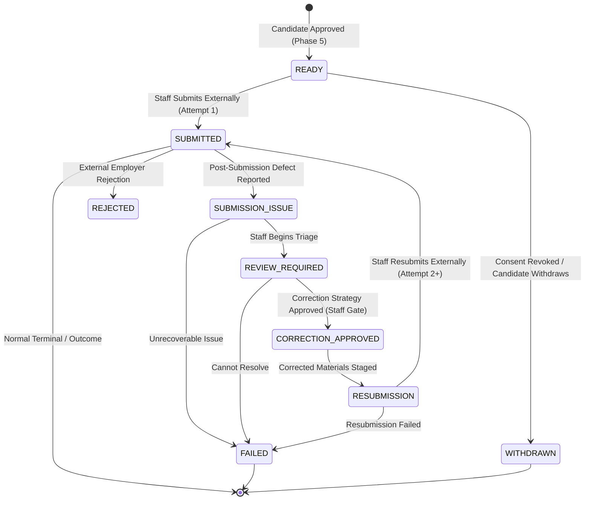

# Phase 6 Engineering Specification — Submission & Evidence Core

**Document Version:** `1.3.0`  
**Status:** `DRAFT — PENDING HUMAN APPROVAL`  
**Implementation Status:** `NOT AUTHORIZED`  
**Authority:** Product Vision, V1 PRD (§§14, 32, 36, 37, 38, 39, 40), Phase 0 Spec, Phase 1 RBAC Spec, Phase 2 Candidate Core Spec (v1.2.0), Phase 3 Application Core Spec (v1.1.0), Phase 4 Task & Preparation Core Spec (v1.1.0), Phase 5 QA & Approval Core Spec (v1.2.2), Approved ADRs (ADR-001 through ADR-005).

---

## Document Revision History

| Version | Date | Status | Description |
| :--- | :--- | :--- | :--- |
| `1.0.0` | 2026-09-24 | Draft | Initial draft for Submission & Evidence Core. |
| `1.1.0` | 2026-09-24 | Draft | Locked human decisions: (1) Staff Correction Gate Only for ordinary post-submission corrections without requiring redundant candidate approval; (2) Dedicated private Supabase Storage bucket (`submission-evidence`) for submission confirmation screenshots/documents. |
| `1.2.0` | 2026-09-24 | Draft | Contract corrections: (1) Verified actual approved ADR inventory (ADR-001 through ADR-005); (2) Defined storage security and authorization contract in alignment with Candidate Core without transport-level lock-in. |
| `1.3.0` | 2026-09-24 | Draft | Contract correction: Enforced absolute immutability on `ApplicationSubmission` (append-only; no UPDATE/DELETE grants or RLS policies). Post-submission incident descriptions and correction notes are recorded via `ApplicationStateHistory.reason` and audit logs without mutating historical submission records. |
| `Addendum v1.2.0` | 2026-09-25 | Addendum Ratified | Addendum: Ratified Optional Candidate Approval & Managed Application Authorization. Transactional candidate notifications dispatched upon external submission confirming employee submitted on candidate's behalf. Notification failures do not roll back authoritative submission. |

---

## 1. Executive Summary

Phase 6 defines the **Submission & Evidence Core** of the Operation Orchestration System (OOS).

The complete end-to-end operational pipeline for job applications is:
```text
Application Preparation (PREPARING)
        ↓
    QA Review (REVIEW)
        ↓
    QA Result (PASS)
        ↓
Candidate Approval (AWAITING_APPROVAL)
        ↓
Candidate Decision (APPROVED)
        ↓
      READY
        ↓
[Phase 6 Manual External Submission]
        ↓
    SUBMITTED (Attempt 1 + Evidence)
        ↓
(Optional Incident / Correction Lifecycle)
SUBMISSION_ISSUE → REVIEW_REQUIRED → CORRECTION_APPROVED → RESUBMISSION → SUBMITTED (Attempt 2+)
```

Phase 6 establishes the controlled operational handoff from a candidate-approved application in `READY` status to an externally submitted application in `SUBMITTED` status. It governs:
1. **Manual External Submission Execution**: Staff-executed external submissions and internal recording of immutable submission evidence.
2. **Submission Attempts & Evidence Tracking**: Sequential, immutable recording of each submission attempt (`ApplicationSubmission`), including external references, URLs, confirmation evidence, binary confirmation files, timestamps, and staff attribution.
3. **Dedicated Private Evidence Storage**: Secure Supabase Storage bucket (`submission-evidence`) for confirmation screenshots and PDFs with signed URL access.
4. **Controlled Post-Submission Incident & Correction Lifecycle**: Structured triage for post-submission defects via `SUBMISSION_ISSUE` → `REVIEW_REQUIRED` → `CORRECTION_APPROVED` → `RESUBMISSION` → `SUBMITTED` without redundant candidate re-approval for operational corrections.
5. **Duplicate Protection & Idempotency**: Rigorous state-machine guarding ensuring applications cannot be submitted concurrently or multiple times without progressing through the authorized correction lifecycle.

Phase 6 strictly adheres to the V1 PRD requirement that **external application submission is 100% manual**. Browser automation, automated form filling, scraping, AI-driven submission, and third-party ATS API integrations are strictly out of scope.

---

## 2. Authority & Source Hierarchy

The engineering definitions herein are derived strictly according to the following authoritative hierarchy:
1. Explicit human decisions and instructions.
2. Product Vision (`docs/00_PRODUCT_VISION.md`).
3. V1 Product Requirements Document (`docs/01_V1_PRD.md`, specifically §§14, 32, 36, 37, 38, 39, 40).
4. Approved Phase 1 Engineering Specification & RBAC Contracts (`docs/engineering/PHASE_01_IDENTITY_RBAC_SPEC.md`).
5. Approved Phase 2 Candidate Core Specification & Contracts (`docs/engineering/PHASE_02_CANDIDATE_CORE_SPEC.md` v1.2.0).
6. Approved Phase 3 Application Core Specification & Contracts (`docs/engineering/PHASE_03_APPLICATION_CORE_SPEC.md` v1.1.0).
7. Approved Phase 4 Task & Preparation Core Specification & Contracts (`docs/engineering/PHASE_04_TASK_PREPARATION_CORE_SPEC.md` v1.1.0).
8. Approved Phase 5 QA & Candidate Approval Core Specification & Contracts (`docs/engineering/PHASE_05_QA_APPROVAL_SPEC.md` v1.2.2).
9. Approved Architectural Decision Records (ADR-001 through ADR-005).
10. Existing accepted implementation.

---

## 3. Scope & Boundaries

### 3.1 In-Scope Capabilities
1. **Manual Submission Recording**:
   - Authorized staff recording of external manual submissions for applications in `READY` status (attempt 1) or `RESUBMISSION` status (attempt > 1).
   - Atomic creation of immutable `ApplicationSubmission` records with auto-incremented `attemptNumber`.
   - Transitioning `Application.status` to `SUBMITTED`.
2. **Submission Evidence Capture & Storage**:
   - Recording structured submission evidence: `submittedAt` (server timestamp), `submittedById` (server-derived user UUID), `externalReference` (confirmation identifier), `externalUrl` (submission portal URL), `confirmationEvidence` (confirmation text/details), `storagePath` (private confirmation document/screenshot path), and `submissionNotes`.
   - Dedicated private Supabase Storage bucket `submission-evidence` with tenant-isolated paths and short-lived signed URLs.
   - Immutable historical preservation of all submission attempts and associated evidence files.
3. **Incident & Correction Lifecycle**:
   - `SUBMITTED → SUBMISSION_ISSUE`: Recording post-submission defects (e.g., portal error, expired listing, bad link) with mandatory `issueDescription`.
   - `SUBMISSION_ISSUE → REVIEW_REQUIRED`: Staff operational triage of reported submission defects.
   - `REVIEW_REQUIRED → CORRECTION_APPROVED`: Approval of correction strategy with mandatory `correctionNotes` (Staff Correction Gate Only).
   - `REVIEW_REQUIRED → FAILED`: Terminal failure transition for unrecoverable submission defects.
   - `CORRECTION_APPROVED → RESUBMISSION`: Staging corrected application materials for secondary external submission attempt.
   - `RESUBMISSION → SUBMITTED`: Recording resubmission attempt with incremented `attemptNumber`.
4. **Duplicate Protection & Concurrency**:
   - Strict state-machine validation preventing duplicate or simultaneous submission recordings.
   - Transactional isolation ensuring atomic state transitions and evidence persistence.
5. **Security & Information Barrier**:
   - PostgreSQL Row Level Security (`FORCE RLS`) enforcing multi-tenant isolation on `application_submissions`.
   - Staff-only access to internal submission notes, issue descriptions, and correction commentary.
   - Candidate portal access restricted to viewing application submission status (`SUBMITTED`), submission date, and approved application materials.
6. **Audit Logging & State History**:
   - Emitting dedicated audit events: `APPLICATION_SUBMITTED`, `APPLICATION_SUBMISSION_ISSUE_RECORDED`, `APPLICATION_CORRECTION_REVIEW_STARTED`, `APPLICATION_CORRECTION_APPROVED`, `APPLICATION_RESUBMISSION_STAGED`, `APPLICATION_RESUBMITTED`, `APPLICATION_SUBMISSION_EVIDENCE_UPLOADED`.
   - Immutable state history tracking via `ApplicationStateHistory`.

### 3.2 Explicit Exclusions (Hard Scope Firewall)
Phase 6 explicitly excludes:
- External browser automation, headless browsers (Puppeteer, Playwright, Selenium), or automated web form dispatch.
- Job scraping, ATS API integrations (Greenhouse, Lever, Workday), or automated job-board submission.
- AI/LLM automated application submission or automated bot interactions pretending to be the candidate.
- Background worker queues (Redis, BullMQ, Celery, Kafka) or automatic retry engines.
- Workflow DAG engines, automatic task routing, or SLA escalation engines.
- New RBAC roles (e.g., `SUBMISSION_COORDINATOR`, `SUBMISSION_MANAGER`, `TEAM_LEAD`).
- Real-time messaging, WebSockets, or live chat.
- Billing, payments, candidate subscription gates, or fee processing.
- Recruiter response parsing, email ingestion, interview scheduling, or offer management.

---

## 4. Architectural Principles & Invariants

1. **Manual Submission Invariant**: All external submissions in V1 are executed manually by human staff. The system serves as the secure system of record capturing evidence, timestamps, and attribution.
2. **State Machine Authority**: Phase 3 holds sole architectural authority over the 14-state `ApplicationStatus` machine. Phase 6 operates strictly within the state transitions connecting `READY`, `SUBMITTED`, `SUBMISSION_ISSUE`, `REVIEW_REQUIRED`, `CORRECTION_APPROVED`, `RESUBMISSION`, and terminal `FAILED`.
3. **Precondition Invariants for Initial Submission**:
   - `Application.status === 'READY'`
   - `Application.approvalStatus === 'APPROVED'` (Universal candidate approval verified in Phase 5)
   - `Candidate.status === 'ACTIVE'` (Candidate consent active and unrevoked)
   - `Job.status === 'OPEN'` (Underlying job not closed or archived)
4. **Staff Correction Gate Invariant**: Post-submission operational corrections execute through staff review and approval (`REVIEW_REQUIRED → CORRECTION_APPROVED → RESUBMISSION`). The initial universal candidate approval granted in Phase 5 provides authorization for the submission workflow; redundant candidate approval cycles are not mandated for ordinary operational corrections. If a correction requires fundamental alterations to candidate-supplied factual credentials, staff may optionally return the application to `PREPARING`.
5. **Immutable Submission History Invariant**: Once created, an `ApplicationSubmission` record and its associated confirmation evidence files are immutable. No column on `ApplicationSubmission` is ever updated, and no records are deleted (`append-only`). Post-submission incident descriptions (`issueDescription`) and correction notes (`correctionNotes`) are recorded strictly through `ApplicationStateHistory.reason` and audit event details. Subsequent submission attempts generate new sequential records (`attemptNumber = 2, 3, ...`).
6. **Staff-Only Submission Authorization**: Only active `EMPLOYEE` or `ADMIN` users within the owning organization may record submissions, upload evidence, report issues, or approve corrections. Candidates have zero authorization to record submissions.
7. **Server-Derived Attribution**: All submission records and audit events record trusted server-derived user UUIDs (`ctx.userId`) and server timestamps (`now()`). No client-supplied actor identifiers are accepted.
8. **Tenancy Isolation**: PostgreSQL Row Level Security (`FORCE RLS`) and tenant-scoped storage paths guarantee that submission records and evidence documents are strictly isolated by organization tenancy.
9. **Post-Submission Consent Invariant**: Under the frozen Phase 3 contract, candidate consent revocation transitions unsubmitted applications to `WITHDRAWN`. Applications that have already reached `SUBMITTED` remain immutable historical records.

---

## 5. Application Lifecycle & State Transitions

### 5.1 State Machine Context (Phase 3 Authority)

Phase 6 governs the post-approval submission and correction lifecycle within Phase 3's authoritative 14-state machine:



### 5.2 State Transition Matrix

| Current State | Target State | Trigger Action | Permitted Actor | Preconditions & Validation | Side Effects & Audit Event |
| :--- | :--- | :--- | :--- | :--- | :--- |
| `READY` | `SUBMITTED` | `recordApplicationSubmissionAction` | `EMPLOYEE`, `ADMIN` | Application is in `READY`; `approvalStatus = APPROVED`; Job is `OPEN`; Candidate consent active. | Creates `ApplicationSubmission` (`attemptNumber = 1`); sets `status = SUBMITTED`; emits `APPLICATION_SUBMITTED`. |
| `SUBMITTED` | `SUBMISSION_ISSUE` | `recordSubmissionIssueAction` | `EMPLOYEE`, `ADMIN` | Application is in `SUBMITTED`; mandatory `issueDescription` provided (min 5 chars). | Transitions application `status = SUBMISSION_ISSUE`; records `ApplicationStateHistory` (`reason = issueDescription`); emits `APPLICATION_SUBMISSION_ISSUE_RECORDED`. (Does NOT update `ApplicationSubmission`). |
| `SUBMISSION_ISSUE` | `REVIEW_REQUIRED` | `startCorrectionReviewAction` | `EMPLOYEE`, `ADMIN` | Application is in `SUBMISSION_ISSUE`. | Sets `status = REVIEW_REQUIRED`; records state history; emits `APPLICATION_CORRECTION_REVIEW_STARTED`. |
| `REVIEW_REQUIRED` | `CORRECTION_APPROVED` | `approveSubmissionCorrectionAction` | `EMPLOYEE`, `ADMIN` | Application is in `REVIEW_REQUIRED`; mandatory `correctionNotes` provided (min 5 chars). | Transitions application `status = CORRECTION_APPROVED`; records `ApplicationStateHistory` (`reason = correctionNotes`); emits `APPLICATION_CORRECTION_APPROVED`. (Does NOT update `ApplicationSubmission`). |
| `REVIEW_REQUIRED` | `FAILED` | `failApplicationAction` | `EMPLOYEE`, `ADMIN` | Application is in `REVIEW_REQUIRED`; mandatory `failureReason` provided. | Sets `status = FAILED`, records `failureReason`; emits `APPLICATION_STATUS_CHANGED`. |
| `CORRECTION_APPROVED` | `RESUBMISSION` | `stageApplicationResubmissionAction` | `EMPLOYEE`, `ADMIN` | Application is in `CORRECTION_APPROVED`; corrected materials verified. | Sets `status = RESUBMISSION`; records state history; emits `APPLICATION_RESUBMISSION_STAGED`. |
| `RESUBMISSION` | `SUBMITTED` | `recordApplicationResubmissionAction` | `EMPLOYEE`, `ADMIN` | Application is in `RESUBMISSION`; Job is `OPEN`; Candidate consent active. | Creates `ApplicationSubmission` (`attemptNumber = previous + 1`); sets `status = SUBMITTED`; emits `APPLICATION_RESUBMITTED`. |
| `RESUBMISSION` | `FAILED` | `failApplicationAction` | `EMPLOYEE`, `ADMIN` | Application is in `RESUBMISSION`; mandatory `failureReason` provided. | Sets `status = FAILED`, records `failureReason`; emits `APPLICATION_STATUS_CHANGED`. |

---

## 6. Submission Evidence & Supabase Storage Architecture

### 6.1 Evidence Fields Definition
In accordance with V1 PRD §37 and human decision lock #2, submission evidence consists of:
1. `attemptNumber` (`Int`, default: 1): Monotonically increasing sequential attempt counter per application.
2. `submittedAt` (`DateTime` @db.Timestamptz(6)): Server-recorded timestamp when the manual submission occurred.
3. `submittedById` (`String` @db.Uuid): Server-derived user UUID of the staff member who performed and recorded the submission.
4. `externalReference` (`String?` @db.VarChar(255)): Optional external confirmation code, application reference number, or requisition ID provided by the employer.
5. `externalUrl` (`String?` @db.VarChar(1024)): Optional external job listing or portal URL where the submission was executed.
6. `confirmationEvidence` (`String?` @db.Text): Optional confirmation message text or portal acknowledgment string.
7. `storagePath` (`String?` @db.VarChar(1024)): Optional relative path to confirmation screenshot or PDF in the private `submission-evidence` Supabase Storage bucket.
8. `submissionNotes` (`String?` @db.Text): Optional staff operational notes captured at time of submission.

*Note on Immutability*: `ApplicationSubmission` is an immutable snapshot created when an external submission occurs. Post-submission incident descriptions and correction strategy notes are persisted in `ApplicationStateHistory.reason` and audit logs upon state transitions, never written via `UPDATE` to historical `ApplicationSubmission` rows.

### 6.2 Dedicated Supabase Storage Contract (`submission-evidence`)
In direct alignment with the Candidate Core storage architecture (Phase 2 Spec §16.1):
- **Provider & Private Bucket**: Submission evidence files are stored in **Supabase Storage** in a dedicated private bucket (`submission-evidence`, `public = false`). No public document URLs are generated.
- **Allowed MIME Types**: `image/png`, `image/jpeg`, `image/webp`, `application/pdf`.
- **Maximum File Size**: 10 MB per file.
- **Deterministic Storage Path Structure**:
  ```text
  tenants/{organizationId}/applications/{applicationId}/submissions/{submissionId}-{sanitizedFilename}
  ```
  Storage paths are generated deterministically server-side; client-controlled file paths are strictly prohibited.
- **Server-Authorized Upload**: Upload capability is authorized strictly server-side for authenticated staff (`EMPLOYEE`, `ADMIN`) within the operating tenant, verifying that the target application is in `READY` (attempt 1) or `RESUBMISSION` (attempt > 1).
- **Signed / Controlled Download Access**: Access to binary confirmation evidence files is provided strictly through server-authorized short-lived signed URLs (or server-mediated retrieval) after verifying organization membership.
- **No Service-Role Key in Client**: Direct use of Supabase service-role keys in the client is strictly prohibited (ADR-002).
- **Staff-Only Evidence Access**: Confirmation screenshots/PDFs and raw evidence files are internal operational records. Candidates have no read or write authorization for `submission-evidence` storage.
- **Historical Evidence Immutability**: Uploaded confirmation evidence files and database records are append-only and immutable. Resubmissions create new sequential attempt records (`attemptNumber = 2, 3...`) and separate storage paths without overwriting or deleting historical evidence.

---

## 7. Data Model & Database Architecture

Phase 6 utilizes the `application_submissions` table established in Phase 3, updated to include `storagePath` for binary confirmation evidence. Once inserted, `ApplicationSubmission` rows are append-only and immutable. No `UPDATE` or `DELETE` operations are permitted on `application_submissions`.

### 7.1 Prisma Schema Definition

```prisma
// ==========================================
// PHASE 6: SUBMISSION DATA MODEL
// ==========================================

model ApplicationSubmission {
  id                   String      @id @default(dbgenerated("gen_random_uuid()")) @db.Uuid
  applicationId        String      @db.Uuid
  attemptNumber        Int         @default(1)
  submittedAt          DateTime    @default(now()) @db.Timestamptz(6)
  submittedById        String      @db.Uuid
  externalReference    String?     @db.VarChar(255)
  externalUrl          String?     @db.VarChar(1024)
  confirmationEvidence String?     @db.Text
  storagePath          String?     @db.VarChar(1024)
  submissionNotes      String?     @db.Text
  createdAt            DateTime    @default(now()) @db.Timestamptz(6)

  application          Application @relation(fields: [applicationId], references: [id], onDelete: Cascade)
  submittedBy          User        @relation("AppSubmissions", fields: [submittedById], references: [id], onDelete: Restrict)

  @@unique([applicationId, attemptNumber])
  @@index([applicationId, attemptNumber])
  @@index([submittedById])
  @@map("application_submissions")
}
```

---

## 8. Authorization & Access Control

### 8.1 Role-Based Access Matrix

| Operation | `CANDIDATE` | `EMPLOYEE` | `ADMIN` | Rules & Constraints |
| :--- | :--- | :--- | :--- | :--- |
| **Generate Evidence Upload URL** | ❌ Denied | ✅ Allowed | ✅ Allowed | Active staff member of owning organization only. |
| **Record Initial Submission** (`READY → SUBMITTED`) | ❌ Denied | ✅ Allowed | ✅ Allowed | Active staff member of owning organization only. |
| **Report Submission Issue** (`SUBMITTED → SUBMISSION_ISSUE`) | ❌ Denied | ✅ Allowed | ✅ Allowed | Active staff member of owning organization only. |
| **Start Correction Review** (`SUBMISSION_ISSUE → REVIEW_REQUIRED`) | ❌ Denied | ✅ Allowed | ✅ Allowed | Active staff member of owning organization only. |
| **Approve Correction** (`REVIEW_REQUIRED → CORRECTION_APPROVED`) | ❌ Denied | ✅ Allowed | ✅ Allowed | Active staff member of owning organization only (Staff Gate). |
| **Stage Resubmission** (`CORRECTION_APPROVED → RESUBMISSION`) | ❌ Denied | ✅ Allowed | ✅ Allowed | Active staff member of owning organization only. |
| **Record Resubmission** (`RESUBMISSION → SUBMITTED`) | ❌ Denied | ✅ Allowed | ✅ Allowed | Active staff member of owning organization only. |
| **View Submission Status in Candidate Portal** | ✅ Allowed (Owner) | ❌ Denied | ❌ Denied | Candidate can view submission status, timestamp, and job details. |
| **View Internal Submission Notes & Issues** | ❌ Denied | ✅ Allowed | ✅ Allowed | Staff only. Never exposed to candidate. |

---

## 9. Row Level Security (RLS) & Tenancy

### 9.1 PostgreSQL DDL & RLS Policies

```sql
-- 1. Enable RLS and FORCE RLS on application_submissions
ALTER TABLE "public"."application_submissions" ENABLE ROW LEVEL SECURITY;
ALTER TABLE "public"."application_submissions" FORCE ROW LEVEL SECURITY;

-- 2. Grants for app runtime (Append-Only: SELECT and INSERT only; UPDATE and DELETE are NOT granted)
GRANT SELECT, INSERT ON "public"."application_submissions" TO "oos_app_runtime";

-- 3. Helper function for Submission RLS
CREATE OR REPLACE FUNCTION public.is_submission_org_privileged_member(target_submission_id uuid)
RETURNS boolean
LANGUAGE sql
STABLE
SECURITY DEFINER
SET search_path = public, pg_temp
AS $$
  SELECT EXISTS (
    SELECT 1
    FROM public.application_submissions s
    JOIN public.applications a ON a.id = s."applicationId"
    JOIN public.organization_members om ON om.organization_id = a."organizationId"
    JOIN public.users u ON u.id = om.user_id
    WHERE s.id = target_submission_id
      AND om.organization_id = (SELECT NULLIF(current_setting('app.current_organization_id', true), '')::uuid)
      AND om.user_id = (SELECT NULLIF(current_setting('app.current_user_id', true), '')::uuid)
      AND om.status = 'ACTIVE'
      AND u.is_active = true
      AND om.role IN ('EMPLOYEE', 'ADMIN')
  );
$$;

-- 4. Policies for application_submissions (Staff-Only, Org-Scoped via Application; Append-Only)
CREATE POLICY "application_submissions_staff_select"
ON "public"."application_submissions"
FOR SELECT
USING (
  public.is_application_org_privileged_member("applicationId")
);

CREATE POLICY "application_submissions_staff_insert"
ON "public"."application_submissions"
FOR INSERT
WITH CHECK (
  public.is_application_org_privileged_member("applicationId")
);
```

---

## 10. Server Actions & API Contracts

All server actions validate input using Zod, authenticate active sessions, enforce tenant boundaries, execute within PostgreSQL transactions, and emit structured audit logs.

### 10.1 Validation Schemas (`src/lib/validation/submission.schemas.ts`)

```typescript
import { z } from 'zod';

export const GenerateSubmissionEvidenceUploadUrlSchema = z.object({
  applicationId: z.string().uuid('Invalid application ID'),
  filename: z.string().min(1).max(255),
  mimeType: z.enum(['image/png', 'image/jpeg', 'image/webp', 'application/pdf']),
  fileSizeBytes: z.number().int().positive().max(10 * 1024 * 1024, 'File size cannot exceed 10 MB'),
});

export const RecordApplicationSubmissionSchema = z.object({
  applicationId: z.string().uuid('Invalid application ID'),
  externalReference: z.string().max(255).optional().nullable(),
  externalUrl: z.string().url('Invalid external URL').max(1024).optional().nullable().or(z.literal('')),
  confirmationEvidence: z.string().max(5000).optional().nullable(),
  storagePath: z.string().max(1024).optional().nullable(),
  submissionNotes: z.string().max(5000).optional().nullable(),
});

export const RecordSubmissionIssueSchema = z.object({
  applicationId: z.string().uuid('Invalid application ID'),
  issueDescription: z.string().min(5, 'Issue description must be at least 5 characters').max(5000),
});

export const ApproveSubmissionCorrectionSchema = z.object({
  applicationId: z.string().uuid('Invalid application ID'),
  correctionNotes: z.string().min(5, 'Correction notes must be at least 5 characters').max(5000),
});

export const StageApplicationResubmissionSchema = z.object({
  applicationId: z.string().uuid('Invalid application ID'),
});

export const RecordApplicationResubmissionSchema = z.object({
  applicationId: z.string().uuid('Invalid application ID'),
  externalReference: z.string().max(255).optional().nullable(),
  externalUrl: z.string().url('Invalid external URL').max(1024).optional().nullable().or(z.literal('')),
  confirmationEvidence: z.string().max(5000).optional().nullable(),
  storagePath: z.string().max(1024).optional().nullable(),
  submissionNotes: z.string().max(5000).optional().nullable(),
});

export const GetSubmissionEvidenceDownloadUrlSchema = z.object({
  submissionId: z.string().uuid('Invalid submission ID'),
});
```

### 10.2 Server Actions (`src/lib/submission/actions.ts`)

1. **`generateSubmissionEvidenceUploadUrlAction(input: GenerateSubmissionEvidenceUploadUrlInput)`**:
   - **Actor**: `EMPLOYEE` or `ADMIN`
   - **Operation**: Verifies application belongs to organization and is in `READY` or `RESUBMISSION`; generates server-authorized upload URL/token to `submission-evidence` bucket with deterministic tenant path. Emits `APPLICATION_SUBMISSION_EVIDENCE_UPLOADED`.

2. **`recordApplicationSubmissionAction(input: RecordApplicationSubmissionInput)`**:
   - **Actor**: `EMPLOYEE` or `ADMIN`
   - **Preconditions**: Application status must be `READY`. Candidate consent must be `ACTIVE`. Job status must be `OPEN`. `approvalStatus` must be `APPROVED`.
   - **Operation**:
     - Creates `ApplicationSubmission` with `attemptNumber = 1`.
     - Transitions application `status = SUBMITTED`.
     - Records `ApplicationStateHistory`.
     - Emits `APPLICATION_SUBMITTED` audit event.

3. **`recordSubmissionIssueAction(input: RecordSubmissionIssueInput)`**:
   - **Actor**: `EMPLOYEE` or `ADMIN`
   - **Preconditions**: Application status must be `SUBMITTED`.
   - **Operation**:
     - Transitions application `status = SUBMISSION_ISSUE`.
     - Records `ApplicationStateHistory` with `reason = input.issueDescription` (does NOT mutate `ApplicationSubmission`).
     - Emits `APPLICATION_SUBMISSION_ISSUE_RECORDED` audit event with `issueDescription` in details.

4. **`startCorrectionReviewAction(applicationId: string)`**:
   - **Actor**: `EMPLOYEE` or `ADMIN`
   - **Preconditions**: Application status must be `SUBMISSION_ISSUE`.
   - **Operation**:
     - Transitions application `status = REVIEW_REQUIRED`.
     - Records `ApplicationStateHistory`.
     - Emits `APPLICATION_CORRECTION_REVIEW_STARTED` audit event.

5. **`approveSubmissionCorrectionAction(input: ApproveSubmissionCorrectionInput)`**:
   - **Actor**: `EMPLOYEE` or `ADMIN`
   - **Preconditions**: Application status must be `REVIEW_REQUIRED`.
   - **Operation**:
     - Transitions application `status = CORRECTION_APPROVED` (Staff Correction Gate).
     - Records `ApplicationStateHistory` with `reason = input.correctionNotes` (does NOT mutate `ApplicationSubmission`).
     - Emits `APPLICATION_CORRECTION_APPROVED` audit event with `correctionNotes` in details.

6. **`stageApplicationResubmissionAction(input: StageApplicationResubmissionInput)`**:
   - **Actor**: `EMPLOYEE` or `ADMIN`
   - **Preconditions**: Application status must be `CORRECTION_APPROVED`.
   - **Operation**:
     - Transitions application `status = RESUBMISSION`.
     - Records `ApplicationStateHistory`.
     - Emits `APPLICATION_RESUBMISSION_STAGED` audit event.

7. **`recordApplicationResubmissionAction(input: RecordApplicationResubmissionInput)`**:
   - **Actor**: `EMPLOYEE` or `ADMIN`
   - **Preconditions**: Application status must be `RESUBMISSION`. Candidate consent must be `ACTIVE`. Job status must be `OPEN`.
   - **Operation**:
     - Queries highest existing `attemptNumber` for application.
     - Inserts new `ApplicationSubmission` with `attemptNumber = highest + 1`, new `submittedAt`, new `submittedById`, and new evidence.
     - Transitions application `status = SUBMITTED`.
     - Records `ApplicationStateHistory` (`fromStatus = RESUBMISSION, toStatus = SUBMITTED`).
     - Emits `APPLICATION_RESUBMITTED` audit event.
     - All earlier `ApplicationSubmission` records (e.g. Attempt 1) and evidence files remain completely unchanged and immutable.

8. **`getSubmissionEvidenceDownloadUrlAction(input: GetSubmissionEvidenceDownloadUrlInput)`**:
   - **Actor**: `EMPLOYEE` or `ADMIN`
   - **Operation**: Verifies submission organization tenancy; returns short-lived signed download URL (60s) from `submission-evidence` bucket.

---

## 11. User Interfaces

### 11.1 Staff Submission Console (`/employee/applications/[id]`)
- **Submission Action Panel** (Active when `status === 'READY'`):
  - Form inputs for external reference, submission portal URL, confirmation text, screenshot/PDF upload, and notes.
  - Primary button: `Record Manual External Submission`.
- **Submission History & Evidence Timeline**:
  - Displays all past attempts sequentially (`Attempt #1`, `Attempt #2`, etc.) with timestamps, staff submitter name, external reference, URL, download link for confirmation evidence file, and evidence notes.
- **Incident & Correction Controls**:
  - `Report Submission Issue`: Opens defect dialog when application is in `SUBMITTED`.
  - `Start Review`: Action button when application is in `SUBMISSION_ISSUE`.
  - `Approve Correction`: Form with correction notes when application is in `REVIEW_REQUIRED`.
  - `Stage Resubmission`: Action button when application is in `CORRECTION_APPROVED`.
  - `Record Resubmission`: Submission form active when application is in `RESUBMISSION`.

### 11.2 Candidate Portal View (`/candidate/applications/[id]`)
- **Submitted Status Badge**: Clear indicator showing `Submitted` once staff records submission.
- **Submission Confirmation Details**: Displays submission date, job details, and approved resume/answers.
- **Privacy Barrier**: Internal staff notes, issue triage descriptions, and correction commentary are omitted from candidate view.

---

## 12. Audit Event Taxonomy

Phase 6 utilizes the centralized `AuditAction` enum with the following authoritative audit events:

| Audit Action | Target Entity | Actor | Event Description |
| :--- | :--- | :--- | :--- |
| `APPLICATION_SUBMITTED` | `Application` | `EMPLOYEE` / `ADMIN` | Staff successfully recorded initial external manual submission (Attempt 1). |
| `APPLICATION_SUBMISSION_ISSUE_RECORDED` | `Application` | `EMPLOYEE` / `ADMIN` | Staff recorded a defect or issue with a submitted application. |
| `APPLICATION_CORRECTION_REVIEW_STARTED` | `Application` | `EMPLOYEE` / `ADMIN` | Staff began operational review and triage of a reported submission issue. |
| `APPLICATION_CORRECTION_APPROVED` | `Application` | `EMPLOYEE` / `ADMIN` | Staff approved the correction plan for the application. |
| `APPLICATION_RESUBMISSION_STAGED` | `Application` | `EMPLOYEE` / `ADMIN` | Corrected application materials staged in `RESUBMISSION` status. |
| `APPLICATION_RESUBMITTED` | `Application` | `EMPLOYEE` / `ADMIN` | Staff recorded secondary external manual submission (Attempt > 1). |
| `APPLICATION_SUBMISSION_EVIDENCE_UPLOADED` | `ApplicationSubmission` | `EMPLOYEE` / `ADMIN` | Staff uploaded confirmation screenshot or document to private storage. |

---

## 13. Security, Privacy & Data Retention

1. **Information Barrier**: Submission issue descriptions, internal correction commentary, and employee triage logs are strictly internal staff records. Candidates receive only high-level status updates (`SUBMITTED`).
2. **Non-Repudiation**: Every `ApplicationSubmission` stores the server-authenticated `submittedById` and server timestamp (`submittedAt`) to maintain complete non-repudiation.
3. **Storage Security**: The `submission-evidence` bucket is strictly private. Files are served solely through short-lived signed URLs generated on-demand by the server. Client-side direct access using service-role keys is strictly prohibited.
4. **Data Retention & Append-Only Immutability**: All submission attempts and evidence documents are permanent historical records. `ApplicationSubmission` is an append-only ledger; records cannot be updated or deleted. Even if an application fails or is corrected, earlier attempt records remain in the database for compliance and auditability.

---

## 14. Deterministic Error Codes

| Error Code | HTTP Status | Description |
| :--- | :--- | :--- |
| `SUBMISSION_INVALID_STATE` | 400 | Application must be in `READY` for initial submission or `RESUBMISSION` for resubmission. |
| `SUBMISSION_NOT_APPROVED` | 400 | Application cannot be submitted because candidate approval has not been granted. |
| `SUBMISSION_CONSENT_REVOKED` | 400 | Application cannot be submitted because candidate consent is not active. |
| `JOB_NOT_OPEN` | 400 | Cannot submit application for a job that is `CLOSED` or `ARCHIVED`. |
| `SUBMISSION_ALREADY_EXISTS` | 400 | Attempted duplicate submission recording on an application already in `SUBMITTED`. |
| `CORRECTION_INVALID_STATE` | 400 | Action executed in an incompatible correction lifecycle state. |
| `STORAGE_UPLOAD_FORBIDDEN` | 403 | Attempted upload to evidence storage without valid staff authorization. |
| `ORGANIZATION_TENANCY_MISMATCH` | 403 | Attempted operation across organization boundaries. |

---

## 15. Testing Strategy

### 15.1 Unit Tests (`tests/unit/`)
- `submission-schemas.test.ts`: Validate Zod schemas for evidence upload URL generation, submission recording, issue reporting, correction approval, and resubmission.
- `submission-lifecycle.test.ts`: Validate state transition invariants (`READY → SUBMITTED`, `SUBMITTED → SUBMISSION_ISSUE → REVIEW_REQUIRED → CORRECTION_APPROVED → RESUBMISSION → SUBMITTED`).

### 15.2 Integration Tests (`tests/integration/`)
- `submission-workflow.test.ts`: End-to-end staff recording of initial submission (attempt 1) with evidence text and storage path.
- `submission-correction-workflow.test.ts`: Full cycle of issue reporting, review, correction approval, staging, and resubmission (attempt 2), verifying that issue and correction commentary are captured in state history without updating submission rows.
- `submission-immutability.test.ts`: Enforce that existing `ApplicationSubmission` records cannot be updated or deleted; verify that previous attempt records (Attempt 1) remain completely unchanged after resubmission (Attempt 2).
- `submission-guards.test.ts`: Enforce guards blocking submission if job is closed, consent is inactive, or approval is missing.
- `submission-storage.test.ts`: Verify signed upload/download URL generation and tenant path sandboxing.
- `submission-rls.test.ts`: Verify RLS policies enforce append-only rules (SELECT/INSERT only, no UPDATE/DELETE), block cross-tenant access, and block candidate direct writes to `application_submissions`.

### 15.3 Regression Test Matrix
- **Phase 1 Regression**: Tenancy, RBAC roles, security definers, and audit log architecture.
- **Phase 2 Regression**: Candidate registration, profile, documents, and consent management.
- **Phase 3 Regression**: Job management, application creation, and partial unique index for reapplications.
- **Phase 4 Regression**: Task management, checklists, and operational workflows.
- **Phase 5 Regression**: QA review verification, 9 criteria, and candidate universal approval gate.

---

## 16. Open Human Decisions

**OPEN HUMAN DECISIONS: NONE**

All architectural, operational, and data model decisions have been resolved by human decision lock:
1. **Decision 1 (Candidate Re-Approval)**: Locked to **Staff Correction Gate Only**. The Phase 5 universal candidate approval provides authorization for the submission lifecycle. Redundant candidate re-approval cycles are not introduced for ordinary operational corrections. If a defect resolution alters candidate-supplied factual credentials, staff may transition the application back to `PREPARING`.
2. **Decision 2 (Submission Evidence Storage)**: Locked to **Dedicated Private Supabase Storage**. Submission confirmation screenshots/documents are stored in private bucket `submission-evidence` with tenant-isolated deterministic paths and server-authorized signed/controlled access.

---

## 17. Acceptance Criteria

1. `application_submissions` table updated with `storagePath`, enforced with `FORCE ROW LEVEL SECURITY`, and restricted to append-only access (SELECT and INSERT grants only; no UPDATE or DELETE).
2. Private Supabase Storage bucket `submission-evidence` configured with tenant-isolated paths.
3. Staff can record external manual submissions for applications in `READY` status, creating Attempt #1 with evidence text and optional confirmation file.
4. System enforces all preconditions for initial submission: `READY` status, candidate approval `APPROVED`, candidate consent `ACTIVE`, and job status `OPEN`.
5. Staff can report submission issues on `SUBMITTED` applications, transitioning to `SUBMISSION_ISSUE` with mandatory defect descriptions recorded in `ApplicationStateHistory.reason` without mutating `ApplicationSubmission`.
6. Staff can progress issues through `REVIEW_REQUIRED` and approve corrections with mandatory `correctionNotes` recorded in `ApplicationStateHistory.reason` to reach `CORRECTION_APPROVED` without mutating `ApplicationSubmission` and without redundant candidate approval.
7. Staff can stage resubmissions (`RESUBMISSION`) and record secondary manual submissions, creating a new `ApplicationSubmission` row with incremented `attemptNumber` while preserving all earlier attempt history and evidence rows unchanged.
8. Candidate portal displays `SUBMITTED` status and submission date while hiding internal staff issue triage and notes.
9. All Phase 6 audit actions emitted accurately with trusted server actor attribution.
10. 100% test pass rate across unit, integration, and regression suites.

---

## 18. Addendum v1.2.0 — Optional Candidate Approval & Submission Notification (Ratified 2026-09-25)

**Authority Reference:** `docs/engineering/CHANGE_OPTIONAL_CANDIDATE_APPROVAL_SPEC.md` (v1.1.0, ACCEPTED — FROZEN)

### 18.1 Transactional Notification on Authoritative Submission
1. **Event Trigger**: Triggered immediately following successful creation of an `ApplicationSubmission` row and transition to `SUBMITTED`.
2. **Notification Content**:
   - In-App Notification: Dispatched to candidate with `NotificationType.APPLICATION_SUBMITTED`.
   - Email: Transactional notification dispatched stating *"An operational team member has submitted your application for [Job Title] at [Company] on your behalf."*
3. **Decoupled Failure Resilience**:
   - `ApplicationSubmission` creation and `SUBMITTED` state transition are authoritative.
   - Any network, SMTP, or provider notification failure is isolated and **cannot** roll back or invalidate the database submission record.
4. **Immutability Invariant**: Historical submissions remain strictly immutable and are never modified by subsequent candidate authorization mode changes.

