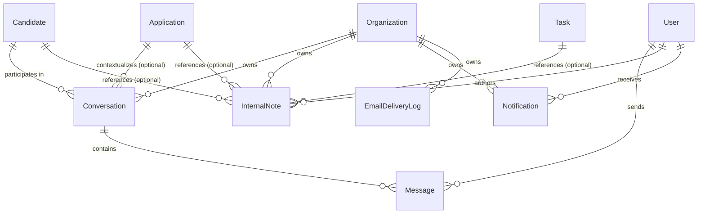

# Phase 7 Engineering Specification — Communication & Notifications Core

**Document Version:** `1.1.1`  
**Status:** `ACCEPTED — FROZEN`  
**Implementation Status:** `IMPLEMENTED — VERIFIED — ACCEPTED`  
**Authority:** Product Vision (§§20, 21), V1 PRD (§§41, 42, 43, 44), Approved Phase 1 Specification (v1.0.0), Approved Phase 2 Specification (v1.2.0), Approved Phase 3 Specification (v1.1.0), Approved Phase 4 Specification (v1.1.0), Approved Phase 5 Specification (v1.2.2), Approved Phase 6 Specification (v1.3.0), Approved ADRs (ADR-001 through ADR-005).

---

## Document Revision History

| Version | Date | Status | Description |
| :--- | :--- | :--- | :--- |
| `1.0.0` | 2026-09-25 | Draft | Initial engineering specification for Communication & Notifications Core. |
| `1.1.0` | 2026-09-25 | Draft | Locked human decisions: (1) Text-only messaging in V1 (zero attachment buckets/APIs; candidate documents remain governed by Candidate Core); (2) Gmail SMTP transport with clean provider interface abstraction (`Notification Domain → Email Notification Service → Email Provider Interface → Gmail SMTP Adapter`). Removed all open decisions. |
| `1.1.1` | 2026-09-25 | Accepted — Frozen | Phase 7 implementation completed and verified. Typecheck, lint, tests, production build, security/RLS verification, and Phase 1–6 regression verification passed. Phase 7 formally accepted and frozen. |

---

## Phase 7 Contract Status

Phase 7 Communication & Notifications Core is an **accepted and frozen** engineering contract.

The specification defines the authoritative Phase 7 communication, notification, internal-note, email, realtime, security, RLS, audit, and lifecycle boundaries.

Future modifications require an explicit engineering/product decision and appropriate regression verification.

Do not silently change the frozen contract.

---

## 1. Executive Summary

Phase 7 defines the **Communication & Notifications Core** of the Operation Orchestration System (OOS).

The primary objective of Phase 7 is to establish a secure, tenant-isolated, low-latency communication and notification foundation that strictly distinguishes between:
1. **Candidate ↔ Staff Communication**: Direct, transparent, text-only messaging between candidates and operational staff, with optional context linkage to specific job applications.
2. **Internal Staff Notes**: Confidential, staff-only operational commentary and notes that are structurally separated from candidate-visible messaging and permanently invisible to candidates.
3. **In-App System Notifications**: First-class, actionable notification records representing key lifecycle milestones and operational alerts.
4. **Transactional Email Notifications**: Server-side delivery channel for approved system events via Gmail SMTP (with provider abstraction), where PostgreSQL remains the immutable single source of truth.

```text
┌────────────────────────────────────────────────────────────────────────────────────────┐
│                                COMMUNICATION TOPOLOGY                                  │
├───────────────────────────────┬───────────────────────────────┬────────────────────────┤
│ 1. Candidate ↔ Staff Messages │ 2. Internal Staff Notes       │ 3. In-App Notifications│
│    (Candidate + Staff Visible)│    (Staff Only — Secret)      │    (Actor Specific)    │
│    • Text-Only Messaging      │    • Triage Commentary        │    • Approval Requests │
│    • Application Inquiries    │    • Verification Checks      │    • QA Milestones     │
│    • Status Clarifications    │    • Operational Strategy     │    • New Message Alert │
└───────────────────────────────┴───────────────────────────────┴────────────────────────┘
                                               │
                                               ▼
                              ┌──────────────────────────────────┐
                              │ 4. Transactional Email Channel   │
                              │    (Outbound Notification Event) │
                              │    • Notification Domain         │
                              │    • Email Notification Service  │
                              │    • Email Provider Interface    │
                              │    • Gmail SMTP Adapter          │
                              └──────────────────────────────────┘
```

---

## 2. Authority & Source Hierarchy

The engineering definitions herein are derived strictly according to the following authoritative hierarchy:
1. Explicit human instructions and locked architectural decisions.
2. Product Vision (`docs/00_PRODUCT_VISION.md`, specifically §§20, 21).
3. V1 Product Requirements Document (`docs/01_V1_PRD.md`, specifically §§41, 42, 43, 44).
4. Approved Phase 1 Engineering Specification & RBAC Contracts (`docs/engineering/PHASE_01_IDENTITY_RBAC_SPEC.md`).
5. Approved Phase 2 Candidate Core Specification & Contracts (`docs/engineering/PHASE_02_CANDIDATE_CORE_SPEC.md` v1.2.0).
6. Approved Phase 3 Application Core Specification & Contracts (`docs/engineering/PHASE_03_APPLICATION_CORE_SPEC.md` v1.1.0).
7. Approved Phase 4 Task & Preparation Core Specification & Contracts (`docs/engineering/PHASE_04_TASK_PREPARATION_CORE_SPEC.md` v1.1.0).
8. Approved Phase 5 QA & Candidate Approval Core Specification & Contracts (`docs/engineering/PHASE_05_QA_APPROVAL_SPEC.md` v1.2.2).
9. Approved Phase 6 Submission & Evidence Core Specification & Contracts (`docs/engineering/PHASE_06_SUBMISSION_SPEC.md` v1.3.0).
10. Approved Architectural Decision Records (ADR-001 through ADR-005).

---

## 3. Human Decisions / Decision Lock

The following architectural and product decisions are explicitly locked for Phase 7:

### Decision 1: Text-Only Communication in V1 (No Attachments)
- **Decision**: V1 Phase 7 candidate ↔ staff messaging is strictly **TEXT-ONLY**.
- **Rationale**: Candidate documents (resumes, portfolios, certifications) are already governed by the authoritative Candidate Document system (Phase 2). Introducing a parallel attachment subsystem inside chat introduces redundant storage boundaries, file scanning overhead, and permission complexity not required for V1 operations.
- **Scope Impact**: 
  - Zero `communication-attachments` storage buckets.
  - Zero attachment columns or models in `Message`.
  - Zero attachment upload/download APIs or presigned URL actions.
- **Implementation Constraint**: If candidates or staff wish to exchange formal documents, they must use the canonical Candidate Document management workflow.

### Decision 2: Transactional Email via Gmail SMTP with Provider Abstraction
- **Decision**: Phase 7 uses **Gmail SMTP** as the initial transactional email transport, encapsulated behind a clean **Email Provider Interface**.
- **Rationale**: Enables immediate transactional notification capabilities for development and staging using verified organization mailboxes without taking on third-party SaaS vendor lock-in or additional credit card requirements. The provider abstraction ensures zero domain coupling to Gmail.
- **Scope Impact**:
  - Architecture: `Notification Domain → Email Notification Service → Email Provider Interface → Gmail SMTP Adapter`.
  - Zero third-party vendor SDKs (no Resend, SendGrid, Mailgun, or AWS SES SDKs in V1).
  - Server-side environment variables only (`SMTP_HOST`, `SMTP_PORT`, `SMTP_USER`, `SMTP_PASS`, `EMAIL_FROM`). Never exposed via `NEXT_PUBLIC_*`.
- **Implementation Constraint**: No background worker queue (no Redis, BullMQ, Celery). Email dispatch occurs synchronously or deferred within Next.js server actions with safe execution (email failure never aborts or rolls back the parent database transaction).

---

## 4. Scope & Boundaries

### 4.1 In-Scope Capabilities
1. **Direct Candidate ↔ Staff Conversations & Messaging**:
   - Tenant-isolated conversations tied to a specific candidate and optionally linked to a specific `Application`.
   - Sequential, append-only messaging with server-derived actor attribution, timestamps, and read tracking (`readAt`).
   - Clean text-only payload with strict character boundaries.
2. **Strict Information Barrier for Internal Staff Notes**:
   - Dedicated, structurally separate `InternalNote` entity.
   - Full PostgreSQL Row Level Security (`FORCE RLS`) completely denying candidate role access at the database level.
   - Staff commentary associated with candidates, applications, or tasks.
3. **First-Class In-App Notification System**:
   - Actionable `Notification` entity tracking event type, recipient, title, summary, entity linkage, and read timestamp.
   - Unread badge counters and real-time reactive UI revalidation.
4. **Transactional Email Notification Channel**:
   - Server-side email delivery dispatched on approved state transitions and messages.
   - Authoritative tracking via `EmailDeliveryLog` capturing recipient, template, delivery status (`QUEUED`, `SENT`, `FAILED`), error details, attempts, and timestamps.
   - Secure server-only credentials (zero client-side exposure).
5. **Real-Time Delivery & Resilience**:
   - Real-time client updates using Supabase Realtime / lightweight reactive sync (`RealtimeRefresher`).
   - Self-healing state recovery guaranteeing PostgreSQL as the sole source of truth if realtime connection drops or lags.

### 4.2 Explicit Non-Goals & Deferred Scope
The following capabilities are explicitly deferred from Phase 7 V1:
- **Group Chats & Slack/Teams-Style Public Channels**: Out of scope for V1 (conversations are strictly 1-to-1 between candidate and organization staff).
- **Communication File Attachments**: Deferred per Decision 1.
- **AI-Driven Automated Messaging or Autonomous Chatbots**: Prohibited by Product Vision and V1 PRD.
- **Third-Party CRM / Omnichannel Messaging Integrations**: No WhatsApp, SMS/Twilio, Intercom, Zendesk, or social media connectors in V1.
- **Voice / Video Calling Infrastructure**: Out of scope.
- **Marketing / Mass Email Broadcasts**: Strictly transactional notifications only.
- **Separate Background Queue Cluster / Message Brokers**: No Redis, BullMQ, Celery, RabbitMQ, or Kafka. Delivery execution runs via Next.js server actions within the modular monolith.

---

## 5. Architecture & Data Model

### 5.1 Entity Relationship Diagram



---

### 5.2 Entity Definitions & Schema Specifications

#### 1. `Conversation`
Represents an ongoing communication channel between a Candidate and Organization Staff.
```prisma
model Conversation {
  id              String        @id @default(uuid()) @db.Uuid
  organizationId  String        @map("organization_id") @db.Uuid
  candidateId     String        @map("candidate_id") @db.Uuid
  applicationId   String?       @map("application_id") @db.Uuid
  subject         String        @db.VarChar(200)
  lastMessageAt   DateTime      @default(now()) @map("last_message_at") @db.Timestamptz(6)
  createdAt       DateTime      @default(now()) @map("created_at") @db.Timestamptz(6)
  updatedAt       DateTime      @updatedAt @map("updated_at") @db.Timestamptz(6)

  organization    Organization  @relation(fields: [organizationId], references: [id], onDelete: Restrict)
  candidate       Candidate     @relation(fields: [candidateId], references: [id], onDelete: Cascade)
  application     Application?  @relation(fields: [applicationId], references: [id], onDelete: SetNull)
  messages        Message[]

  @@index([organizationId, candidateId], name: "idx_conversations_org_candidate")
  @@index([organizationId, applicationId], name: "idx_conversations_org_application")
  @@index([organizationId, lastMessageAt(sort: Desc)], name: "idx_conversations_org_last_message")
  @@map("conversations")
}
```

#### 2. `Message`
An immutable, append-only, text-only message within a conversation.
```prisma
model Message {
  id              String        @id @default(uuid()) @db.Uuid
  conversationId  String        @map("conversation_id") @db.Uuid
  senderId        String        @map("sender_id") @db.Uuid
  senderRole      Role          @map("sender_role")
  body            String        @db.Text
  readAt          DateTime?     @map("read_at") @db.Timestamptz(6)
  createdAt       DateTime      @default(now()) @map("created_at") @db.Timestamptz(6)

  conversation    Conversation  @relation(fields: [conversationId], references: [id], onDelete: Cascade)
  sender          User          @relation(fields: [senderId], references: [id], onDelete: Restrict)

  @@index([conversationId, createdAt(sort: Asc)], name: "idx_messages_conversation_created")
  @@index([conversationId, readAt], name: "idx_messages_conversation_unread")
  @@map("messages")
}
```

#### 3. `InternalNote`
Confidential staff-only operational commentary. **Strictly inaccessible to candidates**.
```prisma
model InternalNote {
  id              String        @id @default(uuid()) @db.Uuid
  organizationId  String        @map("organization_id") @db.Uuid
  candidateId     String?       @map("candidate_id") @db.Uuid
  applicationId   String?       @map("application_id") @db.Uuid
  taskId          String?       @map("task_id") @db.Uuid
  authorId        String        @map("author_id") @db.Uuid
  body            String        @db.Text
  createdAt       DateTime      @default(now()) @map("created_at") @db.Timestamptz(6)

  organization    Organization  @relation(fields: [organizationId], references: [id], onDelete: Restrict)
  candidate       Candidate?    @relation(fields: [candidateId], references: [id], onDelete: Cascade)
  application     Application?  @relation(fields: [applicationId], references: [id], onDelete: Cascade)
  task            Task?         @relation(fields: [taskId], references: [id], onDelete: SetNull)
  author          User          @relation(fields: [authorId], references: [id], onDelete: Restrict)

  @@index([organizationId, candidateId], name: "idx_internal_notes_candidate")
  @@index([organizationId, applicationId], name: "idx_internal_notes_application")
  @@index([organizationId, taskId], name: "idx_internal_notes_task")
  @@index([organizationId, createdAt(sort: Desc)], name: "idx_internal_notes_created")
  @@map("internal_notes")
}
```

#### 4. `Notification`
In-app actionable notification entity.
```prisma
enum NotificationType {
  NEW_MESSAGE
  APPLICATION_STATUS_CHANGED
  CANDIDATE_APPROVAL_REQUESTED
  CANDIDATE_REVISION_REQUESTED
  APPLICATION_SUBMITTED
  SUBMISSION_ISSUE_REPORTED
  CORRECTION_REVIEW_STARTED
  TASK_ASSIGNED
}

model Notification {
  id                String            @id @default(uuid()) @db.Uuid
  organizationId    String            @map("organization_id") @db.Uuid
  recipientId       String            @map("recipient_id") @db.Uuid
  type              NotificationType  @map("type")
  title             String            @db.VarChar(200)
  body              String            @db.Text
  relatedEntityType String?           @map("related_entity_type") @db.VarChar(50)
  relatedEntityId   String?           @map("related_entity_id") @db.Uuid
  readAt            DateTime?         @map("read_at") @db.Timestamptz(6)
  createdAt         DateTime          @default(now()) @map("created_at") @db.Timestamptz(6)

  organization      Organization      @relation(fields: [organizationId], references: [id], onDelete: Restrict)
  recipient         User              @relation(fields: [recipientId], references: [id], onDelete: Cascade)

  @@index([organizationId, recipientId, readAt], name: "idx_notifications_recipient_unread")
  @@index([organizationId, recipientId, createdAt(sort: Desc)], name: "idx_notifications_recipient_created")
  @@map("notifications")
}
```

#### 5. `EmailDeliveryLog`
Authoritative transactional record of external email delivery attempts.
```prisma
enum EmailDeliveryStatus {
  QUEUED
  SENT
  FAILED
}

model EmailDeliveryLog {
  id                String               @id @default(uuid()) @db.Uuid
  organizationId    String               @map("organization_id") @db.Uuid
  recipientEmail    String               @map("recipient_email") @db.VarChar(255)
  templateId        String               @map("template_id") @db.VarChar(100)
  subject           String               @db.VarChar(255)
  status            EmailDeliveryStatus  @default(QUEUED) @map("status")
  providerMessageId String?              @map("provider_message_id") @db.VarChar(255)
  failureReason     String?              @map("failure_reason") @db.Text
  attempts          Int                  @default(0) @map("attempts")
  sentAt            DateTime?            @map("sent_at") @db.Timestamptz(6)
  createdAt         DateTime             @default(now()) @map("created_at") @db.Timestamptz(6)

  organization      Organization         @relation(fields: [organizationId], references: [id], onDelete: Restrict)

  @@index([organizationId, status, createdAt], name: "idx_email_delivery_org_status")
  @@index([recipientEmail, createdAt(sort: Desc)], name: "idx_email_delivery_recipient")
  @@map("email_delivery_logs")
}
```

---

## 6. Security Model & Row Level Security (RLS)

All tables introduced in Phase 7 mandate `FORCE ROW LEVEL SECURITY`. RLS policies evaluate `auth.uid()` and session context using the established security functions `get_current_user_org_id()` and `get_current_user_role()`.

### 6.1 Permission & Boundary Matrix

| Table | Operation | CANDIDATE | EMPLOYEE | ADMIN | Policy Definition |
| :--- | :--- | :--- | :--- | :--- | :--- |
| `conversations` | `SELECT` | OWN (where `candidate.userId = auth.uid()`) | ORG-SCOPED | ORG-SCOPED | Candidates read own conversations; staff read all in organization. |
| `conversations` | `INSERT` | OWN (matching authenticated candidate) | ORG-SCOPED | ORG-SCOPED | Initiated by candidate or staff for valid org candidate. |
| `conversations` | `UPDATE` | OWN (updates `lastMessageAt`) | ORG-SCOPED | ORG-SCOPED | Updated on new messages. |
| `conversations` | `DELETE` | **DENIED** | **DENIED** | **DENIED** | Hard deletion disallowed. |
| `messages` | `SELECT` | OWN CONVERSATION | ORG CONVERSATION | ORG CONVERSATION | Candidates access messages only in their own conversations. |
| `messages` | `INSERT` | OWN CONVERSATION (`senderRole = CANDIDATE`) | ORG CONVERSATION (`senderRole = EMPLOYEE`) | ORG CONVERSATION (`senderRole = ADMIN`) | Append-only. Server verifies sender identity. |
| `messages` | `UPDATE` | OWN (can only mark `readAt` on staff messages) | ORG (can mark `readAt` on candidate messages) | ORG | Restricted exclusively to `readAt` updates. |
| `messages` | `DELETE` | **DENIED** | **DENIED** | **DENIED** | Messages are immutable point-in-time communications. |
| `internal_notes`| `SELECT` | **DENIED (0 rows)** | ORG-SCOPED | ORG-SCOPED | Absolute information barrier. Candidates blocked by RLS. |
| `internal_notes`| `INSERT` | **DENIED** | ORG-SCOPED (`authorId = auth.uid()`) | ORG-SCOPED | Staff-only operational note creation. |
| `internal_notes`| `UPDATE` | **DENIED** | **DENIED** | **DENIED** | Notes are immutable historical records. |
| `internal_notes`| `DELETE` | **DENIED** | **DENIED** | **DENIED** | Deletion prohibited. |
| `notifications` | `SELECT` | OWN (`recipientId = auth.uid()`) | OWN (`recipientId = auth.uid()`) | OWN (`recipientId = auth.uid()`) | Recipients read only their own notifications. |
| `notifications` | `UPDATE` | OWN (mark `readAt`) | OWN (mark `readAt`) | OWN (mark `readAt`) | Restricted to `readAt` timestamp update. |
| `notifications` | `INSERT` | **DENIED** | **DENIED** | **DENIED** | Created strictly via server-side operational actions. |
| `email_delivery_logs`| `SELECT` | **DENIED** | ORG-SCOPED (Read-only) | ORG-SCOPED | Staff monitoring of transactional delivery health. |

---

## 7. Information Barrier & Privacy Safeguards

1. **Physical & Logical Separation**:
   - `InternalNote` records reside in a completely separate database table from `Message` records.
   - Database queries fetching candidate messages NEVER join or union with `internal_notes`.
2. **PostgreSQL RLS Zero-Trust Guarantee**:
   - The RLS policy on `internal_notes` evaluates `get_current_user_role() IN ('EMPLOYEE', 'ADMIN')`. Any query executed under a candidate session returns 0 rows.
3. **API Boundary Isolation**:
   - Candidate server actions do not expose endpoints or fields for internal notes.
   - Error messages returned to candidates for internal note operations return generic `404 Not Found` or `403 Forbidden` without leaking existence or content.
4. **Data Minimization & Logging Guard**:
   - Message bodies and note content must NEVER be logged to standard stdout/stderr logs or audit event details. Audit events capture entity UUIDs, actor attribution, and timestamps only.

---

## 8. Transactional Email Channel Architecture

### 8.1 Provider Abstraction Model

```text
┌─────────────────────────────────────────────────────────────────────────┐
│                           NOTIFICATION DOMAIN                           │
│  (e.g., Application Status Changed, QA Passed, New Candidate Message)   │
└────────────────────────────────────┬────────────────────────────────────┘
                                     │
                                     ▼
┌─────────────────────────────────────────────────────────────────────────┐
│                        EMAIL NOTIFICATION SERVICE                       │
│  • Renders structured HTML / text email template                        │
│  • Creates EmailDeliveryLog record with status QUEUED                   │
│  • Invokes EmailProvider interface                                      │
└────────────────────────────────────┬────────────────────────────────────┘
                                     │
                                     ▼
┌─────────────────────────────────────────────────────────────────────────┐
│                         EMAIL PROVIDER INTERFACE                        │
│  interface EmailProvider {                                              │
│    send(payload: SendEmailPayload): Promise<SendEmailResult>;           │
│  }                                                                      │
└────────────────────────────────────┬────────────────────────────────────┘
                                     │
                                     ▼
┌─────────────────────────────────────────────────────────────────────────┐
│                            GMAIL SMTP ADAPTER                           │
│  • Connects via Nodemailer SMTP to smtp.gmail.com:465 / 587             │
│  • Authenticates with server-only SMTP_USER / SMTP_PASS                 │
│  • Updates EmailDeliveryLog status to SENT or FAILED                    │
└─────────────────────────────────────────────────────────────────────────┘
```

### 8.2 Operational Delivery Principles
1. **Delivery Principle**:
   - Email is a **delivery notification channel**, NOT the source of truth.
   - An email delivery failure does NOT abort or roll back the primary database transaction (e.g., status changes or message creation remain committed).
2. **Sender Identity**:
   - Pre-configured, authoritative sender address: `EMAIL_FROM` (e.g., `notifications@company-domain`).
3. **Credentials & Secrets**:
   - SMTP credentials remain strictly server-side (`SMTP_HOST`, `SMTP_PORT`, `SMTP_USER`, `SMTP_PASS`, `EMAIL_FROM`). Zero exposure to browser code.
4. **Event Triggers**:
   - Candidate Message Received → Staff Email Notification.
   - Staff Message Received → Candidate Email Notification.
   - Candidate Approval Requested (`AWAITING_APPROVAL`) → Candidate Action Email.
   - Application Submitted (`SUBMITTED`) → Candidate Notification Email.
   - Submission Issue Reported → Staff Alert Email.

---

## 9. Real-Time Delivery & Resilience Model

1. **Role of Realtime**:
   - Real-time subscriptions (via Supabase Realtime or `RealtimeRefresher`) provide low-latency UI responsiveness.
   - Real-time events are purely transport signals; client views always render state backed by authoritative PostgreSQL queries.
2. **Disconnection & Reconnection Recovery**:
   - When the client regains network connection or window focus, `RealtimeRefresher` triggers a router revalidation to fetch fresh authoritative server state.
3. **Idempotency & Deduplication**:
   - Unique message IDs prevent duplicate display in the UI if an event is received multiple times over WebSocket and HTTP response.

---

## 10. Message & Notification Lifecycles

### 10.1 Message Lifecycle
```text
[Message Drafted]
       │
       ▼ (sendMessageAction)
    [SENT]  (createdAt recorded, readAt = NULL)
       │
       ▼ (markConversationReadAction / view by recipient)
    [READ]  (readAt = server timestamp)
```
*Note: No unnecessary intermediate states (e.g., `DELIVERING`, `UNDELIVERED`, `ARCHIVED`) in V1.*

### 10.2 Notification Lifecycle
```text
[Domain Event Triggered]
       │
       ▼ (Server Action / Transaction)
   [UNREAD] (createdAt recorded, readAt = NULL)
       │
       ▼ (markNotificationReadAction / user click)
    [READ]  (readAt = server timestamp)
```

### 10.3 Email Delivery Lifecycle
```text
[Notification Event Created]
       │
       ▼ (EmailNotificationService)
   [QUEUED] (EmailDeliveryLog created)
       │
       ├─────────────────────────────────┐
       │ (SMTP Success)                  │ (SMTP Network / Auth Error)
       ▼                                 ▼
    [SENT]                            [FAILED]
(sentAt recorded, providerMessageId)  (failureReason recorded, attempts++)
```

---

## 11. Server Action / API Matrix

| Server Action | Actor | Required Input | Validation Rules | State Transition / Effect |
| :--- | :--- | :--- | :--- | :--- |
| `createConversationAction` | Staff / Candidate | `candidateId?`, `applicationId?`, `subject`, `initialMessage` | `subject` (1-200 chars), `initialMessage` (1-4000 chars) | Creates `Conversation` + initial `Message`, emits `CONVERSATION_CREATED`. |
| `sendMessageAction` | Staff / Candidate | `conversationId`, `body` | `body` (1-4000 chars), caller is conversation participant | Appends `Message`, updates `lastMessageAt`, dispatches notification + email. |
| `markConversationReadAction`| Staff / Candidate | `conversationId` | Caller is authorized participant | Sets `readAt = now()` on all incoming unread messages. |
| `createInternalNoteAction` | Staff / Admin | `candidateId?`, `applicationId?`, `taskId?`, `body` | `body` (1-4000 chars), at least 1 entity link | Appends `InternalNote`, emits `INTERNAL_NOTE_CREATED`. (Staff only). |
| `getInternalNotesAction` | Staff / Admin | `candidateId?`, `applicationId?`, `taskId?` | Valid entity UUID in org | Retrieves staff-only notes. Blocked for candidates. |
| `listNotificationsAction` | Authenticated User| `limit?`, `unreadOnly?` | `limit` (1-100) | Retrieves in-app notifications for caller. |
| `markNotificationReadAction`| Authenticated User| `notificationId` | Recipient is `ctx.userId` | Sets `readAt = now()` on target notification. |
| `markAllNotificationsReadAction` | Authenticated User | None | Authenticated session | Sets `readAt = now()` on all caller's notifications. |

---

## 12. Audit Event Specifications

| Audit Action | Entity Type | Actor Attribution | Log Details / Metadata |
| :--- | :--- | :--- | :--- |
| `CONVERSATION_CREATED` | `Conversation` | `ctx.userId` | `conversationId`, `candidateId`, `applicationId`, `subject` |
| `MESSAGE_SENT` | `Message` | `ctx.userId` | `conversationId`, `messageId`, `senderRole` (No message body) |
| `INTERNAL_NOTE_CREATED` | `InternalNote` | `ctx.userId` | `noteId`, `candidateId`, `applicationId`, `taskId` (No note body) |
| `NOTIFICATION_CREATED` | `Notification` | System / `ctx.userId` | `notificationId`, `recipientId`, `type`, `relatedEntityId` |
| `NOTIFICATION_READ` | `Notification` | `ctx.userId` | `notificationId`, `readAt` |
| `EMAIL_NOTIFICATION_DISPATCHED` | `EmailDeliveryLog`| System | `emailLogId`, `recipientEmail`, `templateId`, `status` |

---

## 13. Quality Gates & Test Requirements

1. **Message Isolation & RBAC Tests**:
   - Candidates can only view messages in their own conversations; querying another candidate's conversation returns `404/403`.
   - Messages are strictly append-only; update/delete operations fail with authorization or schema errors.
2. **Internal Note Information Barrier Tests**:
   - Candidates executing direct SQL queries, Prisma queries, or server actions against `internal_notes` receive 0 rows and permission denial.
   - Staff members in Org A can author and view internal notes; staff members in Org B cannot.
3. **Cross-Tenant Isolation Tests**:
   - Staff from Org A cannot access conversations, messages, notes, or notifications belonging to Org B.
4. **Notification Delivery & Read Tracking Tests**:
   - Actionable notifications are created for appropriate recipients on status transitions (`AWAITING_APPROVAL`, `SUBMITTED`, `SUBMISSION_ISSUE`).
   - Read tracking updates `readAt` accurately without impacting other users' notifications.
5. **Email Provider Abstraction & Fallback Tests**:
   - Mocked provider failure verifies that email failure records `FAILED` status and `failureReason` in `email_delivery_logs` without aborting the parent database transaction.
6. **Regression Quality Gate**:
   - All existing test suites covering Phase 1 through Phase 6 must remain 100% passing.

---

## 14. Performance & Query Bounding

1. **Indexed Queries**:
   - Bounded conversation queries using composite indexes on `[organization_id, candidate_id]` and `[organization_id, last_message_at DESC]`.
   - Bounded message pagination using `[conversation_id, created_at ASC]`.
2. **Efficient Unread Counters**:
   - Unread queries bounded with `WHERE read_at IS NULL` backed by partial/composite index `[conversation_id, read_at]` and `[recipient_id, read_at]`.
3. **No Infrastructure Bloat**:
   - Zero external caching layers (Redis/Memcached) or message brokers (Kafka/RabbitMQ). PostgreSQL indexing and connection pooling provide sub-50ms query latency.

---

## 15. Acceptance Criteria

Phase 7 technical acceptance criteria:
1. Candidate ↔ Staff text conversations operate seamlessly with realtime reactive updates.
2. Internal staff notes are completely segregated and provably invisible to candidates via PostgreSQL RLS and API barriers.
3. In-app notifications accurately reflect key lifecycle events across Candidate and Staff workbenches.
4. Transactional emails are generated through the `EmailProvider` interface via Gmail SMTP with full delivery logging in PostgreSQL.
5. All security, RLS, audit, performance, and regression quality gates pass with 100% test coverage.

Acceptance criteria verified against the completed Phase 7 implementation. Phase 7 is therefore **accepted and frozen**.

---

## 16. Open Human Decisions

**None. All Phase 7 architectural decisions are fully resolved.**

---

## 17. Implementation & Verification Status

**Implementation Status: IMPLEMENTED — VERIFIED — ACCEPTED**

Phase 7 implementation, verification, human acceptance, and regression testing are complete. Phase 7 is frozen as part of the authoritative OOS baseline.

### Verification Summary:
- `npm run typecheck` — **PASSED**
- `npm run lint` — **PASSED**
- `npm test` — **PASSED**
- 53 test suites passed
- 275 tests passed
- `npm run build` — **PASSED**
- Phase 1–6 regression passed
- Phase 7 security/RLS isolation verified
- internal-note candidate information barrier verified
- Gmail SMTP provider abstraction implemented
- text-only communication contract preserved
- no Redis/Kafka/background queue infrastructure introduced
