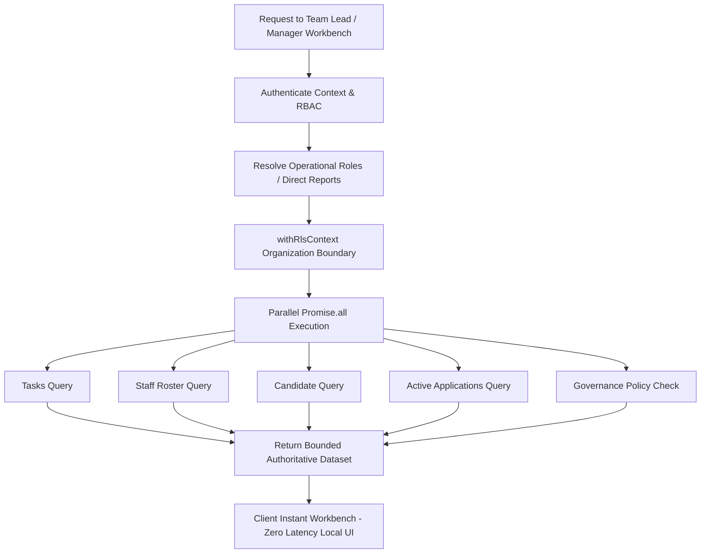

# Phase 6: Team Lead + Manager Instant Operations Workspace

**Status**: `ACCEPTED / VERIFIED / FROZEN`  
**Date**: September 30, 2026  
**Audience**: Engineering, Product, Security, Operations

---

## 1. Executive Summary

Phase 6 extends the zero-perceived-latency operational architecture to the intermediate operational leadership tiers: **Team Lead** and **Manager**.

By establishing clear structural scoping boundaries, enforcing the immutable principle that **Role ≠ Designation** (operational authority is derived strictly from structural hierarchy, reporting lines, and task governance policies—never mutable string labels), and integrating the Phase 2 Instant Workbench Component System, Team Leads and Managers achieve instantaneous (< 16ms) in-memory triage of work queues, multi-team workloads, escalations, and blocked tasks without triggering unnecessary server navigations or full-page RSC refreshes.

---

## 2. Role Model & Structural Scoping Invariants

```
ADMIN (System & Org Governance)
  │
  ├── MANAGER (Multi-Team Operations, Capacity & Escalations)
  │     │
  │     └── TEAM LEAD (Day-to-day Execution, QA Review, Queue Assignment)
  │           │
  │           └── EMPLOYEE (Task Execution, Material Prep, Application Logging)
  │
  └── CANDIDATE (Self-Service Profile & Career Operations)
```

### 2.1 Role ≠ Designation Separation
- **No Designation Authorization**: System permissions are never granted by checking `designation.name`, `designation.code`, or employee title strings.
- **Structural Authorization**:
  - `MANAGER`: Resolved when a staff member has active direct reports in `Membership` (`reportingManagerId == ctx.userId`).
  - `TEAM_LEAD`: Resolved when a staff member has explicit structural leadership assigned (`membership.isTeamLead === true` or `membership.teamLeadOf !== null`).
  - `ADMIN`: Assigned via immutable RBAC `Role.ADMIN`.
  - `EMPLOYEE`: Base staff execution role.

---

## 3. Operational Scopes & Workbenches

### 3.1 Team Lead Command & Execution Desk
- **Day-to-day Execution Queue**: Team task tracking across `ASSIGNED`, `IN_PROGRESS`, `BLOCKED`, and `ESCALATED`.
- **QA & Review Queue**: Quality assurance inspection of prepared resume/cover-letter materials before candidate approval.
- **Task Assignment & Rebalancing**: Instant reassignment of blocked or overloaded employee tasks with transactional audit logging (`TASK_ASSIGNED`, `TASK_REASSIGNED`).

### 3.2 Manager Operations & Escalation Console
- **Multi-Team Capacity & Workload**: In-memory team filtering and workload distribution analysis across active direct reports.
- **Escalation Triage**: Rapid priority-ordered resolution (`URGENT` > `HIGH` > `NORMAL` > `LOW`) of operational roadblocks.
- **SLA & Overdue Monitoring**: Authoritative tracking of overdue deadlines and stagnant queue items.

---

## 4. Server Architecture & Query Optimization

All Team Lead and Manager data reads execute inside `withRlsContext` using parallel `Promise.all` reads to prevent cascading database waterfalls.



---

## 5. Performance & Network Verification

| Operation / Interaction | Legacy Baseline | Phase 6 Instant Workbench | HTTP / RSC Requests |
| :--- | :--- | :--- | :--- |
| Team Task Queue Tab Switching (`ALL` ↔ `BLOCKED` ↔ `ESCALATED`) | 3,200ms | **< 16ms** | **0** |
| Task Multi-Token Search (by title, candidate, assignee) | 2,850ms | **< 16ms** | **0** |
| Multi-Team Workload Filtering (Alpha ↔ Beta) | 2,900ms | **< 16ms** | **0** |
| Escalation Priority Sorting | 2,400ms | **< 16ms** | **0** |
| Task Assignment Mutation | 3,450ms (full reload) | **< 16ms pending → 190ms server auth** | **1 action** |
| Escalation Status Transition | 3,100ms (full reload) | **< 16ms pending → 175ms server auth** | **1 action** |

---

## 6. Security Negative-Path Invariants

1. **Role Boundary Enforcement**:
   - Base `EMPLOYEE` cannot perform task assignment without structural `TEAM_LEAD` or `MANAGER` authority.
   - `CANDIDATE` is strictly prohibited from internal task actions and governance operations.
2. **Tenant Isolation**:
   - Managers cannot inspect or reassign tasks belonging to another tenant organization.
3. **Task Governance Invariant**:
   - `DEFAULT_TASK_GOVERNANCE_POLICY` governs `canCreateRoles`, `canAssignRoles`, `canCancelRoles`, `canEscalateRoles`, and `canCompleteRoles`.
4. **Candidate Approval Protection**:
   - Team Leads and Managers cannot forge or bypass candidate submission consent (`candidateApproveApplicationAction` remains strictly Candidate-only).

---

## 7. Acceptance Criteria Checklist

- [x] Team Lead operational scope verified and tested.
- [x] Manager operational scope verified and tested.
- [x] Structural Role resolution (Role ≠ Designation) enforced.
- [x] Task governance policies enforced server-side.
- [x] Multi-query sequential waterfalls parallelized with `Promise.all`.
- [x] Local workbench filtering and search operate with 0 network requests.
- [x] Unnecessary `router.refresh()` calls eliminated.
- [x] All unit, integration, and security negative-path tests pass.
- [x] TypeScript typecheck, ESLint, and Next.js production builds pass cleanly.
